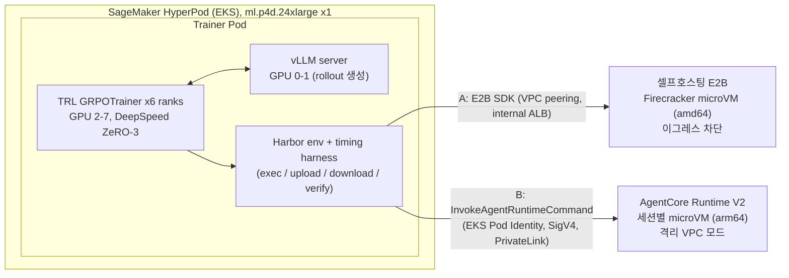

# Agentic RL 샌드박스 on SageMaker HyperPod: E2B vs Amazon Bedrock AgentCore Runtime

[English](README.md) | **한국어**

Harbor 기반 TRL GRPO 학습을 SageMaker HyperPod(EKS 오케스트레이션)에서 돌릴 때, 롤아웃 샌드박스를 두 가지 방식으로 연결하는 재현 가능한 가이드와 측정 기반 비교입니다.

- **방법 A: E2B sandbox** (Harbor 내장 `e2b` 환경). [aws-samples/sample-e2b-on-aws](https://github.com/aws-samples/sample-e2b-on-aws)(커밋 `830b516` 고정)로 같은 AWS 계정에 배포한 E2B on AWS(셀프호스팅)에서 측정했습니다. 샘플 코드는 수정하지 않고, `infra/e2b-selfhosted/`가 배포를 감쌉니다(내부 전용 접근, 팀 한도, Secrets Manager의 API 키, VPC 피어링). E2B Cloud는 문서상 가격과 한도로만 비교합니다.
- **방법 B: Amazon Bedrock AgentCore Runtime** (Harbor `BaseEnvironment`를 직접 구현)

두 방법은 같은 태스크 56개, 같은 정책 모델(`google/gemma-4-E4B-it`), 같은 학습 설정, 같은 샌드박스 워밍업(`tasks/image/warmup.sh`, 스냅샷 전에 한 번 실행)으로 측정했고, 샌드박스는 학습 Pod의 `--sandbox e2b|agentcore` 인자 하나로 바뀝니다.

> 이름 주의: Gemma 4의 "E2B" 모델(`google/gemma-4-E2B-it`)은 E2B 샌드박스와 무관합니다. 이 저장소에서 모델은 항상 Hugging Face 전체 ID로, 샌드박스는 "E2B sandbox"로 씁니다.

## 샌드박스를 HyperPod에 연결하기: 단계별 가이드

공통 단계를 한 번 진행한 뒤, 고른 샌드박스의 가이드를 따르세요. 각 가이드는 학습 전에 연결을 확인하는 oracle 검증으로 끝납니다.

| 단계 | 옵션 A: E2B on AWS (셀프호스팅) | 옵션 B: AgentCore Runtime |
|---|---|---|
| 1. 사전 준비 | [00-prerequisites](docs/ko/00-prerequisites.md) (도메인 필요, 5절) | [00-prerequisites](docs/ko/00-prerequisites.md) |
| 2. HyperPod EKS 클러스터, Pod 권한, Secret | [01-hyperpod-eks](docs/ko/01-hyperpod-eks.md) | [01-hyperpod-eks](docs/ko/01-hyperpod-eks.md) |
| 3. 태스크와 샌드박스 이미지 | [02-tasks-and-images](docs/ko/02-tasks-and-images.md) | [02-tasks-and-images](docs/ko/02-tasks-and-images.md) |
| 4. **샌드박스를 HyperPod에 연결** | **[03a-sandbox-e2b](docs/ko/03a-sandbox-e2b.md)**: E2B 배포(3.1~3.3절), VPC 피어링 + 내부 ALB(3.4절), API 키 Secret(3.5절), 연결과 이그레스 확인(3.7절), 템플릿(3.8절), oracle(3.9절) | **[03b-sandbox-agentcore](docs/ko/03b-sandbox-agentcore.md)**: 격리 서브넷 + PrivateLink 포함 VPC 엔드포인트(3절), shim 이미지와 런타임(4, 5절), IAM(6절), TRL 연결과 oracle(9절) |
| 5. GRPO 학습 | [04-grpo-training](docs/ko/04-grpo-training.md), `--sandbox e2b` | [04-grpo-training](docs/ko/04-grpo-training.md), `--sandbox agentcore` |
| 6. 정리 | [06-cleanup](docs/ko/06-cleanup.md) 2절 | [06-cleanup](docs/ko/06-cleanup.md) 3절 |

명령 요약은 [빠른 시작](#빠른-시작), 옵션 선택 기준은 [언제 E2B, 언제 AgentCore](#언제-e2b-언제-agentcore)에 있습니다.

## 아키텍처



정책 모델은 학습 Pod 안에서만 호출되고, 샌드박스는 명령 실행과 verifier만 담당합니다(TRL Harbor 통합의 external agent 패턴). 샌드박스에서 vLLM으로 돌아오는 네트워크 경로가 필요 없고, 토큰과 logprob은 학습 쪽에서 그대로 잡힙니다. 모델이 만든 코드가 샌드박스에서 실행되므로 모든 태스크는 `network_mode = "no-network"`이고, 두 샌드박스 모두 인터넷 이그레스를 막은 상태로 측정했습니다.

## 보안 참고

- **두 샌드박스 모두 이그레스 차단.** 모든 태스크가 `network_mode = "no-network"`입니다. E2B는 샌드박스 네트워크 정책(`allow_internet_access=False`)으로, AgentCore는 인터넷 경로가 없는 격리 서브넷으로 막으며, 둘 다 `bench/egress_check.py`로 확인했습니다([docs/ko/03a](docs/ko/03a-sandbox-e2b.md) 3.7절, [docs/ko/03b](docs/ko/03b-sandbox-agentcore.md) 9.1절).
- **샌드박스 API까지 사설 경로.** 학습 Pod는 E2B를 VPC 피어링과 내부 ALB로, AgentCore 데이터 플레인(`InvokeAgentRuntime`, `InvokeAgentRuntimeCommand`, `StopRuntimeSession`)을 HyperPod VPC의 인터페이스 VPC 엔드포인트 `com.amazonaws.us-west-2.bedrock-agentcore`(PrivateLink, 프라이빗 DNS)로 호출합니다([docs/ko/03b](docs/ko/03b-sandbox-agentcore.md) 3절).
- **AgentCore 서브넷의 엔드포인트 정책.** 격리 라우팅 테이블 전용 S3 게이트웨이 엔드포인트는 리전 ECR 레이어 버킷의 `s3:GetObject`만, ECR, CloudWatch Logs, AgentCore 데이터 플레인 인터페이스 엔드포인트는 이 계정의 주체만 허용합니다([docs/ko/03b](docs/ko/03b-sandbox-agentcore.md) 3절).
- **남은 경로: DNS.** 격리 서브넷에서도 VPC 리졸버가 공개 DNS 이름에 응답하므로 DNS 터널링은 가능합니다. 태스크가 민감한 데이터를 다룬다면 Route 53 Resolver DNS Firewall을 추가하세요(이 가이드에서는 구성하지 않음).
- **내부 ALB, SSH 없음.** 셀프호스팅 E2B는 두 VPC의 HTTPS만 받는 내부 로드 밸런서로만 접근하고, 배스천은 SSM으로만 다루며 키 페어의 개인 키는 생성 직후 버립니다([docs/ko/03a](docs/ko/03a-sandbox-e2b.md) 3.1, 3.4, 6절).
- **비밀은 Secrets Manager와 Kubernetes Secret에만.** 자격 증명은 환경 변수로만 받고, E2B 팀 API 키는 Secrets Manager에 있으며, Pod는 `HF_TOKEN`, `E2B_API_KEY`를 Secret `sandbox-secrets`에서 받습니다. Secret은 server-side apply로 써서 어노테이션에 사본이 남지 않습니다. Pod의 AWS 권한은 EKS Pod Identity이며, 신뢰 정책은 클러스터, 네임스페이스, ServiceAccount 하나로 제한됩니다([docs/ko/01](docs/ko/01-hyperpod-eks.md) 6절).
- **vLLM은 localhost에서만.** 롤아웃 서버는 학습 Pod 안의 `127.0.0.1:8000`에만 바인드됩니다. dev 모드의 가중치 업데이트 경로에 인증이 없기 때문입니다([docs/ko/04](docs/ko/04-grpo-training.md) 4.4, 4.5절).

## 언제 E2B, 언제 AgentCore

| 상황 | 추천 | 근거 |
|---|---|---|
| 운영 인력 없이 바로 시작, 사용량이 들쭉날쭉 | AgentCore | 런타임 1개, 사용량 과금: 학습 1회 샌드박스 비용 $6.09 [estimated], 2,112 세션과 명령 31,672건에서 스로틀 0 [measured] |
| 데이터 반출 불가, IAM으로 통제 | AgentCore 또는 셀프호스팅 E2B | 둘 다 계정 안. E2B Cloud는 데이터가 계정 밖으로 나감 |
| GPU 시간이 비싸고 샌드박스 호출이 많음 | 셀프호스팅 E2B | 세션 시작 21배, exec 16배 빠름 [measured]. 학습 시간 48% 단축 [measured], GPU 포함 전체 비용 28% 낮음 [estimated] |
| 노드를 계속 채울 대규모 상시 학습 | 셀프호스팅 E2B | 고정비 $11.11/h [estimated]. 평균 동시 세션 약 430 이상이면 샌드박스 비용도 AgentCore보다 낮아짐 [estimated] |
| 2 vCPU / 8 GB를 넘는 샌드박스, x86 전용 바이너리 | E2B | AgentCore 세션 크기 고정, arm64만 [documented] |
| 큰 파일 전송, 중간 상태 포크 | E2B | AgentCore 8 MB 전송 5.5~5.7초 [measured], 세션 포크 없음 |
| 명령 단위 감사 | 어느 쪽이든 추가 구성 | AgentCore 데이터 플레인 호출은 CloudTrail 기본 이벤트 기록에 없음 [measured] |

두 샌드박스 모두 태스크 56/56 통과, 40 스텝 학습 1,920 롤아웃 실패 0 [measured]. 평가 포함 학습 1회는 셀프호스팅 E2B 2.65 h, AgentCore 5.05 h였고 [measured], GPU를 포함한 1회 비용은 $98.10 대 $136.98입니다 [estimated]. 상세 수치, 비용 공식, 한계는 [docs/ko/05-comparison.md](docs/ko/05-comparison.md)에 있습니다.

## 빠른 시작

전제: [docs/ko/00-prerequisites.md](docs/ko/00-prerequisites.md)의 도구, 쿼터, 환경 변수.

```bash
# 1. HyperPod EKS cluster, then trainer pod access: namespace, ServiceAccount, Pod Identity, Secret (docs/01)
./infra/hyperpod/create-cluster.sh
./infra/k8s/setup-access.sh            # RUNTIME_ID is optional here; rerun with it in step 3

# 2. Images (docs/02, 04): task image (amd64 + arm64, Finch), trainer image (CodeBuild; also creates the results bucket)
TAG=v2 ./tasks/image/build-push.sh
TAG=v12 ./training/build-image.sh

# 3. Method B: AgentCore isolated network + runtime (docs/03b), then rerun setup-access.sh with the runtime id (docs/01)
TAG=v2 ./agentcore/deploy_runtime.sh
RUNTIME_ID=<runtime id> ./infra/k8s/setup-access.sh

# 4. Method A: self-hosted E2B (docs/03a)
DOMAIN=<your domain> ./infra/e2b-selfhosted/deploy.sh
./infra/e2b-selfhosted/peer.sh
E2B_DOMAIN=e2b.<your domain> ./infra/e2b-selfhosted/set-secret.sh
TAG=v12 ./infra/k8s/submit.sh e2b-prebuild 0 \
  python3 bench/prebuild_e2b_templates.py --image <ACCOUNT_ID>.dkr.ecr.us-west-2.amazonaws.com/harbor-rl/tasks-base:v2

# 5. Validation: oracle (56 tasks) and egress blocking (docs/03a, 03b)
TAG=v12 ./infra/k8s/submit.sh oracle-e2b 0 python3 bench/oracle_check.py --sandbox e2b
TAG=v12 ./infra/k8s/submit.sh egress-e2b 0 python3 bench/egress_check.py --sandbox e2b
AGENTCORE_RUNTIME_ARN=<arn> TAG=v12 ./infra/k8s/submit.sh oracle-agentcore 0 python3 bench/oracle_check.py --sandbox agentcore

# 6. Training (docs/04): one argument switches the sandbox
TAG=v12 ./infra/k8s/submit.sh grpo-e2b 8 bash -c "RUN_ID=grpo-e2b training/run.sh e2b"
AGENTCORE_RUNTIME_ARN=<arn> TAG=v12 ./infra/k8s/submit.sh grpo-agentcore 8 \
  bash -c "RUN_ID=grpo-agentcore training/run.sh agentcore"

# 7. Analysis (docs/04 section 8, docs/05): after downloading the results into results/,
#    regenerate the usage inputs of cost_model.py for your own training windows (UTC)
uv run --with boto3 python3 bench/agentcore_metrics.py --start <start> --end <end> \
  --runtime-arn <arn> --out results/usage/agentcore_grpo_window.json
uv run --with boto3 python3 bench/e2b_client_cpu.py --start <start> --end <end> --out results/usage/e2b_client_cpu.json
uv run --with pandas --with matplotlib python3 bench/analyze.py --results results
uv run --with pandas --with matplotlib python3 bench/cost_model.py --results results
```

`results/usage/`에 커밋된 두 파일은 측정 실행의 값이므로, 재현할 때는 7단계처럼 자신의 학습 구간으로 다시 만듭니다. 분석 스크립트는 로컬에 `pandas`와 `matplotlib`이 필요합니다(위처럼 `uv run --with`로 지정).

정리는 [docs/ko/06-cleanup.md](docs/ko/06-cleanup.md)를 따릅니다. 셀프호스팅 E2B 노드와 GPU 노드는 켜져 있는 동안 계속 과금됩니다.

## 문서

| 문서 | 내용 |
|---|---|
| [00-prerequisites](docs/ko/00-prerequisites.md) | 리전, 쿼터, 도구, 자격 증명, 비용 추정 |
| [01-hyperpod-eks](docs/ko/01-hyperpod-eks.md) | 공식 템플릿으로 HyperPod EKS 클러스터 생성, Pod Identity |
| [02-tasks-and-images](docs/ko/02-tasks-and-images.md) | 태스크 스위트, 멀티 아키텍처 이미지, arm64 주의점 |
| [03a-sandbox-e2b](docs/ko/03a-sandbox-e2b.md) | 방법 A: 셀프호스팅 E2B 배포와 연결, E2B Cloud로 바꾸기 |
| [03b-sandbox-agentcore](docs/ko/03b-sandbox-agentcore.md) | 방법 B: AgentCore 런타임, shim, `BaseEnvironment` 코드 해설 |
| [04-grpo-training](docs/ko/04-grpo-training.md) | TRL + Harbor GRPO 학습 실행 |
| [05-comparison](docs/ko/05-comparison.md) | 측정 기반 비교와 의사결정 표 |
| [06-cleanup](docs/ko/06-cleanup.md) | 생성한 리소스 삭제 순서 |
| [references](docs/ko/references.md) | 출처(확인 날짜), 문서와 실제 동작의 차이, 사전 가정 검증표 |

## 저장소 구조

```
docs/        가이드 (영어), docs/ko/ 에 한국어 가이드
infra/       HyperPod 파라미터, IAM 정책, 셀프호스팅 E2B 스크립트, Kubernetes 매니페스트
tasks/       Harbor 태스크 선택/생성 스크립트와 태스크(데이터는 저장소에 포함하지 않음)
agentcore/   Harbor AgentCore 환경, shim, 이미지, 격리 네트워크와 런타임 배포 스크립트
training/    Trainer Dockerfile, train_grpo.py, run.sh, TRL 패치, 타이밍 하네스
bench/       오라클 검증, 이그레스 검증, 샌드박스 벤치마크, 분석과 비용 계산 스크립트
results/     원시 결과(CSV, JSONL), 요약 표, 차트
```

## 라이선스와 출처

이 저장소는 Apache License 2.0을 따릅니다([LICENSE](LICENSE)). 서드파티 저작물 표기는 [NOTICE](NOTICE)에 있습니다. AgentCore 환경과 shim은 Apache-2.0 코드(`mightma/harbor@acr-kit-v1`, `awslabs/agentcore-rl-toolkit`)를 출처 표기와 함께 재사용했습니다. 태스크는 `AdithyaSK/data_agent_rl_environment_train`(리비전 고정)에서 파생했습니다. 모든 출처와 확인 날짜는 [docs/ko/references.md](docs/ko/references.md)에 있습니다. 셀프호스팅 E2B 배포는 [aws-samples/sample-e2b-on-aws](https://github.com/aws-samples/sample-e2b-on-aws)(Apache-2.0)를 사용하며, 배포 시점에 내려받고 이 저장소에는 포함하지 않습니다.
