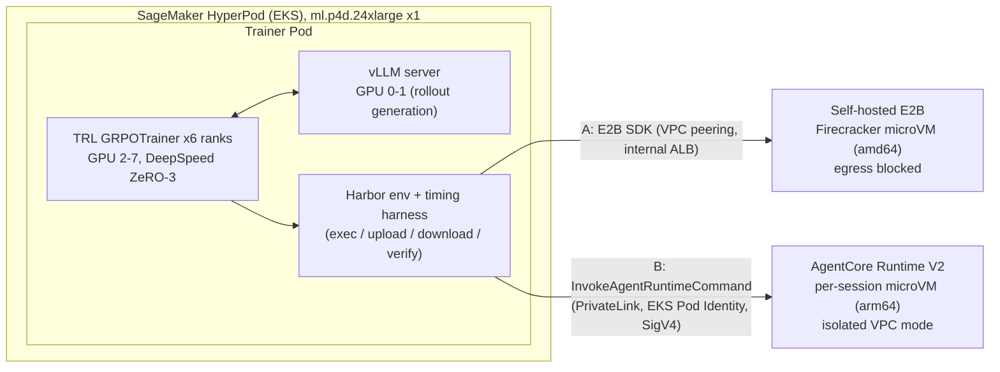

# Agentic RL Sandboxes on SageMaker HyperPod: E2B vs Amazon Bedrock AgentCore Runtime

**English** | [한국어](README.ko.md)

A reproducible guide and a measurement-based comparison for connecting rollout sandboxes to Harbor-based TRL GRPO training on Amazon SageMaker HyperPod with EKS orchestration, using two methods:

- **Method A: E2B sandbox** (Harbor's built-in `e2b` environment), measured on E2B self-hosted on AWS with [aws-samples/sample-e2b-on-aws](https://github.com/aws-samples/sample-e2b-on-aws) (pinned commit `830b516`) deployed in the same AWS account. The sample's code is used unchanged; `infra/e2b-selfhosted/` wraps its deployment (internal-only access, team limits, API key in Secrets Manager, VPC peering). E2B Cloud is compared with its documented prices and limits only.
- **Method B: Amazon Bedrock AgentCore Runtime** (a custom Harbor `BaseEnvironment`)

Both methods were measured with the same 56 tasks, the same policy model (`google/gemma-4-E4B-it`), and the same training settings. The sandbox is switched with a single argument of the trainer pod: `--sandbox e2b|agentcore`.

> Naming note: the Gemma 4 "E2B" model (`google/gemma-4-E2B-it`) is unrelated to the E2B sandbox. This repository always writes the model's full Hugging Face ID and calls the sandbox "E2B sandbox".

## Connecting a sandbox to HyperPod: step-by-step guides

Follow the common steps once, then the guide for the sandbox you choose. Each guide ends with an oracle check that proves the connection before training.

| Step | Option A: E2B on AWS (self-hosted) | Option B: AgentCore Runtime |
|---|---|---|
| 1. Prerequisites | [00-prerequisites](docs/00-prerequisites.md) (plus a domain, section 5) | [00-prerequisites](docs/00-prerequisites.md) |
| 2. HyperPod EKS cluster, pod permissions, Secret | [01-hyperpod-eks](docs/01-hyperpod-eks.md) | [01-hyperpod-eks](docs/01-hyperpod-eks.md) |
| 3. Tasks and sandbox images | [02-tasks-and-images](docs/02-tasks-and-images.md) | [02-tasks-and-images](docs/02-tasks-and-images.md) |
| 4. **Connect the sandbox to HyperPod** | **[03a-sandbox-e2b](docs/03a-sandbox-e2b.md)**: deploy E2B (3.1 to 3.3), VPC peering + internal ALB (3.4), API key Secret (3.5), connectivity and egress check (3.7), templates (3.8), oracle (3.9) | **[03b-sandbox-agentcore](docs/03b-sandbox-agentcore.md)**: isolated subnets + VPC endpoints incl. PrivateLink (3), shim image and runtime (4, 5), IAM (6), TRL connection and oracle (9) |
| 5. GRPO training | [04-grpo-training](docs/04-grpo-training.md) with `--sandbox e2b` | [04-grpo-training](docs/04-grpo-training.md) with `--sandbox agentcore` |
| 6. Cleanup | [06-cleanup](docs/06-cleanup.md) section 2 | [06-cleanup](docs/06-cleanup.md) section 3 |

The command summary is in [Quick start](#quick-start); help with the choice is in [When to use E2B, when to use AgentCore](#when-to-use-e2b-when-to-use-agentcore).

## Architecture



The policy model is called only inside the trainer pod; the sandbox only runs commands and the verifier (the external agent pattern of TRL's Harbor integration). No network path from the sandbox back to vLLM is needed, and TRL captures tokens and logprobs on the trainer side. Because model-generated code runs in the sandbox, every task uses `network_mode = "no-network"`, and both sandboxes were measured with internet egress blocked.

## When to use E2B, when to use AgentCore

| Situation | Recommendation | Basis |
|---|---|---|
| No team to operate sandbox infrastructure, bursty usage | AgentCore | One runtime, usage-based billing: sandbox cost $6.09 per training run [estimated], 0 throttles across 2,112 sessions and 31,672 commands [measured] |
| Data must not leave the account, IAM control | AgentCore or self-hosted E2B | Both stay in the account. With E2B Cloud the data leaves the account |
| Expensive GPU time, many sandbox calls per rollout | Self-hosted E2B | Session start 21x and exec 16x faster [measured]. Step time 48% shorter [measured], total cost including GPU 28% lower [estimated] |
| Large, always-on training that keeps a node busy | Self-hosted E2B | Fixed cost $11.11/h [estimated]. Above about 430 concurrent sessions on average, its sandbox cost also drops below AgentCore [estimated] |
| Sandboxes larger than 2 vCPU / 8 GB, x86-only binaries | E2B | AgentCore session size is fixed, arm64 only [documented] |
| Large file transfers, forking mid-rollout state | E2B | AgentCore 8 MB transfer takes 5.5 to 5.7 s [measured], no session fork |
| Command-level audit | Extra setup either way | AgentCore data-plane calls are not in the default CloudTrail event history [measured] |

Both sandboxes passed all 56 tasks, and each 40-step training run finished 1,920 rollouts with 0 failures [measured]. Both were measured with the same read-only warm-up baked into the sandbox snapshot and over private network paths (VPC peering to E2B, PrivateLink to the AgentCore data plane). Detailed numbers, cost formulas and limitations are in [docs/05-comparison.md](docs/05-comparison.md).

## Quick start

Prerequisites: tools, quotas and environment variables in [docs/00-prerequisites.md](docs/00-prerequisites.md).

```bash
# 1. HyperPod EKS cluster (docs/01)
./infra/hyperpod/create-cluster.sh

# 2. Images (docs/02, 04): task image (amd64 + arm64, Finch), trainer image (CodeBuild; also creates the results bucket)
TAG=v2 ./tasks/image/build-push.sh
TAG=v12 ./training/build-image.sh

# 3. Method B: AgentCore isolated network + runtime (docs/03b), trainer pod permissions (docs/01)
TAG=v2 ./agentcore/deploy_runtime.sh
RUNTIME_ID=<runtime id> ./infra/k8s/setup-access.sh

# 4. Method A: self-hosted E2B (docs/03a)
DOMAIN=<your domain> ./infra/e2b-selfhosted/deploy.sh
./infra/e2b-selfhosted/peer.sh
E2B_DOMAIN=e2b.<your domain> ./infra/e2b-selfhosted/set-secret.sh
TAG=v12 ./infra/k8s/submit.sh e2b-prebuild 0 \
  python3 bench/prebuild_e2b_templates.py --image <ACCOUNT_ID>.dkr.ecr.us-west-2.amazonaws.com/harbor-rl/tasks-base:v2

# 5. Validation: oracle (56 tasks) and egress blocking (docs/03a, 03b)
TAG=v12 ./infra/k8s/submit.sh oracle-e2b 0 python3 bench/oracle_check.py --sandbox e2b
TAG=v12 ./infra/k8s/submit.sh egress-e2b 0 python3 bench/egress_check.py --sandbox e2b
AGENTCORE_RUNTIME_ARN=<arn> TAG=v12 ./infra/k8s/submit.sh oracle-agentcore 0 python3 bench/oracle_check.py --sandbox agentcore

# 6. Training (docs/04): one argument switches the sandbox
TAG=v12 ./infra/k8s/submit.sh grpo-e2b 8 bash -c "RUN_ID=grpo-e2b training/run.sh e2b"
AGENTCORE_RUNTIME_ARN=<arn> TAG=v12 ./infra/k8s/submit.sh grpo-agentcore 8 \
  bash -c "RUN_ID=grpo-agentcore training/run.sh agentcore"

# 7. Analysis (docs/04, 05): after downloading the results into results/, regenerate the usage inputs of
#    cost_model.py for your own training windows (the committed files are from the measured runs)
uv run --with boto3 python3 bench/agentcore_metrics.py --start <start> --end <end> \
  --runtime-arn <arn> --out results/usage/agentcore_grpo_window.json
uv run --with boto3 python3 bench/e2b_client_cpu.py --start <start> --end <end> --out results/usage/e2b_client_cpu.json
uv run --with pandas --with matplotlib python3 bench/analyze.py --results results
uv run --with pandas --with matplotlib python3 bench/cost_model.py --results results
```

Follow [docs/06-cleanup.md](docs/06-cleanup.md) to tear everything down. The self-hosted E2B nodes and the GPU node are billed for as long as they run.

## Documentation

| Document | Contents |
|---|---|
| [00-prerequisites](docs/00-prerequisites.md) | Region, quotas, tools, credentials, cost estimate |
| [01-hyperpod-eks](docs/01-hyperpod-eks.md) | HyperPod EKS cluster with the official template, Pod Identity |
| [02-tasks-and-images](docs/02-tasks-and-images.md) | Task suite, multi-architecture images, arm64 notes |
| [03a-sandbox-e2b](docs/03a-sandbox-e2b.md) | Method A: deploying and connecting self-hosted E2B, switching to E2B Cloud |
| [03b-sandbox-agentcore](docs/03b-sandbox-agentcore.md) | Method B: AgentCore runtime, shim, `BaseEnvironment` code walkthrough |
| [04-grpo-training](docs/04-grpo-training.md) | Running TRL + Harbor GRPO training |
| [05-comparison](docs/05-comparison.md) | Measurement-based comparison and decision table |
| [06-cleanup](docs/06-cleanup.md) | Teardown order for every resource |
| [references](docs/references.md) | Sources (with check dates), documented vs actual behavior, assumption checks |

Korean versions of all documents are in [docs/ko/](docs/ko/).

## Repository layout

```
docs/        Guides (English); docs/ko/ has the Korean versions
infra/       HyperPod parameters, IAM policies, self-hosted E2B scripts, Kubernetes manifests
tasks/       Harbor task selection/build scripts and tasks (task data is not included)
agentcore/   Harbor AgentCore environment, shim, image, isolated network and runtime deploy scripts
training/    Trainer Dockerfile, train_grpo.py, run.sh, TRL patches, timing harness
bench/       Oracle check, egress check, sandbox benchmark, analysis and cost scripts
results/     Raw results (CSV, JSONL), summary tables, charts
```

## Security notes

- **Egress blocked in both sandboxes.** Every task uses `network_mode = "no-network"`. E2B sandboxes apply it as a sandbox network policy (created with `allow_internet_access=False`); AgentCore sessions run in isolated subnets with no internet route. Both were checked with `bench/egress_check.py` ([docs/03a](docs/03a-sandbox-e2b.md) section 3.7, [docs/03b](docs/03b-sandbox-agentcore.md) section 9.1).
- **Endpoint policies on the AgentCore subnets.** The isolated route table has its own S3 gateway endpoint that allows only `s3:GetObject` on the regional ECR layer bucket, and the ECR, CloudWatch Logs and AgentCore data-plane interface endpoints allow only principals of this account ([docs/03b](docs/03b-sandbox-agentcore.md) section 3).
- **Private path to AgentCore.** The trainer pods call `InvokeAgentRuntime`, `InvokeAgentRuntimeCommand` and `StopRuntimeSession` through an interface endpoint for `com.amazonaws.us-west-2.bedrock-agentcore` (PrivateLink, private DNS) in the HyperPod VPC, as they reach self-hosted E2B through an internal ALB. The runtime execution role has no AgentCore data-plane permissions, so session code cannot use this endpoint to drive other sessions.
- **DNS is a residual path.** The VPC resolver still answers public names from the isolated subnets, so DNS tunneling remains possible. Add Route 53 Resolver DNS Firewall if tasks handle sensitive data (not configured in this guide).
- **Internal ALB, no SSH.** Self-hosted E2B is reached only through an internal load balancer that admits HTTPS from the two VPCs; the bastion is reached through SSM only and its key pair's private key is discarded ([docs/03a](docs/03a-sandbox-e2b.md) sections 3.1, 3.4, 6).
- **Secrets stay in Secrets Manager and Kubernetes Secrets.** Credentials come from environment variables, the E2B team API key lives in Secrets Manager, and pods receive `HF_TOKEN` and `E2B_API_KEY` from the Secret `sandbox-secrets`, written with server-side apply so no annotation keeps a copy ([docs/01](docs/01-hyperpod-eks.md) section 6). Pods get AWS permissions through EKS Pod Identity with a trust policy scoped to one cluster, namespace and ServiceAccount.
- **vLLM listens on localhost.** The rollout server binds to `127.0.0.1:8000` inside the trainer pod, because its development-mode weight-update routes have no authentication ([docs/04](docs/04-grpo-training.md) section 4.4).

## License and attribution

This project is licensed under the Apache License 2.0 (see [LICENSE](LICENSE)). Third-party attributions are in [NOTICE](NOTICE): the AgentCore environment and shim adapt Apache-2.0 code (`mightma/harbor@acr-kit-v1`, `awslabs/agentcore-rl-toolkit`), and the tasks are derived from `AdithyaSK/data_agent_rl_environment_train` (dataset revision pinned in `tasks/select_tasks.py`). All sources and check dates are in [docs/references.md](docs/references.md). The self-hosted E2B deployment uses [aws-samples/sample-e2b-on-aws](https://github.com/aws-samples/sample-e2b-on-aws) (Apache-2.0), downloaded at deploy time and not included in this repository.
