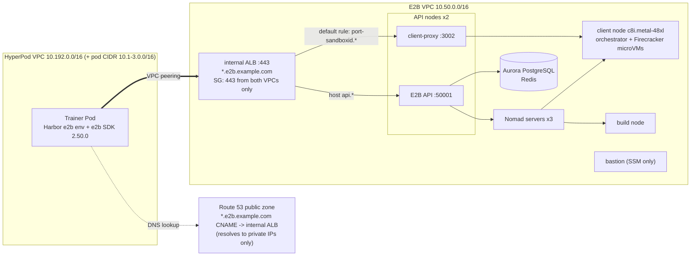

[한국어](ko/03a-sandbox-e2b.md)

# 03a. Method A: E2B sandbox (self-hosted E2B on AWS)

In this step you deploy E2B, used as rollout sandbox A, as a self-hosted installation in the same AWS account and Region (us-west-2), and connect it so that the training Pod on HyperPod uses it through Harbor's built-in `e2b` environment. Finally, you prebuild the templates and run oracle validation to confirm that all 56 tasks work.

- Self-hosted implementation: [`aws-samples/sample-e2b-on-aws`](https://github.com/aws-samples/sample-e2b-on-aws) pinned to commit `830b516` (full SHA `830b516a47b5ecbe86bb981d4816927145280e22` in `deploy.sh`), `x86_64`, client node `c8i.metal-48xl`
- Harbor code is not modified. Two environment variables in the training Pod, `E2B_API_KEY` and `E2B_DOMAIN`, switch between self-hosted and E2B Cloud (section 8).
- All measurements in this guide were taken on self-hosted E2B only. The results are in [`05-comparison.md`](05-comparison.md).

Estimated time: `deploy.sh` 1 to 1.5 hours (mostly waiting), peering and Secret a few minutes, template prebuild and oracle validation a few minutes to a few tens of minutes each

## 0. Prerequisites

| Item | Details |
|---|---|
| Domain | One domain with a public Route 53 hosted zone (section 2) |
| EC2 quota | Running On-Demand Standard instances (`L-1216C47A`) about 230 vCPUs ([`00-prerequisites.md`](00-prerequisites.md) section 2) |
| HyperPod cluster | [`01-hyperpod-eks.md`](01-hyperpod-eks.md) completed, including section 6 (`setup-access.sh`; `RUNTIME_ID` is not needed for E2B). VPC Name tag `harbor-rl-hp-VPC`, namespace `harbor-rl`, ServiceAccount `trainer`, Pod Identity role `harbor-rl-trainer-pod` |
| Task image | `harbor-rl/tasks-base:v2` from [`02-tasks-and-images.md`](02-tasks-and-images.md) (including the linux/amd64 variant) |
| Trainer image | `TAG=v12 ./training/build-image.sh` from [`04-grpo-training.md`](04-grpo-training.md) section 3. This script also creates the project S3 bucket `harbor-rl-sandbox-<ACCOUNT_ID>-us-west-2` (`deploy.sh` uploads the CloudFormation template to this bucket) |
| Local tools | AWS CLI v2, `kubectl`, `python3`, `curl`. The Session Manager plugin is not needed (only SSM Run Command is used) |

Fixed cost: self-hosted E2B costs about $11.11/hour while it is running, even with no sandboxes up [estimated]. The formula is in [`05-comparison.md`](05-comparison.md).

## 1. Architecture

The CloudFormation stack (`harbor-rl-e2b`) created by `deploy.sh` creates a new VPC (10.50.0.0/16), a bastion, an internal ALB, and the database, and the bastion then deploys the remaining E2B components through the sample's deployment chain (Packer, Terraform, Nomad).

| Component | Instance / service | Role |
|---|---|---|
| Nomad servers x3 | `t3.xlarge` | Nomad/Consul control plane |
| API nodes x2 | `t3.xlarge` | E2B REST API (`api.<E2B_DOMAIN>`, :50001) and client-proxy (:3002) |
| Client node x1 | `c8i.metal-48xl` | orchestrator + Firecracker microVMs (sandboxes). Bare metal because Firecracker requires KVM |
| Build node x1 | `m8i.4xlarge` | Template builds (image pull, rootfs creation) |
| Bastion | `c7i.xlarge` | Runs the deployment chain. Managed only through SSM, no SSH |
| DB / cache | Aurora PostgreSQL Serverless, ElastiCache Redis | Teams, API keys, tiers, template metadata |
| Load balancer | Internal ALB (ACM wildcard certificate, HTTPS 443) | Entry point for `*.<E2B_DOMAIN>` |
| NAT gateway | 1 | Outbound traffic from the nodes (image pulls and so on) |



The SDK connects to two kinds of addresses.

- API: `https://api.<E2B_DOMAIN>`. Sandbox creation and template builds. A host rule on the ALB routes these to the API nodes.
- Sandbox: `https://<port>-<sandbox_id>.<E2B_DOMAIN>` (command execution and file transfer use envd port 49983). The ALB default rule routes these to the client-proxy (:3002) on the API nodes, and the client-proxy forwards them to the corresponding sandbox on the client node.

For this reason, a single wildcard `*.<E2B_DOMAIN>` CNAME points to the internal ALB instead of individual records. The name resolves on the internet, but the result is only private IPs (10.50.x.x), so it cannot be reached from the internet, and the training Pod reaches it through VPC peering. For the same reason, run the E2B SDK or CLI inside the VPC (training Pod, bastion), not on your laptop.

## 2. Preparing the domain

Self-hosted E2B distinguishes the API and each sandbox by host name, so you need **a domain with a public Route 53 hosted zone**. This is because an ACM wildcard certificate is issued with DNS validation and a wildcard record is created.

- Create a subdomain of your own domain (for example, `sandbox.example.com`) as a Route 53 public hosted zone, and delegate it with NS records in the parent DNS.
- This guide uses `DOMAIN=<hosted zone name>` and `E2B_DOMAIN=e2b.<DOMAIN>` (for example, `e2b.example.com`).
- If you use a company domain, check your domain policy first. This guide uses an internal ALB so that endpoints that respond without authentication (for example, the E2B API's `/health`) are not exposed to the internet (section 6).
- Because the domain does not send mail, add anti-spoofing records (null MX, SPF `-all`, DMARC `reject`). `deploy.sh` adds them automatically.

## 3. Deployment

### 3.1 Stack and deployment chain: `deploy.sh`

```bash
export AWS_REGION=us-west-2
DOMAIN=example.com ./infra/e2b-selfhosted/deploy.sh   # E2B_DOMAIN defaults to e2b.example.com
```

[`infra/e2b-selfhosted/deploy.sh`](../infra/e2b-selfhosted/deploy.sh) is idempotent. If it fails partway, fix the cause and run the same command again; it skips completed steps and continues. It automates the following.

| Step | Details |
|---|---|
| 0 | Upsert anti-spoofing records: MX `0 .` and SPF `v=spf1 -all` on `<DOMAIN>` and `<E2B_DOMAIN>`, `p=reject` on `_dmarc.<DOMAIN>` |
| 1 | Download `e2b-setup-env.yml` from the pinned commit (full SHA, so the reference cannot move), upload it to the project S3 bucket, and create the stack from that URL (template version pinned). The bucket name is predictable, so the upload passes `--expected-bucket-owner <ACCOUNT_ID>` and fails if another account owns a bucket with that name |
| 2 | Create the EC2 key pair `harbor-rl-e2b-bastion` that the template requires. The private key is discarded (nothing is written to `~/.ssh`); the bastion is reached only through SSM, so no SSH credential exists |
| 3 | Create the stack: `Environment=dev`, `Architecture=x86_64`, `ClientInstanceType=c8i.metal-48xl`, `VpcBlock=10.50.0.0/16` (so it does not overlap the HyperPod VPC), `PublicAccess=Private` (internal ALB), `AllowRemoteSSHIPs=127.0.0.1/32` (no SSH from anywhere), `AutoDeploy=false`. The script generates the DB password and passes it only through a temporary 0600 parameter file that it deletes immediately (it never appears on the command line; the stack stores it in Secrets Manager). The template declares `DBPassword` as `NoEcho` (checked at the pinned commit), so CloudFormation does not show it in stack parameters |
| 4 | Add the DNS validation CNAME for the ACM certificate that the stack waits on to Route 53, and after the stack completes, upsert the `*.<E2B_DOMAIN>` CNAME to the internal ALB DNS name |
| 5 | Once the bastion registers with SSM, start the sample's deployment chain (`deploy-all.sh`: packer, terraform, init-db, build, prepare, deploy, create-template) from the pinned commit in the background through SSM Run Command, and check the completion markers every 2 minutes. The deployment log `/tmp/e2b.log` is created with mode 600 before the chain starts, because the chain prints the team API key into it until `finalize.sh` redacts it |
| 6 | Run [`finalize.sh`](../infra/e2b-selfhosted/finalize.sh) (section 3.3) |

In step 5, the script adds two settings that are missing from the sample's unattended execution path.

- `HOME=/root`: the cloud-init/SSM path has no `HOME`, so Go in the `init-db` step cannot determine its cache directory and exits.
- `git config --global --add safe.directory /opt/infra/sample-e2b-on-aws`: the repository is owned by `ubuntu` but the chain runs as root, so git rejects the repository, the commit hash in the image tag becomes empty, and the `build` step fails.

> If you do not specify `ClientInstanceType`, the sample default (`c5.metal`) is used. This guide specifies `c8i.metal-48xl` explicitly (changeable with the `CLIENT_INSTANCE_TYPE` environment variable).

### 3.2 Checking progress: `status.sh`

```bash
./infra/e2b-selfhosted/status.sh
```

Through SSM, this shows the completion markers on the bastion (`/opt/.e2b-step-*.done`) and the last 15 lines of the deployment log (`/tmp/e2b.log`). No SSH is needed. Because the output remains in the SSM command history, lines containing `api key`, `token`, `password`, or `secret` are filtered out on the bastion before being returned. If `deploy.sh` ended in failure, use this output to find the cause, fix it, and run `deploy.sh` again.

The three scripts (`status.sh`, `finalize.sh`, `db-query.sh`) use the shared helper [`bastion.sh`](../infra/e2b-selfhosted/bastion.sh). It sends the script body base64-encoded through SSM `AWS-RunShellScript` and waits for the result. Because the body and output remain in the SSM history, secret values are never placed in the body; they are read from Secrets Manager inside the bastion and never printed.

### 3.3 Team tier and API key: `finalize.sh`

`deploy.sh` runs this automatically at the end. It is also safe to run again separately.

```bash
./infra/e2b-selfhosted/finalize.sh
```

1. **Adjust the team tier.** The sample creates team tier `base_v1` with a maximum session of 1 hour and 20 concurrent sandboxes. Harbor's E2B environment creates sandboxes with a 24-hour timeout (`harbor/environments/e2b.py:227-236`, `timeout=86_400`), so if left unchanged every creation fails with `400: Timeout cannot be greater than 1 hours`. The script changes these to `max_length_hours = 24` and `concurrent_instances = 1000` (changeable with `MAX_HOURS` and `MAX_SANDBOXES`). 1,000 is set large enough that node capacity becomes the actual limit.
2. **Team API key to Secrets Manager.** Inside the bastion, the `teamApiKey` in `/opt/config.properties` is stored in the Secrets Manager secret `harbor-rl-e2b/team-api-key` (tag `Project=harbor-rl-sandbox`). The key is not printed, so it does not remain in the SSM command history.
3. **Clean up logs and files.** The key printed by the sample's deployment log (`/tmp/e2b.log`) is replaced with `<redacted>`, and `/opt/config.properties` and the DB configuration file are made root-only with `chmod 600`.

To query the DB directly, use [`db-query.sh`](../infra/e2b-selfhosted/db-query.sh). It runs a single SQL statement on the bastion through SSM; the DB credentials are read from Secrets Manager on the bastion and never leave it. Do not query credential columns.

```bash
./infra/e2b-selfhosted/db-query.sh "select id, max_length_hours, concurrent_instances from tiers"
```

### 3.4 VPC peering and ALB restriction: `peer.sh`

```bash
./infra/e2b-selfhosted/peer.sh
```

What [`peer.sh`](../infra/e2b-selfhosted/peer.sh) (idempotent) does:

- Creates and accepts the peering connection `harbor-rl-e2b-to-hp` between the E2B VPC (the stack's `VPC` resource, 10.50.0.0/16) and the HyperPod VPC (Name tag `harbor-rl-hp-VPC`).
- Adds routes for **all associated CIDRs** of the peer VPC (including HyperPod's 10.192.0.0/16 and the secondary Pod CIDRs 10.1.0.0/16, 10.2.0.0/16, 10.3.0.0/16), asymmetrically:
  - HyperPod side: every route table except those associated with a gateway and the AgentCore isolated route table (`harbor-rl-agentcore-isolated`) gets the route to the E2B VPC, so nodes and pods can reach the ALB.
  - E2B side: only the route tables of the internal ALB's subnets get the route back to the HyperPod VPC. Peering routes in any other E2B route table (sandbox client node, Nomad servers, API nodes) are removed, so those hosts have no path to HyperPod. The E2B VPC's regional NAT gateway route table is associated with a gateway and rejects peering routes in any case.
- HyperPod node security groups admit only their own members, so even over the peering connection E2B hosts cannot open connections to HyperPod nodes or pods. Traffic flows only from HyperPod to the ALB and back.
- **Restricts the ALB security group.** The sample opens the ALB security group on 80 and 443 from 0.0.0.0/0 regardless of the `PublicAccess` value (`PublicAccess` only changes the ALB scheme). Sandbox hosts respond without authentication to anyone who can reach the ALB, so the script revokes the 0.0.0.0/0 and ::/0 rules on both ports and allows only HTTPS 443 from the CIDRs of the two VPCs (there is no listener on 80). It then reads the security group back and exits with an error if any rule is still open to 0.0.0.0/0 or ::/0.

### 3.5 Kubernetes Secret: `set-secret.sh`

```bash
export KUBECONFIG=$HOME/.kube/harbor-rl-hp
E2B_DOMAIN=e2b.example.com ./infra/e2b-selfhosted/set-secret.sh
```

[`set-secret.sh`](../infra/e2b-selfhosted/set-secret.sh) reads the team API key from Secrets Manager and writes it to the Kubernetes Secret `sandbox-secrets` (namespace `harbor-rl`) as `E2B_API_KEY` and `E2B_DOMAIN`. The key is passed only through a pipe and never appears on screen or on disk. The Secret is written with server-side apply (`kubectl apply --server-side --force-conflicts --field-manager=harbor-rl`), so no `last-applied-configuration` annotation keeps a copy of the values. Run it after `setup-access.sh` ([`01-hyperpod-eks.md`](01-hyperpod-eks.md) section 6), which creates the namespace. Because the apply replaces all of the Secret's data, `HF_TOKEN` is set from the environment variable if present, and otherwise the existing Secret's value is written back unchanged. The Job manifest ([`infra/k8s/job.yaml`](../infra/k8s/job.yaml)) injects all three values with `optional: true`.

Changes to the Secret are not reflected in Pods that are already running. Resubmit the Job.

### 3.6 Rotating the API key

```bash
ROTATE=1 ./infra/e2b-selfhosted/finalize.sh               # new team API key (old key stops working)
E2B_DOMAIN=e2b.example.com ./infra/e2b-selfhosted/set-secret.sh
TAG=v12 ./infra/k8s/submit.sh e2b-prebuild 0 python3 bench/prebuild_e2b_templates.py \
  --image <ACCOUNT_ID>.dkr.ecr.us-west-2.amazonaws.com/harbor-rl/tasks-base:v2   # rebuild templates (3.8)
```

`ROTATE=1` reruns the sample's `init-db.sh` on the bastion to create a new team (new team ID and new API key). The old key stops working and **the old team's templates are also deleted**, so you must rebuild the templates. In the same run, the tier adjustment, the Secrets Manager update, and the log cleanup are applied as well. Follow this procedure if you suspect the key has been exposed.

### 3.7 Checking connectivity and egress

Because the ALB is internal, checks are done from inside the cluster. Start a short-lived debug Job.

```bash
TAG=v12 ./infra/k8s/submit.sh e2b-debug 0 sleep 7200
kubectl -n harbor-rl wait --for=condition=Ready pod -l job-name=e2b-debug --timeout=600s
kubectl -n harbor-rl exec job/e2b-debug -- bash -c '
  getent hosts api.$E2B_DOMAIN                                                       # expect 10.50.x.x
  curl -s -o /dev/null -w "%{http_code}\n" https://api.$E2B_DOMAIN/health            # expect 200
  curl -s -o /dev/null -w "%{http_code}\n" https://api.$E2B_DOMAIN/templates'        # expect 401 (no key)
```

If the name resolves to 10.50.x.x but you cannot connect, check the peering routes (3.4) and the ALB security group.

Checking that egress is blocked (after the template prebuild in 3.8): using the same harness as training, start a sandbox for one task and check that outbound connections fail while task data is readable.

```bash
TAG=v12 ./infra/k8s/submit.sh egress-e2b 0 python3 bench/egress_check.py --sandbox e2b
kubectl -n harbor-rl logs -f job/egress-e2b
# expect: "network policy: no-network", the https, pypi and s3 checks fail, "egress blocked: True | data readable: True"
```

[`bench/egress_check.py`](../bench/egress_check.py) runs three network checks (`https`: `curl https://example.com`, `pypi`: Python `urlopen('https://pypi.org')`, `s3`: a public object in another account's S3 bucket) and one data check. On E2B, all three network checks fail at the DNS resolution stage (`curl` reports `Resolving timed out`). This is because the harness passes the task's `network_mode = "no-network"` to Harbor, and the Harbor E2B environment translates it into `allow_internet_access=False` when creating the sandbox (section 6).

### 3.8 Template prebuild

For each task, the Harbor E2B environment looks up the template alias `{task short name}__{12-character hash of environment/ contents}` (`/` replaced with `__`, `.` with `-`, `harbor/environments/e2b.py:105-108`), and if it does not exist, builds it directly with `Template().from_image(image)` (no registry credentials) or `from_dockerfile` (`:180-214`). The task Dockerfiles in this guide use a private ECR image (`FROM ${BASE_IMAGE}`), so Harbor cannot build them directly.

So [`bench/prebuild_e2b_templates.py`](../bench/prebuild_e2b_templates.py) builds the templates in advance.

- It computes the alias, CPU, and memory by **actually instantiating Harbor's `E2BEnvironment` object** (`harbor_alias`, `:29-45`). As a result, the names always match what Harbor looks up during training.
- For the ECR password, only the 12-hour token (user name `AWS`) obtained with `ecr:GetAuthorizationToken` is passed in the build request (`ecr_password` and `build_one`, `:55-71`). No long-lived AWS keys are passed to E2B.
- It sets the shared sandbox warm-up [`tasks/image/warmup.sh`](../tasks/image/warmup.sh) as the template start command, with the ready check `test -f /tmp/.harbor-warmup-done` (`WARMUP_START_CMD`, `:48-52`, and `set_start_cmd`, `:67-68`). E2B snapshots the template after the start command finishes, so every sandbox starts with the task libraries imported once and the task data read. The same script runs before the AgentCore V2 snapshot ([`03b-sandbox-agentcore.md`](03b-sandbox-agentcore.md) section 4), following the AgentCore V2 optimization guidance; it only reads files and creates no per-session state.
- It builds from the linux/amd64 variant of the shared image. Each `task.toml`'s `cpus = 2` and `memory_mb = 4096` go into the template as is.
- Existing aliases are skipped (rebuild with `--force`, also after changing `warmup.sh`). The number of concurrent builds is `--parallel` (default 8).

```bash
TAG=v12 ./infra/k8s/submit.sh e2b-prebuild 0 python3 bench/prebuild_e2b_templates.py \
  --image <ACCOUNT_ID>.dkr.ecr.us-west-2.amazonaws.com/harbor-rl/tasks-base:v2
kubectl -n harbor-rl logs -f job/e2b-prebuild     # last line: "templates: 56 ok, 0 failed"
```

For this purpose, the training Pod role has only `ecr:GetAuthorizationToken` and pull on the single `harbor-rl/tasks-base` repository (`EcrTokenForE2BTemplateBuild` and `PullTaskBaseImage` in [`infra/iam/trainer-pod-policy.json`](../infra/iam/trainer-pod-policy.json)). Run the prebuild only as this Kubernetes Job. The ECR token is handed to the E2B template builder, and a token obtained with the Pod role can only pull that one repository; running the script locally with broader credentials would hand over a token that can pull every repository those credentials can read. The image build happens remotely on the E2B build node, so local Finch or Docker is not needed.

If you change a task's `environment/`, the hash and therefore the alias change, so run this step again.

### 3.9 Oracle validation

```bash
TAG=v12 ./infra/k8s/submit.sh oracle-e2b 0 python3 bench/oracle_check.py --sandbox e2b
kubectl -n harbor-rl logs -f job/oracle-e2b       # last line: "[e2b] oracle passed 56/56 -> ..."
```

[`bench/oracle_check.py`](../bench/oracle_check.py) uses the same harness as training (`training.harness:TimedBashEnv`) to start a sandbox for each task, uploads `solution/`, runs `bash /solution/solve.sh`, and records the verifier reward in a CSV (`/results/oracle/oracle_e2b_<timestamp>.csv`). All 56/56 must pass before moving on to the next step. For failed tasks, the cause is recorded in the CSV's `error` column. The measurement results are in [`05-comparison.md`](05-comparison.md).

## 4. Behavior of the Harbor E2B environment (Harbor 0.23.0)

This section summarizes only what you need to interpret the comparison results (`harbor/environments/e2b.py`).

| Item | Behavior |
|---|---|
| Sandbox creation | `AsyncSandbox.create(template=<alias>, timeout=86_400, allow_internet_access=..., network=...)` (`:221-236`). One retry on failure |
| Command execution | Starts with `commands.run(background=True)` and then `wait()`. Only connection establishment errors (`ConnectError`, `ConnectTimeout`, `PoolTimeout`) and 429 are attempted up to 3 times (`:46-56`, `:432-462`). A command that has already started is not resent. No stdin is provided |
| Upload | `upload_dir` calls `files.write_files` in batches of 20 files |
| Download | `download_dir` walks recursively with `files.list` and calls `files.read` once per file |
| Termination | `stop(delete)` calls `kill()` regardless of the `delete` value (`:280-297`) |
| Network | Declares `disable_internet=True` and allowlist support in `capabilities` (`:123-138`) |

The AgentCore environment moves a directory as a single tar.gz, so file transfer figures include this implementation difference (noted in `05-comparison.md`).

When the training process exits, TRL's `HarborEnv.__del__` can stop before cleanup, and Harbor creates sandboxes with a 24-hour timeout, so leftover sandboxes keep consuming resources. The exit hook in [`training/harness.py`](../training/harness.py) (`:186-196`) calls `kill` on all live sandboxes.

## 5. Pinning the SDK version: `e2b==2.50.0`

The trainer image pins `e2b==2.50.0` ([`training/Dockerfile`](../training/Dockerfile)). E2B Python SDK 2.51.0 uses `POST /v2/sandboxes` to create sandboxes, but the API of this self-hosted version does not provide that path, so creation fails with `404 ... method not allowed`. 2.50.0 uses `POST /sandboxes`. The template build API is not affected, so the symptom is that templates get built but sandboxes do not start.

General principle: **with self-hosted E2B, pin the SDK version to match the deployed server version**. E2B Cloud serves the latest API, but a self-hosted server stays at the version from deployment time. If you change the sample commit, check the SDK version again.

## 6. Security

| Item | Configuration in this guide |
|---|---|
| Exposure | `PublicAccess=Private` gives the ALB an internal scheme. Public DNS exposes only private IPs. `peer.sh` restricts the ALB security group to HTTPS 443 from the two VPCs (removing the rules open to all IPv4 and IPv6 addresses) and exits with an error if a rule open to the internet remains. Sandbox hosts respond without authentication once traffic reaches the ALB, so this restriction matters |
| Administrative access | `AllowRemoteSSHIPs=127.0.0.1/32`, so there is no SSH path. The bastion is managed only through SSM Run Command. The key pair is created because the template requires it, and its private key is discarded at creation |
| API key | Stored directly into Secrets Manager from the bastion (not left in the SSM history), redacted from the sample's logs (`/tmp/e2b.log` is mode 600 from the start), configuration files root-only. Delivered to the cluster only as a Kubernetes Secret by `set-secret.sh` (server-side apply). The prebuild Job hands E2B only a 12-hour ECR token that can pull one repository. Rotation in section 3.6 |
| DB password | Passed to CloudFormation through a temporary 0600 file rather than the command line (`NoEcho` parameter), and kept in Secrets Manager by the stack. `db-query.sh` also reads it only inside the bastion |
| Sandbox egress | Every `task.toml` has `[environment] network_mode = "no-network"`. TRL's Harbor integration does not pass a network policy, so the harness computes the task policy with Harbor's `resolve_agent_env_baseline` and passes it as `network_policy=` ([`training/harness.py:111-125`](../training/harness.py)). The Harbor E2B environment puts this into the creation request as `allow_internet_access=False` (`e2b.py:232-234`). If an environment cannot enforce the policy, Harbor rejects the task when the environment is created (`harbor/environments/base.py:776-790`) |
| Network path from E2B to HyperPod | Only the ALB subnets have a route back to the HyperPod VPC, and HyperPod node security groups admit only their own members, so sandbox hosts cannot open connections to HyperPod nodes or pods (section 3.4) |
| Supply chain | The sample is pinned to a full commit SHA, and the template upload checks bucket ownership (`--expected-bucket-owner`) |
| Orchestrator | The sample deploys with Nomad ACLs enabled |
| Training Pod permissions | EKS Pod Identity. The only AWS permissions needed on the E2B side are the ECR token for template builds and pull on `tasks-base` |

An E2B team API key cannot be scoped per action the way IAM can. Whoever holds the key can manage all of that team's sandboxes and templates, so do not take the key outside the paths above.

## 7. Cost

Self-hosted cost is not per-second sandbox billing but **the infrastructure cost while it is running**: client node `c8i.metal-48xl` (the largest), 3 Nomad servers and 2 API nodes (`t3.xlarge`), build node (`m8i.4xlarge`), bastion, Aurora Serverless, ElastiCache Redis, NAT gateway, and ALB. The same cost is incurred even with no sandboxes running, so the lower the utilization, the higher the cost per rollout. The cost per rollout and break-even calculations against E2B Cloud and AgentCore are in [`05-comparison.md`](05-comparison.md), and the deletion procedure is in [`06-cleanup.md`](06-cleanup.md).

## 8. Alternative: E2B Cloud (not measured in this guide)

| Item | Self-hosted (this guide) | E2B Cloud |
|---|---|---|
| Infrastructure | All of sections 1 to 3 | None |
| Configuration | `E2B_API_KEY` + `E2B_DOMAIN` | `E2B_API_KEY` only. Without `E2B_DOMAIN`, the SDK default domain is used |
| Concurrent sandboxes | Tier DB value (adjusted to 1,000); the actual limit is node capacity | Hobby 20, Pro 100 (can be increased with add-ons) [documented] |
| Maximum session | Tier DB value (adjusted to 24 hours) | Hobby 1 hour, Pro 24 hours [documented] |
| Creation rate | Set by the operator | Hobby 1/s, Pro 5/s [documented] |
| Templates | Private ECR + short-lived token, built inside the account | The same script can be used. However, the 12-hour ECR token is passed to an external service |
| Data location | VPC inside the account | Task data and command output leave the account (to E2B) |
| Billing | Always-on cost of EC2, Aurora, and so on | vCPU-second $0.000014, GiB-second $0.0000045 [documented] |

How to switch: put an E2B Cloud key in `E2B_API_KEY` and rerun `./infra/k8s/setup-access.sh` from [`01-hyperpod-eks.md`](01-hyperpod-eks.md) section 6. If you also use AgentCore, keep `RUNTIME_ID` set: the script rewrites the role policy, and without it the AgentCore statement is left out. The script keeps the Secret's other keys, so remove the `E2B_DOMAIN` set for self-hosted yourself.

```bash
export E2B_API_KEY=<your E2B Cloud key>
RUNTIME_ID=<runtime id> ./infra/k8s/setup-access.sh   # keep RUNTIME_ID if you also use AgentCore
kubectl -n harbor-rl patch secret sandbox-secrets --type=json -p='[{"op":"remove","path":"/data/E2B_DOMAIN"}]'
```

Then run sections 3.8 and 3.9 as is. Sections 2 through 3.6 and the version pinning in section 5 are not needed (the latest SDK can be used).

The Harbor E2B environment creates sandboxes with a 24-hour timeout and the concurrency sweep goes up to 128, so reproducing this guide on E2B Cloud requires Pro or higher (including the concurrency add-on). On the Hobby tier, creation may be rejected because of the 1-hour maximum session limit.

E2B Cloud hourly cost of a 2 vCPU / 4 GiB sandbox [estimated]: `(2 x 0.000014 + 4 x 0.0000045) x 3600 = 0.000046 x 3600 = about $0.166/hour`.

## 9. Common pitfalls

| Symptom | Cause | Fix |
|---|---|---|
| Templates build but sandbox creation fails with `404 ... method not allowed` | SDK 2.51.0 and later create with `POST /v2/sandboxes`, which this self-hosted server does not provide | Pin `e2b==2.50.0` (section 5) |
| Every creation fails with `400: Timeout cannot be greater than 1 hours` | The sample's default tier `base_v1` is 1 hour / 20 concurrent, while Harbor creates with 24 hours | `finalize.sh` (section 3.3) |
| Deployment chain exits at `init-db` with `GOCACHE is not defined ...` | No `HOME` in the unattended execution path | `deploy.sh` sets `HOME=/root`. Do the same if you run the sample chain yourself |
| `e2b-core/client-proxy:` invalid reference in the `build` step | git running as root rejects the `ubuntu`-owned repository, so the commit hash is empty | `deploy.sh` sets `safe.directory` |
| E2B SDK or CLI cannot connect from a laptop | Internal ALB; public DNS returns only private IPs | Run from the training Pod or the bastion |
| ALB security group is 0.0.0.0/0 even with `PublicAccess=Private` | The sample's `PublicAccess` changes only the ALB scheme | `peer.sh` allows only 443 from the two VPCs |
| `deploy.sh` fails at the template upload with `AccessDenied` or a 403 | `--expected-bucket-owner` found that the project bucket name is owned by another account (or the bucket does not exist yet) | Run `training/build-image.sh` first, which creates the bucket in your account; if another account owns the name, do not use it |
| `peer.sh` exits with `ALB security group ... is still open to the internet` | A 0.0.0.0/0 or `::/0` rule was not removed (for example, a rule added on another port or in another form) | Find the remaining rule in the console or with `aws ec2 describe-security-groups`, remove it, and rerun `peer.sh` |
| Connections from an E2B host (for example, the client node) to HyperPod addresses fail | Intended. On the E2B side only the ALB subnets have a route to HyperPod, and HyperPod node security groups admit only their own members | Connections always start from the HyperPod side (training Pod) toward the ALB |
| Client node is created as `c5.metal` | Sample default when `ClientInstanceType` is not specified | Specify it explicitly as `deploy.sh` does |
| The bastion SSH key cannot be found | `deploy.sh` does not keep the key pair's private key | Access the bastion through SSM Run Command (the `bastion.sh` based scripts) |
| `create-route` fails on one route table | The gateway route table for the NAT gateway rejects peering routes | Exclude that table (handled in `peer.sh`) |
| From the training Pod, `api.<E2B_DOMAIN>` resolves to a private IP but the connection times out | Missing peering route (especially for Pod CIDRs) or the ALB security group | Rerun `peer.sh`, check section 3.7 |
| Harbor tries to build a template itself and fails | The alias does not exist. Task Dockerfiles are based on private ECR, so Harbor cannot build without credentials. Changing `environment/` also changes the alias | Rerun the prebuild in section 3.8 |
| After key rotation, every creation fails to find templates | `ROTATE=1` recreates the team and deletes the old team's templates | Rebuild templates as in section 3.6 |
| Sandboxes remain after the training process exits | Harbor creates with a 24-hour timeout, and TRL `HarborEnv.__del__` can stop before cleanup | The exit hook in `training/harness.py` calls `kill` on live sandboxes |
| Default memory differs between E2B documents | Inconsistency across documents | Specify `cpus = 2` and `memory_mb = 4096` in `task.toml` |

Sources and check dates are in [`references.md`](references.md).

## Next steps

- [`03b-sandbox-agentcore.md`](03b-sandbox-agentcore.md): Method B (AgentCore Runtime)
- [`04-grpo-training.md`](04-grpo-training.md): Run GRPO training with `--sandbox e2b`
