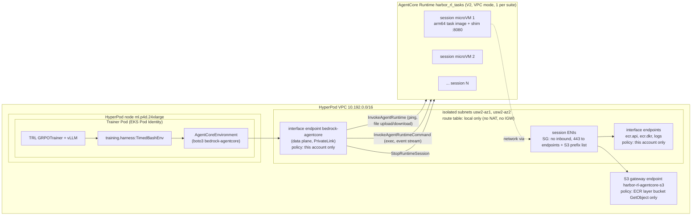

[한국어](ko/03b-sandbox-agentcore.md)

# 03b. Method B: Amazon Bedrock AgentCore Runtime sandbox

In this step you use Amazon Bedrock AgentCore Runtime sessions as Harbor sandboxes. There are five things to prepare.

1. An isolated network with no internet path (`agentcore/network.sh`)
2. A small service contract shim attached to the task image (`agentcore/shim/main.go`)
3. One runtime shared by the entire task suite (`agentcore/deploy_runtime.sh`)
4. A Harbor `BaseEnvironment` implementation (`agentcore/harbor_agentcore/environment.py`)
5. A harness that connects it to training without forking TRL (`training/harness.py`)

Estimated time: network a few minutes, image build/push a few minutes (when the shared base image already exists), waiting for the runtime to become READY a few minutes

## 0. Prerequisites

| Item | Details |
|---|---|
| HyperPod cluster | [`01-hyperpod-eks.md`](01-hyperpod-eks.md) completed, including section 6 (`setup-access.sh` run without `RUNTIME_ID` is fine; section 5 below reruns it with the runtime ID). VPC Name tag `harbor-rl-hp-VPC` (primary CIDR 10.192.0.0/16) |
| Task image | `harbor-rl/tasks-base:v2` from [`02-tasks-and-images.md`](02-tasks-and-images.md) (including the linux/arm64 variant) |
| Trainer image | For the oracle validation Job. `TAG=v12 ./training/build-image.sh` from [`04-grpo-training.md`](04-grpo-training.md) section 3 |
| Local tools | AWS CLI 2.36.46 or later (supports `--platform-version`), Finch (or Docker), `envsubst` (gettext) |
| Quota | AgentCore active sessions of 128 or more (the maximum of the concurrency sweep). Defaults in section 7 |

## 1. Why a custom environment

Harbor has no official AgentCore provider (checked 2026-09-30). Harbor issue [#3446](https://github.com/harbor-framework/harbor/issues/3446) proposes a provider, but it is still open and no provider has been merged. Harbor can accept a class that implements `BaseEnvironment` via an import path (`module:Class`), so this repository contains a single environment class without modifying Harbor.

Reference implementations and licenses:

| Reference implementation | License | In this repository |
|---|---|---|
| [`mightma/harbor@acr-kit-v1`](https://github.com/mightma/harbor/tree/acr-kit-v1) (commit `4ee0cb25`) | Apache-2.0 | The shim's health handshake, command wrapping rules, and streaming handling pattern are reused with attribution |
| [`awslabs/agentcore-rl-toolkit`](https://github.com/awslabs/agentcore-rl-toolkit) (`agentcore-sandboxd`) | Apache-2.0 | The original source that the branch above drew from. Attributed |
| [`mightma/harbor-on-agentcore`](https://github.com/mightma/harbor-on-agentcore) | No LICENSE file | Design reference only. **No code copied** |

Attribution is in `agentcore/shim/main.go:13-17` and `agentcore/harbor_agentcore/environment.py:18-20`. Points where this implementation differs from the references (always `StopRuntimeSession`, no `HealthyBusy` reporting, stdin blocked, `platformVersion V2`, VPC mode) are explained in the sections below.

## 2. Architecture



- **One rollout = one session.** The first call with a new `runtimeSessionId` makes the service start one microVM. The policy model is called only inside the trainer Pod, and the session handles only command execution and the verifier (the external agent pattern of the TRL Harbor integration). No network path from the session back to vLLM is needed.
- **One runtime for the whole suite.** A runtime points to one image. The 56 tasks in this guide use one shared base image, so there is one runtime. If tasks use different images, deduplicate by image content to reduce the number of runtimes, and check the per-account runtime quota (section 7).
- **VPC mode, no internet.** The session's network interfaces are placed in isolated subnets inside the HyperPod VPC, and the route table of these subnets has only the local route. Code generated by the model cannot reach the internet; only image pulls and log delivery go through VPC endpoints, and each endpoint's policy limits what can be done there (section 3.1). Network settings are **per runtime**, so internet access cannot be turned on or off per session. To mix tasks that need the internet with tasks that do not, use separate runtimes.
- **Private path from the trainer.** The trainer Pod calls the AgentCore data plane (`InvokeAgentRuntime`, `InvokeAgentRuntimeCommand`, `StopRuntimeSession`) through an interface endpoint for `com.amazonaws.us-west-2.bedrock-agentcore` with private DNS [documented], so the calls stay inside the VPC, just as the E2B calls go through VPC peering to an internal ALB ([`03a-sandbox-e2b.md`](03a-sandbox-e2b.md) section 3.4).

## 3. Isolated network: `network.sh`

```bash
export AWS_REGION=us-west-2
./agentcore/network.sh      # idempotent; prints SUBNETS=... and SESSION_SG=...
```

`deploy_runtime.sh` calls this script, so you do not need to run it separately. Resources that [`agentcore/network.sh`](../agentcore/network.sh) creates in the HyperPod VPC (all tagged `Project=harbor-rl-sandbox`):

| Resource | Settings | Reason |
|---|---|---|
| Route table `harbor-rl-agentcore-isolated` (`:26-32`) | Local route only | No NAT or internet gateway route, so sessions have no internet |
| 2 subnets (`:34-47`) | AZ IDs `usw2-az1`, `usw2-az2`, CIDRs `10.192.96.0/24`, `10.192.112.0/24` | VPC mode subnets must be in AZ IDs supported by AgentCore (us-west-2: `usw2-az1`, `usw2-az2`, `usw2-az3`) [documented]. The CIDRs are unused ranges in the HyperPod VPC's primary CIDR. Changeable with `AZ_IDS` and `CIDRS` |
| Session security group `harbor-rl-agentcore-sessions` (`:60-70`) | No inbound. Removes the default allow-all egress and allows HTTPS 443 only to the endpoint security group and the S3 managed prefix list (`com.amazonaws.us-west-2.s3`) | ECR image layers come from S3, so 443 to the S3 gateway endpoint is required. A gateway endpoint is specified by prefix list, not by IP |
| Endpoint security group `harbor-rl-agentcore-endpoints` (`:71-79`) | Allows HTTPS 443 from the session security group and all CIDRs of the VPC | Private DNS for interface endpoints applies to the whole VPC, so ECR pulls and log delivery from HyperPod nodes and Pods also go through these endpoints |
| S3 gateway endpoint `harbor-rl-agentcore-s3` (`:91-106`) | A gateway endpoint of its own, associated only with the isolated route table. Endpoint policy: `s3:GetObject` on `arn:aws:s3:::prod-us-west-2-starport-layer-bucket/*` only. The script detaches the isolated route table from any other S3 gateway endpoint in the VPC; the other route tables keep using the VPC's existing S3 endpoint | Required for VPC mode without internet [documented]. The ECR layer bucket is the only S3 resource sessions need (AgentCore devguide, "Minimum S3 bucket permissions for container agents") [documented], so session code cannot read from or write to any other bucket through the endpoint |
| Interface endpoints (`:108-125`) | `ecr.api`, `ecr.dkr`, `logs`, `bedrock-agentcore`, private DNS enabled, in the two isolated subnets. Endpoint policy: any action, only for principals of this account (`aws:PrincipalAccount` = `<ACCOUNT_ID>`) | `ecr.api`, `ecr.dkr` and `logs` are required for VPC mode without internet [documented]. `bedrock-agentcore` is the AgentCore data-plane endpoint (PrivateLink) [documented]: with private DNS, the trainer Pods reach the runtime through it instead of the public endpoint. Private DNS applies to the whole VPC, so nodes and Pods use these endpoints too, with this account's roles. The policy blocks session code from pushing data out through ECR or CloudWatch Logs with another account's credentials |

If the session security group has no egress to the S3 prefix list, image layers cannot be downloaded, and runtime creation or update ends in `UPDATE_FAILED` (reason "internal error").

### 3.1 Endpoint policies

Code inside a session can reach these endpoints, so the endpoint policies limit what it can do there.

| Endpoint | Policy | Scope |
|---|---|---|
| S3 gateway `harbor-rl-agentcore-s3` | Only `s3:GetObject` on `arn:aws:s3:::prod-<region>-starport-layer-bucket/*` | Associated only with the isolated route table. `network.sh` detaches the isolated route table from any other S3 gateway endpoint in the VPC. The other route tables (HyperPod node subnets and so on) keep using the S3 endpoint the VPC already had |
| `ecr.api`, `ecr.dkr`, `logs`, `bedrock-agentcore` interface endpoints | Only principals whose `aws:PrincipalAccount` is this account | Private DNS applies to the whole VPC, so HyperPod nodes and Pods use these endpoints too. They call with this account's roles, so they are not affected. Sessions can reach the `bedrock-agentcore` endpoint as well, but the execution role has no AgentCore data-plane permissions (section 6) |

Verification (2026-10-07): with these endpoint policies, reading an object from another S3 bucket inside an AgentCore session through the endpoint fails with HTTP 403, image pulls work, and the oracle validation (section 9.1) still passes 56/56.

**Residual risk: DNS.** The isolated route table has no internet route, but the VPC resolver (`AmazonProvidedDNS`) still answers queries for public names from these subnets. This is also why, in the egress check of section 9.1, `curl` fails at the connection stage rather than at DNS resolution. Session code can therefore encode data into DNS queries (DNS tunneling). If tasks handle sensitive data, add Route 53 Resolver DNS Firewall to the VPC. It applies to the whole VPC, so it needs an allow list for the names the cluster uses (ECR, S3, STS, EKS, Hugging Face, the E2B domain, and so on). This guide does not configure it.

## 4. Service contract and shim

AgentCore Runtime requires an HTTP service contract (`GET /ping` and `POST /invocations` on port 8080) even when it is used only to run commands [documented]. The task image is just a Python data analysis environment, so a small static Go binary shim is attached as the ENTRYPOINT. Shell commands are executed through `InvokeAgentRuntimeCommand` without going through the shim.

Contract of the shim ([`agentcore/shim/main.go`](../agentcore/shim/main.go)):

| Path | Request | Response |
|---|---|---|
| `GET /ping` | | Always `{"status":"Healthy"}` (`:56-58`) |
| `POST /invocations` | `{"action":"ping"}` | `{"status":"ok"}` |
| | `{"action":"upload","path","data"(base64),"mode"}` | `{"status":"ok","path"}`. Writes to a temporary file in the same directory and then renames it, so no truncated file is left behind on failure (`:60-94`) |
| | `{"action":"download","path"}` | `{"status":"ok","path","data"(base64)}`. A file larger than the shim cap (96 MiB, `maxUploadBytes`) is refused with HTTP 413 instead of being read into memory (`:119-124`) |
| | Anything else | `{"status":"error","error"}` with 4xx/5xx |

Design rationale:

- **It does not report `HealthyBusy`.** The idle timeout does not apply to a session in `HealthyBusy` state, so if a client dies without cleaning up, the session remains and is billed until its maximum lifetime (8 hours). This shim always reports only `Healthy`, so even abandoned sessions end after the idle timeout (15 minutes).
- **Warm-up before listening (`main()` and `warmup()`, `:138-172`).** Before it opens port 8080, the shim runs `/usr/local/share/harbor/warmup.sh` (the shared [`tasks/image/warmup.sh`](../tasks/image/warmup.sh)) and waits for it, at most 90 seconds, well below the 120-second V2 initialization limit. V2 takes the snapshot after the first healthy `/ping`, and `/ping` cannot answer before the shim listens, so the snapshot contains the imported task libraries and the task data read from `/data`. This follows the V2 optimization guide: do expensive, reusable work such as importing dependencies at startup, before the snapshot [documented]. The script only reads files, so no per-session state (random values, time, credentials) is cloned into sessions. A failure or timeout is only logged and costs speed, not correctness. E2B runs the same script as its template start command ([`03a-sandbox-e2b.md`](03a-sandbox-e2b.md) section 3.8).
- **Files are sent through `/invocations`.** `InvokeAgentRuntimeCommand` limits command length to 64 KB, but the `InvokeAgentRuntime` payload allows up to 100 MB [documented]. The shim-side cap is 96 MiB (`maxUploadBytes`, `main.go:34-36`) and applies to both uploads and downloads. The end-to-end limit is lower: the data travels base64-encoded inside the `InvokeAgentRuntime` payload (100,000,000 bytes), so it is about 75 MB of raw data. The shim refuses downloads over 96 MiB with HTTP 413, and files between about 75 MB and 96 MiB fail at the API instead.

### 4.1 Image

[`agentcore/image/Dockerfile`](../agentcore/image/Dockerfile) adds only the shim binary and the warm-up script on top of the arm64 variant of the shared base image. The Go image of the shim build stage is pinned by digest. The task contents are the same as the image used with E2B.

```dockerfile
# agentcore/image/Dockerfile:3-14
ARG BASE_IMAGE
FROM --platform=linux/arm64 golang:1.25-bookworm@sha256:3b4a11519ad929d1e1d261a12cff056f0c85b735253d7d861346b9c6f8b36437 AS shim
WORKDIR /src
COPY shim/main.go .
RUN go mod init agentcore-shim && CGO_ENABLED=0 GOOS=linux GOARCH=arm64 go build -trimpath -ldflags="-s -w" -o /agentcore-shim .

FROM --platform=linux/arm64 ${BASE_IMAGE}
COPY --from=shim /agentcore-shim /usr/local/bin/agentcore-shim
# Shared sandbox warm-up (tasks/image/warmup.sh), run by the shim before the snapshot.
COPY warmup.sh /usr/local/share/harbor/warmup.sh
EXPOSE 8080
ENTRYPOINT ["/usr/local/bin/agentcore-shim"]
```

`deploy_runtime.sh` performs the build and push, so you do not need to run them yourself. The build context is a temporary directory with `shim/main.go` and `warmup.sh` (copied from `tasks/image/warmup.sh`), because the Dockerfile needs files from both `agentcore/` and `tasks/`. The commands the script runs, and their Docker equivalents:

```bash
REGISTRY=<ACCOUNT_ID>.dkr.ecr.us-west-2.amazonaws.com
TAG=v2
CTX=$(mktemp -d) && mkdir -p $CTX/shim
cp agentcore/shim/main.go $CTX/shim/ && cp tasks/image/warmup.sh $CTX/

# Finch
aws ecr get-login-password --region us-west-2 | finch login --username AWS --password-stdin $REGISTRY
finch build --platform linux/arm64 --build-arg BASE_IMAGE=$REGISTRY/harbor-rl/tasks-base:$TAG \
  -f agentcore/image/Dockerfile -t $REGISTRY/harbor-rl/tasks-agentcore:$TAG $CTX
finch push --platform linux/arm64 $REGISTRY/harbor-rl/tasks-agentcore:$TAG

# Docker equivalent
aws ecr get-login-password --region us-west-2 | docker login --username AWS --password-stdin $REGISTRY
docker buildx build --platform linux/arm64 --build-arg BASE_IMAGE=$REGISTRY/harbor-rl/tasks-base:$TAG \
  -f agentcore/image/Dockerfile -t $REGISTRY/harbor-rl/tasks-agentcore:$TAG --push $CTX
```

AgentCore Runtime accepts only linux/arm64 images [documented]. Both stages are pinned to `--platform=linux/arm64`, so on an Apple silicon Mac the build runs without emulation, while an x86 machine needs arm64 emulation (QEMU). If the base image has no arm64 variant, the build fails.

## 5. Deploying the runtime: `deploy_runtime.sh`

```bash
export AWS_REGION=us-west-2
TAG=v2 ./agentcore/deploy_runtime.sh               # TAG = tag of harbor-rl/tasks-base (required, no default)
TAG=v2 SKIP_BUILD=1 ./agentcore/deploy_runtime.sh  # reuse an already pushed tasks-agentcore:v2
```

The last line prints the runtime ARN, status (`READY`), and `platformVersion` (`V2`). What [`agentcore/deploy_runtime.sh`](../agentcore/deploy_runtime.sh) does:

1. **Image** (`:22-37`): if the ECR repository `harbor-rl/tasks-agentcore` does not exist, creates it with `scanOnPush=true` and the `Project=harbor-rl-sandbox` tag, then runs the Finch build (from a temporary context with `shim/main.go` and `warmup.sh`) and push from section 4.1. With `SKIP_BUILD=1`, it uses the already pushed `tasks-agentcore:$TAG` as is.
2. **Execution role** (`:39-49`): creates `harbor-rl-agentcore-exec` if it does not exist, and **reapplies the inline policy every time** (changes to the policy file take effect on rerun). Scope in section 6.
3. **Network** (`:51-53`): runs `network.sh` (which also creates the data-plane PrivateLink endpoint), takes the subnets and session security group, and builds the `networkMode: VPC` configuration.
4. **Runtime** (`:55-81`): creates the runtime named `harbor_rl_tasks` (changeable with `RUNTIME_NAME`) if it does not exist, and otherwise updates it with the same settings. An update creates a new runtime version, and the `DEFAULT` endpoint follows the latest version.
5. **Wait** (`:83-91`): checks every 15 seconds until the status is `READY`; on `*FAILED*` it prints `failureReason` and exits.

Key part of the create call:

```bash
# agentcore/deploy_runtime.sh:59-69 (values substituted)
aws bedrock-agentcore-control create-agent-runtime --region us-west-2 \
  --agent-runtime-name harbor_rl_tasks \
  --agent-runtime-artifact '{"containerConfiguration":{"containerUri":"<REGISTRY>/harbor-rl/tasks-agentcore:<TAG>"}}' \
  --role-arn arn:aws:iam::<ACCOUNT_ID>:role/harbor-rl-agentcore-exec \
  --network-configuration '{"networkMode":"VPC","networkModeConfig":{"subnets":["<SUBNET_1>","<SUBNET_2>"],"securityGroups":["<SESSION_SG>"]}}' \
  --protocol-configuration '{"serverProtocol":"HTTP"}' \
  --lifecycle-configuration '{"idleRuntimeSessionTimeout":900,"maxLifetime":28800}' \
  --platform-version V2 \
  --tags Project=harbor-rl-sandbox
```

- `--platform-version V2`: the default is V1. V2 starts sessions from an initialized snapshot, and session creation succeeds only if `/ping` returns healthy within 120 seconds [documented].
- `idleRuntimeSessionTimeout` 900 seconds, `maxLifetime` 28,800 seconds (8 hours).
- The runtime itself is not billed; only active sessions are billed [documented]. The created resources and their delete commands are in [`06-cleanup.md`](06-cleanup.md).

After deployment, run `setup-access.sh` from [`01-hyperpod-eks.md`](01-hyperpod-eks.md) section 6 again, this time with the runtime ID, so that the training Pod role gets the AgentCore permissions on this runtime. Keep the other environment variables you used the first time (`HF_TOKEN`, and `E2B_API_KEY` for E2B Cloud); existing Secret keys are kept either way.

```bash
export RUNTIME_ID=<RUNTIME_ID>      # last path segment of the runtime ARN
./infra/k8s/setup-access.sh
```

## 6. IAM

| Role | Trusted principal | Permissions | Files |
|---|---|---|---|
| `harbor-rl-agentcore-exec` (runtime execution role) | `bedrock-agentcore.amazonaws.com`, restricted by `aws:SourceAccount` and `aws:SourceArn` (bedrock-agentcore resources in this account) | Image pull from the single `harbor-rl/tasks-agentcore` repository, `ecr:GetAuthorizationToken`, writes only to the log groups `/aws/bedrock-agentcore/runtimes/${RUNTIME_NAME}-*` of this runtime (`deploy_runtime.sh` exports `RUNTIME_NAME`, default `harbor_rl_tasks`, before rendering the policy with `envsubst`) | [`infra/iam/agentcore-exec-policy.json`](../infra/iam/agentcore-exec-policy.json), [`agentcore-exec-trust.json`](../infra/iam/agentcore-exec-trust.json) |
| `harbor-rl-trainer-pod` (EKS Pod Identity) | `pods.eks.amazonaws.com`, restricted by `aws:SourceAccount` and the Pod Identity session tags (this cluster, namespace `harbor-rl`, ServiceAccount `trainer`) | `bedrock-agentcore:InvokeAgentRuntimeCommand`, `InvokeAgentRuntime`, `StopRuntimeSession` on **a single runtime** only (`runtime/<RUNTIME_ID>` and its `runtime-endpoint/*`). S3 `results/*` put/get for uploading results. ECR token for E2B template builds and pull on `harbor-rl/tasks-base` | [`infra/iam/trainer-pod-policy.json`](../infra/iam/trainer-pod-policy.json), [`trainer-pod-trust.json`](../infra/iam/trainer-pod-trust.json) |

**Keep the execution role least-privileged.** Code running inside a session (including commands generated by the policy model) can read the execution role's credentials. The execution role in this guide allows only task image pulls and runtime log writes, so even if the credentials are exposed, what can be done with them is limited to that scope. Do not add permissions such as S3 or Bedrock model invocation to the execution role. No access keys are created for any role.

## 7. Quotas, limits, and auditing

| Item | Value | Source |
|---|---|---|
| Active sessions (`L-3E5722B2`) | 5,000 (us-east-1, us-west-2), 2,500 in other Regions. Adjustable | [documented] |
| Data plane API (`L-46ED137C`) | 1,000 TPS. Adjustable. `InvokeAgentRuntimeCommand` also falls under this | [documented] |
| New session creation (`L-8EE2AEA2`) | 25 TPS. Adjustable | [documented] |
| Resources per session | Fixed 2 vCPU / 8 GB. Not adjustable | [documented] |
| Image size (`L-0A9E32B3`) | 2 GB. Not adjustable | [documented] |
| Maximum session lifetime / idle timeout | 8 hours / 15 minutes. Adjustable | [documented] |
| Commands | Timeout 1 to 3,600 seconds, length up to 65,536 characters. Shell state is not preserved between commands (files and background processes persist within the session) | [documented] |
| Architecture | linux/arm64 only | [documented] |
| Number of runtimes (`L-F4575653`) | 1,000 | [documented] |
| VPC mode ENIs | Can remain for up to 8 hours after the runtime is deleted (blocking deletion of subnets and security groups during that time) | [documented] |

How the quotas show up in actual latency and throughput is covered in [`05-comparison.md`](05-comparison.md).

**Audit logs.** CloudTrail event history records control plane calls (`CreateAgentRuntime`, `UpdateAgentRuntime`, and so on) by default. Data plane calls (`InvokeAgentRuntime`, `InvokeAgentRuntimeCommand`, `StopRuntimeSession`) do not appear in the default event history. If you need auditing at the level of individual commands run in a session, you must separately configure CloudTrail data events (a trail and event selectors); this guide did not validate that configuration. In this guide, the command record is kept in the harness's timing log (JSONL, including the first 300 characters of each command).

## 8. Walking through the `BaseEnvironment` code

This implements Harbor 0.23.0's `BaseEnvironment` (`harbor/environments/base.py`). Line numbers below refer to [`agentcore/harbor_agentcore/environment.py`](../agentcore/harbor_agentcore/environment.py).

| Harbor method | AgentCore API | Notes |
|---|---|---|
| `start` | `InvokeAgentRuntime` (`{"action":"ping"}`) | The first call with a new session ID creates the microVM |
| `exec` | `InvokeAgentRuntimeCommand` (event stream) | stdin blocked, bash wrapping, cwd/env/user composition |
| `upload_*`, `download_*` | `InvokeAgentRuntime` (shim) | Directories as a single tar.gz |
| `stop` | `StopRuntimeSession` | Always, regardless of the `delete` value |

### 8.1 Configuration, type, and capabilities

Configuration comes from environment variables.

| Variable | Meaning |
|---|---|
| `AGENTCORE_RUNTIME_ARN` | Required. If missing, `_validate_definition()` fails when the environment is created (`:153-155`) |
| `AGENTCORE_QUALIFIER` | Endpoint qualifier, default `DEFAULT` |
| `AGENTCORE_NETWORK_ISOLATED` | `1` declares that the runtime is in isolated VPC mode. The default in `infra/k8s/submit.sh` is `1` |
| `AGENTCORE_MAX_THREADS` | Thread pool size for boto3 calls, default 512 |
| `AWS_REGION` | Runtime Region |

```python
# environment.py:147-151
@property
def capabilities(self) -> EnvironmentCapabilities:
    # Network mode (PUBLIC or VPC) is fixed per runtime, so there is no per-session toggle: the runtime either
    # blocks all egress (isolated VPC subnets) or allows it.
    return EnvironmentCapabilities(disable_internet=self._network_isolated)
```

The network is a property of the runtime, not the session, so the environment class cannot check it on its own. It advertises support for `disable_internet` only when the operator declares "this runtime is in isolated subnets" with `AGENTCORE_NETWORK_ISOLATED=1`. Every task in this guide has `network_mode = "no-network"`, so without the declaration Harbor rejects the task when the environment is created with `network_mode='no-network' is not supported by agentcore environment` (`harbor/environments/base.py:776-790`). There is no case where a task silently runs with the internet open. Conversely, setting `1` on a PUBLIC runtime breaks this guarantee, so the value must match the actual network configuration.

`type()` is `"agentcore"` (`:143-145`). One boto3 client is shared per process (`:68-78`), with a connection pool of 512 and a read timeout of 3,720 seconds (maximum command timeout + 120 seconds). boto3 calls are blocking, so they run in a dedicated thread pool (`:59-65`). The asyncio default executor has few threads and becomes a client-side bottleneck at high concurrency.

### 8.2 `start` / `stop`

```python
# environment.py:174-179
async def start(self, force_build: bool) -> None:
    # The first call that names a new session id provisions the microVM.
    stem = re.sub(r"[^a-zA-Z0-9_-]+", "-", self.environment_name)[:120]
    self._session_id = f"{stem}-{uuid.uuid4().hex}".ljust(SESSION_ID_MIN_LEN, "0")
    await _in_thread(self._invoke_shim, {"action": "ping"})
    await self._upload_environment_dir_after_start()
```

- The session ID is the task name + a uuid, padded to the minimum of 33 characters that the API requires.
- When the shim's `ping` response is `{"status":"ok"}`, the session is ready (`_invoke_shim`, `:159-172`).
- The image is fixed in advance on the runtime, so `force_build` is not used. The task Dockerfile is not built; only its `WORKDIR` is read and used as the default cwd for `exec` (`:140-141`).

```python
# environment.py:181-193
async def stop(self, delete: bool) -> None:
    # Always stop the session: an idle session keeps billing memory until the idle timeout.
    if not self._session_id:
        return
    session_id, self._session_id = self._session_id, None
    try:
        await _in_thread(
            _call_with_retry, _client().stop_runtime_session,
            agentRuntimeArn=self._runtime_arn, runtimeSessionId=session_id, qualifier=self._qualifier,
        )
    except ClientError as e:
        if e.response.get("Error", {}).get("Code") != "ResourceNotFoundException":
            self.logger.warning(f"StopRuntimeSession failed for {session_id}: {e}")
```

`stop` always calls `StopRuntimeSession` regardless of the `delete` argument. Without the call, the session is billed for memory until the idle timeout (15 minutes). `ResourceNotFoundException` for a session that has already ended is ignored, and other errors only log a warning.

### 8.3 `exec`: command composition and wrapping

The `InvokeAgentRuntimeCommand` request body has only `command` and `timeout`, with no cwd, env, or user fields [documented]. So these three are composed into the command string.

```python
# environment.py:100-110 (compose_command)
prefix = "exec </dev/null; "
prefix += f"cd {shlex.quote(cwd)} && " if cwd else ""
if env:
    bad = [k for k in env if not _ENV_KEY_RE.match(k)]
    if bad:
        raise ValueError(f"invalid environment variable names: {bad}")
    prefix += "export " + " ".join(f"{k}={shlex.quote(str(v))}" for k, v in env.items()) + " && "
composed = prefix + command
if user is None or str(user) in ("root", "0"):
    return composed
return f"su -s /bin/bash {shlex.quote(str(user))} -c {shlex.quote(composed)}"
```

- `exec </dev/null;`: the service gives the command an open pipe as stdin that never receives EOF. Left as is, commands that read stdin, such as `cat` or `python3` with no arguments, hang until the timeout. Docker (`exec` without `-i`) and E2B provide no stdin, so this matches their semantics.
- env keys are validated with the regular expression `^[A-Za-z_][A-Za-z0-9_]*$`, and values are escaped with `shlex.quote`. env is Harbor's persistent env merged with the per-call env (`_merge_env`).
- Non-root users run through `su -s /bin/bash <user> -c`.

The composed command is wrapped again in `/bin/bash -c`. The API splits the command like argv, so without a shell wrapper, pipes, `&&`, and `$VAR` are not interpreted.

```python
# environment.py:81-90 (wrap_in_shell)
if "'" not in command:
    return f"/bin/bash -c '{command}'"
escaped = command.replace("\\", "\\\\").replace('"', '\\"')
return f'/bin/bash -c "{escaped}"'
```

If there are no single quotes, the command is wrapped in single quotes; otherwise it is wrapped in double quotes with only `\` and `"` escaped, so that `$` and backticks are interpreted by the inner shell.

### 8.4 `exec`: timeout, length limit, stream

```python
# environment.py:197-226 (_exec_sync, abridged)
wrapped = wrap_in_shell(command)
if len(wrapped) > COMMAND_MAX_LEN:          # 65,536 chars
    raise ValueError(...)
resp = _call_with_retry(_client().invoke_agent_runtime_command, ...,
                        accept="application/vnd.amazon.eventstream",
                        body={"command": wrapped, "timeout": timeout_sec})
for event in resp["stream"]:
    chunk = event.get("chunk")
    if chunk is None:
        raise RuntimeError(f"error event in command stream: {event}")
    if "contentDelta" in chunk: ...          # stdout / stderr
    elif "contentStop" in chunk: ...         # exitCode, status
if exit_code is None:
    raise RuntimeError("command stream ended without contentStop")
if status == "TIMED_OUT" and exit_code == 0:
    exit_code = 124
```

- **Timeout**: clamped to the API range of 1 to 3,600 seconds (`exec`, `:240-241`). If no value is given, it is 3,600 seconds. The TRL harness passes 180 seconds per tool call.
- **Length limit**: if the wrapped command exceeds 64 KB (65,536 characters), it fails before calling the API. Send large scripts with `upload_file` and then run them.
- **Stream**: the events are `contentStart`, `contentDelta{stdout,stderr}`, and `contentStop{exitCode,status}`. If a command ended by timing out but the exit code is 0, it is changed to 124, following the convention of the `timeout` command.

### 8.5 Retry scope

```python
# environment.py:113-122
def _call_with_retry(fn, *, attempts: int = 8, **kwargs):
    """Retry throttling and transient errors with jittered exponential backoff."""
    for i in range(attempts):
        try:
            return fn(**kwargs)
        except ClientError as e:
            code = e.response.get("Error", {}).get("Code", "")
            if code not in RETRYABLE_CODES or i == attempts - 1:
                raise
            time.sleep(min(20.0, 0.5 * 2**i) * (0.5 + random.random()))
```

- **When it retries**: when the API call itself fails with `ThrottlingException`, `ServiceQuotaExceededException`, `RetryableConflictException`, `ServiceUnavailableException`, or `InternalServerException` (`:54-55`). Exponential backoff with jitter, at most 20 seconds between attempts, at most 8 attempts. At this stage the command has not started yet, so resending is safe. The botocore standard retry configured on the boto3 client (at most 3 attempts per call) also operates underneath.
- **When it does not retry**: if, after the response stream has started, an error event arrives in the stream or the stream ends without `contentStop`, it fails with `RuntimeError`. The command may already have partially run, so an automatic rerun could duplicate side effects. The harness returns this exception to the policy model as the `sandbox error: ...` output of that tool call. The Harbor E2B environment follows the same principle (retrying only connection establishment errors and 429).

### 8.6 File transfer

```python
# environment.py:257-266 (upload_dir)
buf = io.BytesIO()
with tarfile.open(fileobj=buf, mode="w:gz") as tar:
    tar.add(str(source_dir), arcname=".")
archive = f"/tmp/.upload-{uuid.uuid4().hex}.tgz"
await self._write(archive, buf.getvalue())
target = shlex.quote(str(PurePosixPath(target_dir)))
r = await self.exec(f"mkdir -p {target} && tar -xzf {archive} -C {target} && rm -f {archive}", user="root")
```

- A directory is packed into one tar.gz and sent with 1 shim call + 1 `exec`.
- `download_dir` does the reverse: it creates a tar.gz in the session, reads it, and extracts it with `filter="data"` (`:272-287`). The archive is produced by code running in the session, so it is treated as untrusted: `filter="data"` rejects absolute paths, parent-path traversal and links, and before extracting, the environment refuses an archive with more than 100,000 entries (`MAX_DOWNLOAD_MEMBERS`) or more than 1 GiB of expanded content (`MAX_DOWNLOAD_BYTES`, `:126-128`).
- The shim refuses to read a file larger than its cap (96 MiB, `maxUploadBytes`) and returns HTTP 413 instead of loading it into memory (`main.go:119-124`). Because the data is base64-encoded inside the `InvokeAgentRuntime` payload (100,000,000 bytes), a single file can move end to end only up to about 75 MB of raw data; files between about 75 MB and 96 MiB fail at the API.
- A single file is written and read directly through the shim (`_write`, `_read`, `:245-251`, `:268-270`). Uploads preserve the source file's permission bits.
- The Harbor E2B environment uploads in batches of 20 and downloads file by file, so the transfer methods of the two environments differ. Each environment's implementation was measured as is, and [`05-comparison.md`](05-comparison.md) notes this difference.

## 9. Connecting to TRL (no fork)

TRL 1.14.1's `HarborSpec(environment_type=...)` passes only Harbor built-in environment names to Harbor as `type=`. Passing an import path (`module:Class`) causes a validation error on the first `reset()`. However, the `agent=` argument accepts `"pkg.mod:Class"`, so a subclass of the TRL bash harness (`TimedBashEnv` in [`training/harness.py`](../training/harness.py)) is passed instead, and inside it Harbor's `import_path` and the task network policy are used.

```python
# training/harness.py:109-125 (abridged)
et = self._environment_type
config = TrialEnvironmentConfig(import_path=et) if ":" in et else TrialEnvironmentConfig(type=et)
# TRL's Harbor env does not pass a network policy, so every sandbox would default to public internet.
network_policy = resolve_agent_env_baseline(self._task.config, config)
...
self._env = EnvironmentFactory.create_environment_from_config(
    config=config, ..., task_env_config=self._task.config.environment,
    network_policy=network_policy,
)
```

```python
# training/train_grpo.py:30-34, 104
SANDBOXES = {
    "e2b": "e2b",  # Harbor's built-in E2B environment
    "agentcore": "harbor_agentcore.environment:AgentCoreEnvironment",
}
HARNESS = "training.harness:TimedBashEnv"
train_spec = HarborSpec(args.train_tasks, agent=HARNESS, environment_type=env_type)
```

Both sandboxes go through the same harness, so the following apply identically.

- Network policy: the task's `[environment] network_mode` is computed the same way as a Harbor trial and passed along
- Timing: create, start, upload_build_files, healthcheck, prepare, exec, verify, and stop are recorded as JSONL in `$SANDBOX_TIMING_DIR`
- Failure handling: if provisioning fails, the training step is not stopped; the reward for that rollout is set to 0 and the cause is recorded as `rollout_failed`
- Shutdown handling: avoids the problem of TRL `HarborEnv.__del__` hanging at interpreter exit, and the exit hook (`:186-196`) stops all live sessions

The trainer image makes `harbor_agentcore` importable with `PYTHONPATH=/app:/app/agentcore` ([`training/Dockerfile`](../training/Dockerfile)), and the Job manifest passes `AGENTCORE_RUNTIME_ARN` and `AGENTCORE_NETWORK_ISOLATED` ([`infra/k8s/job.yaml`](../infra/k8s/job.yaml)). When using the Harbor CLI, specify it with `-e harbor_agentcore.environment:AgentCoreEnvironment`.

### 9.1 Oracle validation and egress check

```bash
export AGENTCORE_RUNTIME_ARN=arn:aws:bedrock-agentcore:us-west-2:<ACCOUNT_ID>:runtime/<RUNTIME_ID>
TAG=v12 ./infra/k8s/submit.sh oracle-agentcore 0 python3 bench/oracle_check.py --sandbox agentcore
kubectl -n harbor-rl logs -f job/oracle-agentcore   # last line: "[agentcore] oracle passed 56/56 -> ..."
```

[`bench/oracle_check.py`](../bench/oracle_check.py) uses the same harness as training to start a session for each task, runs `bash /solution/solve.sh`, and records the verifier reward in a CSV (`/results/oracle/oracle_agentcore_<timestamp>.csv`). All 56/56 must pass. If every task fails with `network_mode='no-network' is not supported`, `AGENTCORE_NETWORK_ISOLATED` is not `1`.

Egress blocking is checked by starting one session with the same harness as training ([`bench/egress_check.py`](../bench/egress_check.py)).

```bash
AGENTCORE_RUNTIME_ARN=<runtime ARN> TAG=v12 ./infra/k8s/submit.sh egress-agentcore 0 \
  python3 bench/egress_check.py --sandbox agentcore
kubectl -n harbor-rl logs -f job/egress-agentcore
# expect: "network policy: no-network", the https, pypi and s3 checks fail, "egress blocked: True | data readable: True"
```

The script runs three network checks (`https`, `pypi`, `s3`) and one data read check. In AgentCore isolated VPC mode there is no internet path, so the `https` check (`curl`) fails with a connection timeout, and the `s3` check (a public object in another account's bucket) gets HTTP 403 from the S3 gateway endpoint policy. The task data in `/home/user/input` is readable.

## 10. Common pitfalls

| Symptom | Cause | Fix |
|---|---|---|
| Commands such as `cat` or `python3` with no arguments hang until the timeout (180 seconds during training) | `InvokeAgentRuntimeCommand` provides an open pipe with no EOF as stdin | Prefix every command with `exec </dev/null;` (`compose_command`) |
| Pipes, `&&`, and `$VAR` do not work | The command is split like argv | Wrap with `/bin/bash -c` (`wrap_in_shell`) |
| Random seeds, uuids, and time-related state are identical across all sessions | V2 starts sessions by cloning an initialized snapshot, so the state at ENTRYPOINT time is copied into every session | Generate seeds at command execution time. Be careful with task code that generates random data at startup |
| The first heavy import in a session (for example, `import pandas`) is sometimes much slower than later ones | Even with the warm-up in the snapshot, most sessions take 1.7 to 2.7 s for the first import, with a tail up to about 57 s ([`05-comparison.md`](05-comparison.md) section 2). The cause of the tail was not determined | Keep the warm-up (section 4) and account for the tail in rollout time budgets and tool timeouts |
| `download_dir ...: N entries, M bytes exceeds limits` | A directory copied out of the session exceeds 100,000 entries or 1 GiB | Download only the files you need, or reduce the output. The limits are `MAX_DOWNLOAD_*` in `environment.py`; verifier logs and artifacts are small, so move larger outputs through another path rather than raising the limits |
| A single file transfer fails with 413 (`file larger than the response limit`) or an API error | The shim refuses downloads over 96 MiB (`maxUploadBytes`) with 413. Files between about 75 MB and 96 MiB exceed the `InvokeAgentRuntime` payload limit (100,000,000 bytes) after base64 encoding and fail at the API | Compress or split inside the session (at most about 75 MB of raw data per file) |
| Transferring files of several MB or more is slow | base64 transfer through the shim | Include large files in the image or go through S3 (in an isolated VPC, the S3 gateway endpoint policy in section 3 allows only the ECR layer bucket, so add your bucket to that policy and the execution role, knowing that session code can then use it too) |
| Misreading "25 TPS" in the command execution documentation as the command limit | 25 TPS is the new session creation limit. `InvokeAgentRuntimeCommand` falls under the data plane 1,000 TPS quota | Plan concurrency based on session creation rate and the number of active sessions |
| Runtime metrics cannot be queried in CloudWatch | Invocation metrics require all 4 dimensions: `Resource` (runtime ARN), `Operation`, `ComputeType=MicroVM`, `Name=<runtime name>::DEFAULT`. Usage metrics (`CPUUsed-vCPUHours`, `MemoryUsed-GBHours`) use `Resource`, `Service=AgentCore.Runtime`, `Name` | See [`bench/agentcore_metrics.py`](../bench/agentcore_metrics.py) |
| Runtime create/update ends in `UPDATE_FAILED`, reason "internal error" | The session security group has no 443 egress to the S3 prefix list, so ECR layers cannot be downloaded | Rerun `network.sh` (section 3) |
| VPC mode runtime creation fails | A subnet is in an AZ that AgentCore does not support | Create subnets in AZ IDs `usw2-az1`, `usw2-az2`, `usw2-az3` (by AZ ID, not AZ name) |
| Deleting subnets and security groups fails after the runtime is deleted | VPC mode ENIs remain for up to 8 hours | Wait and delete again ([`06-cleanup.md`](06-cleanup.md)) |
| Every task fails with `network_mode='no-network' is not supported by agentcore environment` | `AGENTCORE_NETWORK_ISOLATED` is not `1` | Set it to `1` for an isolated VPC runtime (the `submit.sh` default) |
| Session charges continue after the client dies | If the shim reports `HealthyBusy`, the idle timeout does not apply and the session stays until its maximum lifetime. The reference implementation does not stop the session on `stop(delete=False)` | The shim always reports `Healthy`, `stop()` always calls `StopRuntimeSession`, and the harness exit hook stops all live sessions |
| `create-agent-runtime` does not recognize `--platform-version` | Old AWS CLI version | AWS CLI 2.36.46 or later, or boto3 1.43.95 or later |
| The runtime is READY but session creation fails | V2 requires `/ping` to be healthy within 120 seconds. The image is amd64, or the ENTRYPOINT does not open 8080 | Check that the image is arm64 (`finch image inspect`, or `docker image inspect` with Docker), and check the log group `/aws/bedrock-agentcore/runtimes/<RUNTIME_ID>-DEFAULT` |
| Access to another S3 bucket from a session returns 403 | Intended. The S3 gateway endpoint policy of the isolated route table allows only `s3:GetObject` on the ECR layer bucket | Put task data in the image or upload it through the shim. If S3 is really needed, add that bucket to the endpoint policy explicitly |
| ECR or Logs calls with another account's credentials get `AccessDenied` inside the VPC | The interface endpoint policies allow only principals of this account, and private DNS applies to the whole VPC | Intended. If cross-account access is needed, add that account to the endpoint policy |
| Session logs no longer reach CloudWatch after renaming the runtime | The execution role's log permissions are scoped to `/aws/bedrock-agentcore/runtimes/${RUNTIME_NAME}-*` | Run `deploy_runtime.sh` again with the same `RUNTIME_NAME` to update the policy |
| AgentCore calls from training Pods fail with `AccessDenied` | `setup-access.sh` was run without `RUNTIME_ID`, so the Pod role has no AgentCore statement | Run `setup-access.sh` again with `RUNTIME_ID` (section 5) |
| `deploy_runtime.sh` exits immediately with `set TAG` | `TAG` is a required value with no default | Specify the `tasks-base` tag, for example `TAG=v2` |

Sources and check dates are in [`references.md`](references.md).

## Next steps

- [`04-grpo-training.md`](04-grpo-training.md): Run GRPO training with `--sandbox agentcore`
- [`05-comparison.md`](05-comparison.md): Measured comparison with E2B
