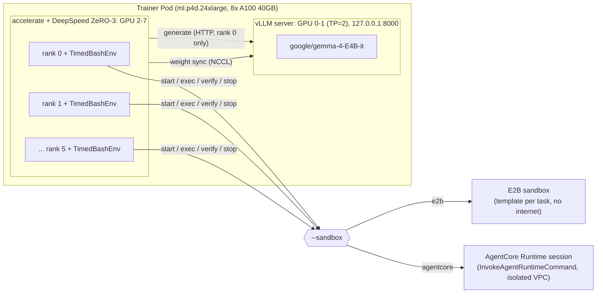

[한국어](ko/04-grpo-training.md)

# 04. Running GRPO training (TRL + Harbor)

In this step you train the policy model with TRL `GRPOTrainer` and Harbor tasks on one GPU node in HyperPod EKS (`ml.p4d.24xlarge`, A100 40GB x 8). The rollout sandbox is switched with a single flag (`--sandbox e2b|agentcore`); all other code, the trainer image, and the hyperparameters are the same for both sandboxes.

Prerequisites:
- `01-hyperpod-eks.md`: cluster, kubectl, namespace `harbor-rl`, ServiceAccount `trainer` (EKS Pod Identity), Secret `sandbox-secrets`
- `02-tasks-and-images.md`: the task suite (`tasks/train`, `tasks/heldout`) and `harbor-rl/tasks-base:v2`
- `03a-sandbox-e2b.md`: E2B template prebuild, `E2B_API_KEY` in `sandbox-secrets` (plus `E2B_DOMAIN` if self-hosted)
- `03b-sandbox-agentcore.md`: ARN of the AgentCore runtime deployed in isolated VPC mode

Time required: trainer image build a few tens of minutes (CodeBuild), one training run (40 steps + evaluations before and after) a few hours. Actual measurements are in `05-comparison.md`.

## 1. Architecture: the external agent pattern

The policy model is served by a vLLM server inside the training Pod, and TRL receives the token IDs and logprobs of the generations directly on the training side. The sandbox runs only the `bash` commands the model requests and the verifier (the external agent pattern of the TRL Harbor integration). Because there is no agent inside the sandbox calling vLLM, no network path from the sandbox back to the Pod is needed, and the sandbox can run without internet (`no-network`). The only calls going from the Pod to the sandbox are session creation, `exec`, file upload and download, and termination.



- vLLM: runs on GPUs 0 and 1 with tensor parallel 2 and binds to `127.0.0.1:8000` only (section 4.4). Rank 0 gathers the prompts from every rank, sends them in one request, and broadcasts the results to all ranks (TRL server mode).
- Training: 6 processes on GPUs 2 to 7, DeepSpeed ZeRO-3 ([`training/zero3.yaml`](../training/zero3.yaml), no optimizer/parameter offload, bf16).
- Sandbox: on each rank, a Harbor environment (`training.harness:TimedBashEnv`) independently creates sessions and runs commands.

> Sequential provisioning: TRL calls `environment.reset()` in a plain for loop within a process, so sandbox creation is sequential within a rank, and concurrency equals the number of training processes (6 here).

Why colocate mode (training and vLLM sharing the same GPUs) is not used: memory is tight on A100 40GB, and colocate + sleep mode has a problem where weights are reloaded on every tool-call turn (TRL issue #7428).

## 2. Policy model: `google/gemma-4-E4B-it`

> Terminology note: the "E2B" in Gemma 4 model names (`google/gemma-4-E2B-it`, effective 2B) is unrelated to the E2B sandbox. In this guide, models are always referred to by their full Hugging Face ID.

| Item | Value | Reason |
|---|---|---|
| Model | `google/gemma-4-E4B-it` | Apache 2.0, not gated. Tool calling, chat template, and response parsing work with TRL 1.14.1 + transformers 5.x |
| Parameter composition | Text decoder, per-layer embedding (PLE), audio/vision towers [documented] | |
| Frozen | Tensors whose names contain `audio`, `vision`, or `per_layer` | The tasks are text-only, and this makes full fine-tuning of the text decoder fit on A100 40GB |
| attention | `sdpa` | FlashAttention 2 does not support Gemma 4's head_dim of 512 |
| dtype | bfloat16, gradient checkpointing | |

The number of trainable parameters after freezing can be checked in the `[train_grpo] sandbox=... frozen_tensors=... trainable_params=... total_params=...` line near the beginning of the training log (computed with `ds_numel` because parameters are partitioned under ZeRO-3).

To use a different model, change the `MODEL` environment variable (`run.sh`). In that case, check that the freezing rule (`FROZEN_SUBSTRINGS`) and the attention implementation fit that model.

## 3. Trainer image (`harbor-rl/trainer:v12`)

A single [`training/Dockerfile`](../training/Dockerfile) runs everything: the vLLM server, training, benchmarks, and the E2B template prebuild. The same image (tag `v12` in this guide) is used for both sandbox runs. Only the `linux/amd64` platform is needed (p4d is x86_64).

| Component | Version | Notes |
|---|---|---|
| Base | `vllm/vllm-openai:v0.30.0@sha256:8a69ffad015f138d7170c4ddc429e230a3bc1c1719f67e14324749df200a4b90` | Pinned by digest. Has only `python3`, no `python` |
| TRL | `trl[harbor]==1.14.1` | Uses the `trl.experimental.harbor` module (version pinned because it is an experimental module) |
| Harbor | `harbor[e2b]==0.23.0` | |
| E2B SDK | `e2b==2.50.0` | 2.51.0 creates sandboxes with `POST /v2/sandboxes`, which the self-hosted E2B API in this guide does not support |
| Other | `transformers==5.17.0`, `deepspeed==0.19.7`, `boto3==1.43.99`, `pandas==3.0.6`, `matplotlib==3.11.2` | All Python packages are pinned to exact versions, so the same tag can be rebuilt with the same contents |
| Code | `training/`, `agentcore/harbor_agentcore/`, `bench/`, `tasks/train/` (40), `tasks/heldout/` (16), `tasks/image/warmup.sh` (read by `bench/prebuild_e2b_templates.py` for the E2B template start command) | `PYTHONPATH=/app:/app/agentcore`, working directory `/app` |

The AgentCore path does not use the E2B SDK, so the `e2b` pin does not affect AgentCore runs.

The tag for reproducing this guide is `v12`, built from these pins. The measurements in [`05-comparison.md`](05-comparison.md) were taken with this tag.

### 3.1 Building with CodeBuild (recommended)

Building a large amd64 image under emulation locally (especially on Apple silicon) and uploading it is slow, so [`training/build-image.sh`](../training/build-image.sh) builds it on AWS CodeBuild (x86_64, `BUILD_GENERAL1_LARGE`, privileged) and pushes it directly to ECR. `TAG` is required (no default).

```bash
export AWS_REGION=us-west-2
TAG=v12 ./training/build-image.sh
# -> <ACCOUNT_ID>.dkr.ecr.us-west-2.amazonaws.com/harbor-rl/trainer:v12
```

What the script does:
- First time only: creates the S3 bucket `harbor-rl-sandbox-<ACCOUNT_ID>-us-west-2` (public access blocked), the ECR repository `harbor-rl/trainer` (scan on push enabled), the IAM role `harbor-rl-codebuild` ([`infra/codebuild/codebuild-policy.json`](../infra/codebuild/codebuild-policy.json)), and the CodeBuild project `harbor-rl-trainer-build`, all tagged `Project=harbor-rl-sandbox`. Skips any that already exist.
- The bucket name is predictable, so the existence check (`head-bucket`) and the upload pass `--expected-bucket-owner <ACCOUNT_ID>`; a bucket with that name owned by another account is never used.
- On every run, re-applies the role's trust policy ([`infra/codebuild/codebuild-trust.json`](../infra/codebuild/codebuild-trust.json)): `codebuild.amazonaws.com` can assume the role only with `aws:SourceAccount` = this account and `aws:SourceArn` = the `harbor-rl-trainer-build` project.
- Zips the build context (`training`, `agentcore/harbor_agentcore`, `bench`, `tasks/train`, `tasks/heldout`, `tasks/image/warmup.sh`, buildspec), uploads it to `s3://<bucket>/codebuild/trainer-src.zip`, builds with [`infra/codebuild/buildspec.yml`](../infra/codebuild/buildspec.yml) (`docker build` followed by `docker push`), and polls the status every 20 seconds. On success it prints the image URI.

If you change the tasks (`tasks/train`, `tasks/heldout`) or the training code, they must be put back into the image, so rebuild with a new tag. Delete commands for the created resources are in `06-cleanup.md`.

### 3.2 Building locally (alternative)

```bash
REGISTRY=<ACCOUNT_ID>.dkr.ecr.us-west-2.amazonaws.com
IMAGE=$REGISTRY/harbor-rl/trainer:v12

# Finch
aws ecr get-login-password --region us-west-2 | finch login --username AWS --password-stdin $REGISTRY
finch build --platform linux/amd64 -f training/Dockerfile -t "$IMAGE" .
finch push "$IMAGE"

# Docker equivalent
aws ecr get-login-password --region us-west-2 | docker login --username AWS --password-stdin $REGISTRY
docker buildx build --platform linux/amd64 -f training/Dockerfile -t "$IMAGE" --push .
```

## 4. Running training

### 4.1 Switching sandboxes

The only sandbox selector is `--sandbox` in [`training/train_grpo.py`](../training/train_grpo.py).

| `--sandbox` | Harbor environment | Implementation |
|---|---|---|
| `e2b` | `e2b` | Harbor's built-in E2B environment (unmodified) |
| `agentcore` | `harbor_agentcore.environment:AgentCoreEnvironment` | The Harbor `BaseEnvironment` implementation in this repository |

In both cases the harness is specified with `HarborSpec(tasks, agent="training.harness:TimedBashEnv", environment_type=...)`. The harness handles environments given as import paths (section 7).

### 4.2 Submitting the Job

Training uses all 8 GPUs and port `:8000`, so only one Job runs at a time. The two sandboxes are run one after the other on the same node with the same image.

```bash
export AWS_REGION=us-west-2
export KUBECONFIG=$HOME/.kube/harbor-rl-hp

# Method B: AgentCore Runtime
TAG=v12 \
AGENTCORE_RUNTIME_ARN=arn:aws:bedrock-agentcore:us-west-2:<ACCOUNT_ID>:runtime/<RUNTIME_ID> \
AGENTCORE_NETWORK_ISOLATED=1 \
  ./infra/k8s/submit.sh grpo-agentcore 8 \
  bash -c "RUN_ID=grpo-agentcore training/run.sh agentcore"

# Method A: E2B sandbox (after the AgentCore job has finished)
TAG=v12 ./infra/k8s/submit.sh grpo-e2b 8 \
  bash -c "RUN_ID=grpo-e2b training/run.sh e2b"
```

[`infra/k8s/submit.sh`](../infra/k8s/submit.sh) `<job name> <GPU count> <command...>`:
- `TAG` (trainer image tag) is required; if omitted, the script stops immediately. If you set `IMAGE` directly, that value is used instead of `TAG`.
- `AGENTCORE_RUNTIME_ARN` is needed only for the AgentCore Job.
- `AGENTCORE_NETWORK_ISOLATED` defaults to `1`. It is the operator's declaration that the runtime was deployed in VPC mode on subnets with no internet path, and the AgentCore environment accepts `no-network` tasks only when this value is `1` (section 6.1).
- `RESULTS_S3_URI` defaults to `s3://harbor-rl-sandbox-<ACCOUNT_ID>-us-west-2/results`.
- Converts the command into a JSON array, renders [`infra/k8s/job.yaml`](../infra/k8s/job.yaml) with `envsubst`, and runs `kubectl apply`.

Arguments appended after `run.sh` are passed through to `train_grpo.py` as is (for example, `training/run.sh e2b --max-steps 5` for a short smoke check). Nothing is appended for the comparison runs.

### 4.3 Job configuration

| Item | Value |
|---|---|
| ServiceAccount | `trainer` (Pod Identity role `harbor-rl-trainer-pod`; no access keys go into the Pod) |
| Retries | `backoffLimit: 0`, `restartPolicy: Never`, automatically deleted 24 hours after completion (`ttlSecondsAfterFinished`) |
| `AWS_REGION` | `us-west-2` |
| `AGENTCORE_RUNTIME_ARN`, `AGENTCORE_NETWORK_ISOLATED`, `RESULTS_S3_URI` | Rendered by `submit.sh` |
| `HF_HOME` | `/cache/hf` (kept on the node's NVMe, so the model download is skipped from the second run on) |
| `E2B_API_KEY`, `E2B_DOMAIN`, `HF_TOKEN` | Secret `sandbox-secrets` (all `optional: true`; `E2B_DOMAIN` only for self-hosted E2B) |
| Volumes | `/dev/shm` (memory, 64Gi); `/cache` and `/results` are hostPaths under the node's `/opt/dlami/nvme/harbor-rl/` |

Pod role permissions ([`infra/iam/trainer-pod-policy.json`](../infra/iam/trainer-pod-policy.json)): `InvokeAgentRuntimeCommand`, `InvokeAgentRuntime`, and `StopRuntimeSession` on the single task runtime (present only when `setup-access.sh` ran with `RUNTIME_ID`), write and read on `results/*` in the results bucket, and the ECR token and `harbor-rl/tasks-base` pull for E2B template builds.

### 4.4 What `training/run.sh` does

[`training/run.sh`](../training/run.sh) `e2b|agentcore [train_grpo.py arguments...]`:

1. Sets the output directory `/results/<RUN_ID>` from `RUN_ID` (default `grpo-<sandbox>-<timestamp>`). If this directory is not empty, it does not start. Results remain on the node hostPath, so reusing the same `RUN_ID` would mix logs with a previous run. Use a new `RUN_ID` or move the previous directory.
2. Stops if a vLLM server is already running on `:8000`.
3. Starts the vLLM server on GPUs 0 and 1 with `setsid`, listening on `127.0.0.1:8000` only. On exit, a `trap` terminates the whole process group and releases the GPUs.

```bash
CUDA_VISIBLE_DEVICES=0,1 VLLM_SERVER_DEV_MODE=1 setsid vllm serve "$MODEL" \
  --tensor-parallel-size 2 --host 127.0.0.1 --port 8000 \
  --weight-transfer-config '{"backend": "nccl"}' \
  --logprobs-mode processed_logprobs --max-logprobs -1 \
  --limit-mm-per-prompt '{"image": 0, "audio": 0}' \
  --max-model-len 32768 --gpu-memory-utilization 0.6
```

| Flag | Meaning |
|---|---|
| `--host 127.0.0.1` | Binds the server to the Pod's loopback interface. With `VLLM_SERVER_DEV_MODE=1` the server exposes weight-update and RPC routes without authentication, and only the trainer processes in the same Pod need it |
| `--weight-transfer-config '{"backend": "nccl"}'`, `VLLM_SERVER_DEV_MODE=1` | Sends the trained weights to the server over NCCL at every step |
| `--logprobs-mode processed_logprobs --max-logprobs -1` | Returns logprobs of the distribution used for sampling (TRL uses them to compute importance ratios) |
| `--limit-mm-per-prompt` image/audio 0 | Disables multimodal input (text tasks) |
| `--max-model-len 32768` | A multi-turn prompt (instructions + previous turns + tool output) plus the generation limit of 8,192 tokens must fit. TRL checks the context against the maximum length in the model config, not the server's `--max-model-len`, so if the server value is smaller, vLLM rejects the request with 400 and training terminates |
| `--gpu-memory-utilization 0.6` | Leaves GPU memory headroom for the buffer that receives weights during weight sync |

4. Checks every 5 seconds until `/health` responds. If vLLM exits first, prints the last 50 lines of `vllm.log` and exits.
5. Runs `accelerate launch --config_file training/zero3.yaml --num_processes 6 training/train_grpo.py --sandbox <sandbox> --model "$MODEL" --output-dir /results/<RUN_ID>` on GPUs 2 to 7, also writing the output to `train.log` (`PYTORCH_CUDA_ALLOC_CONF=expandable_segments:True`).
6. If training succeeds and `RESULTS_S3_URI` is set, uploads the results with `python3 -m bench.s3sync /results/<RUN_ID>`. If training fails (`set -euo pipefail`), it exits before uploading.

### 4.5 Security notes

- **vLLM is reachable only inside the Pod.** The development-mode server accepts weight updates without authentication, so it listens on `127.0.0.1` (section 4.4). Sandboxes never call it (external agent pattern).
- **The trainer Pod runs as root and uses hostPath volumes** (`/cache`, `/results`) on the GPU node. This is acceptable for a single-tenant HyperPod node dedicated to this workload; do not run it this way on a node shared with other tenants.
- **Rewards from an untrusted policy can be tampered with.** The agent's commands run as root in the same sandbox where the verifier later runs, so a policy could in principle modify the files or tools the verifier uses and raise its own reward. This is a property of Harbor's design, not of either sandbox. Treat rewards from untrusted policies accordingly.
- **Pod permissions** come from EKS Pod Identity with a trust policy scoped to this cluster, namespace `harbor-rl` and ServiceAccount `trainer` ([`01-hyperpod-eks.md`](01-hyperpod-eks.md) section 6).

## 5. Hyperparameters (identical for both sandboxes)

All are defaults in `train_grpo.py` and are not overridden in the comparison runs.

| Item | Value | Notes |
|---|---|---|
| `seed` | 42 | |
| `max_steps` | 40 | |
| Batch | per-device 1 x grad accum 8 x 6 ranks = 48 rollouts per step | 6 prompts x 8 generations. Because of Gemma 4's 262k vocabulary, the full logits of several long sequences do not fit in 40GB |
| `num_generations` | 8 | GRPO group size |
| `num_generations_eval` | 6 | 6 samples per held-out task |
| `per_device_eval_batch_size` | 2 | |
| `max_completion_length` | 8192 | Budget for the whole multi-turn exchange (model tokens + tool output) |
| `max_tool_calling_iterations` | 20 | |
| `temperature` | 1.0 | |
| `learning_rate` | 2e-6 | |
| `beta` | 0 | No KL term (no reference model needed) |
| Precision | bf16, gradient checkpointing, `sdpa` | |
| Evaluation | At start (`eval_on_start`) and end (`eval_steps=max_steps`), 16 held-out tasks | Disable with `--skip-eval` |
| `vllm_server_timeout` | 900 seconds | |
| `save_strategy` | `"no"` | No checkpoints saved |
| Tool output limit | 2,000 characters (`TOOL_OUTPUT_MAX_CHARS`, TRL default 8,000 characters) | Prevents large `cat` output from exhausting the token budget |
| Tool call timeout | 180 seconds | Harness `_exec` default. TRL does not use the agent timeout in `task.toml` |

> Why evaluation is not called separately with `trainer.evaluate()` before and after `train()`: under DeepSpeed ZeRO-3, calling `evaluate()` before `train()` leaves the engine in inference mode and backward fails. So `eval_on_start` and the last-step evaluation inside the training loop are used instead.

## 6. Training harness (`training/harness.py`)

`TimedBashEnv` in [`training/harness.py`](../training/harness.py) inherits from TRL's `HarborBashEnv` (which exposes a single `bash` tool to the model) and adds network policy passing, plugin environments, per-call timing, failure handling, and shutdown cleanup. Both sandboxes use the same harness.

### 6.1 Applying the network policy

TRL's Harbor environment does not pass a network policy to Harbor, so left as is, every sandbox would be created with the default (public internet allowed). The harness resolves the task's `[environment]` policy the same way a Harbor trial does and passes it to the environment.

```python
network_policy = resolve_agent_env_baseline(self._task.config, config)   # harbor.trial.network_policy
self._env = EnvironmentFactory.create_environment_from_config(..., network_policy=network_policy)
```

- Every task in this suite has `network_mode = "no-network"` (`02-tasks-and-images.md` section 3.1).
- E2B: the Harbor E2B environment creates the sandbox with `allow_internet_access=False`.
- AgentCore: `AgentCoreEnvironment` declares support for blocking internet only when `AGENTCORE_NETWORK_ISOLATED=1`. The network is a per-runtime setting, so the actual blocking is done by the runtime's isolated VPC configuration (`03b-sandbox-agentcore.md`).
- Harbor rejects environments that do not support blocking internet at creation time. The harness records this as `rollout_failed` (cause `provision`) and sets that rollout's reward to 0, so training never silently proceeds with internet allowed.
- [`bench/sandbox_bench.py`](../bench/sandbox_bench.py) passes the policy the same way.

### 6.2 Timing records

To avoid depending on TRL logs, every sandbox call is measured directly and written to a per-process JSONL file (`$SANDBOX_TIMING_DIR/sandbox_<host>_rank<N>_<pid>.jsonl`, default `<output-dir>/sandbox/`). Each record contains `ts` (call end time), `step`, `sandbox`, `rollout`, `task`, `op`, `dur`, `ok`, and `err`. `step` is the value of the `TRAIN_STEP` environment variable, which a callback in `train_grpo.py` sets to the step number, `eval_before`, or `eval_after`.

| `op` | What is measured |
|---|---|
| `provision` | All five stages below |
| `create`, `start`, `upload_build_files`, `healthcheck`, `prepare` | Environment object creation, session start, build file upload, task healthcheck, working directory preparation |
| `exec` | One tool call (including `rc` and the first 300 characters of the command) |
| `verify` | Verifier run |
| `reward` | Rollout reward value (`reward`) |
| `stop` | Session termination |
| `rollout_failed` | Provisioning or verifier failure (`cause`, `err`, and a traceback on provisioning failure) |
| `generate` | One vLLM generation round, recorded by [`training/trl_patches.py`](../training/trl_patches.py). All ranks wait for the same round, so it is recorded on each rank |

If provisioning fails, that rollout continues with a tool that returns an error message and a reward of 0, so the training step is not interrupted.

### 6.3 Per-step breakdown (`bench/analyze.py`)

`training_summary` in [`bench/analyze.py`](../bench/analyze.py) computes the per-step time breakdown from `steps.jsonl` and the sandbox JSONL files.

- Scope: only events whose `step` is a number (the start and end evaluation phases are excluded).
- Calls are sequential within a rank, so for each step the sum of `dur` per `op` is computed per rank, and then averaged over the 6 ranks.
- `step_wall_sec` = `t_end - t_begin` of the `kind=step` record in rank 0's `steps.jsonl`
- `generation_sec` = rank average of the `generate` sum
- `sandbox_provision_sec`, `sandbox_exec_sec`, `sandbox_verify_sec`, `sandbox_stop_sec` = rank average of the sum of each `op`
- `sandbox_wait_sec` = provision + exec + verify + stop
- `train_and_other_sec` = `step_wall_sec - generation_sec - sandbox_wait_sec` (backpropagation, weight sync, waiting on collective communication, and so on)
- In addition: `mean_reward` (`reward` from the TRL log), `failed_rollouts` and their causes, `exec_calls`, `exec_timeouts`, and per-run held-out before/after values (`eval_reward` in `eval_before.json` and `eval_after.json`)

Outputs: `results/summary/training_steps.csv`, `training_runs.csv`, `results/charts/training.png`. `sandbox_usage_summary` in the same script uses all events, including the evaluation phases, to compute per-`op` latency (`training_sandbox_ops.csv`) and session time (`training_sandbox_sessions.csv`, where a session runs from the start of `create` to the end of `stop` for each rollout), and [`bench/cost_model.py`](../bench/cost_model.py) uses these for cost estimates.

`analyze.py` reads the first directory by name among `results/grpo-<sandbox>*`. So use fixed names such as `RUN_ID=grpo-e2b` and `RUN_ID=grpo-agentcore` for the comparison runs, and keep other runs outside `results/`.

## 7. TRL 1.14.1 workarounds

All workarounds apply identically to both sandboxes, and TRL is not forked.

**(1) Server mode + tool calling + multiple ranks (`training/trl_patches.py`).** Server-mode generation in TRL 1.14.1 slices the gathered results from all ranks by `process_index * len(prompts)`. In other words, it assumes every rank sends the same number of requests. However, in `_tool_call_loop`, the number of samples to regenerate after tool calls differs per rank, which causes an `IndexError`, and if one rank's loop ends first, it no longer matches the other ranks' collective communication and can deadlock. `trl_patches.apply()`, called at the very top of `train_grpo.py`, (a) computes per-rank offsets from the gathered counts, (b) makes ranks whose loop has ended keep participating in collective communication with empty requests until all ranks finish, and (c) records a `generate` event for each generation round. It does not change the generated content itself, and it supports text-only prompts only.

**(2) Plugin sandboxes.** TRL's `HarborEnv` passes only `type=` to Harbor, so Harbor rejects environments given as import paths. The harness overrides `_start` and uses `EnvironmentConfig(import_path=...)` when the value contains `:`. The network policy is passed at the same point (section 6.1).

**(3) Hang on exit and sandbox cleanup.** TRL's `HarborEnv.__del__` waits on an event loop thread that has already stopped at interpreter exit, so the process never ends. Also, sandboxes that are open at exit are not cleaned up (Harbor creates E2B sandboxes with a 24-hour timeout, and AgentCore sessions are billed until the idle timeout). The harness keeps `__del__` from blocking and registers an exit hook with `threading._register_atexit` so that it runs before the `concurrent.futures` thread pools are shut down, stopping all live sandboxes. A regular `atexit` runs after the thread pools are shut down and cannot call AgentCore `StopRuntimeSession`.

**(4) Public methods become tools.** TRL exposes every public method of the environment class as a model tool. Leaving helper methods public causes a `DocstringParsingException` during tool schema generation, so they get a `_` prefix, as in `_close` and `_timed`. The only tool exposed to the model is `bash`.

**(5) Context length check.** In server mode, TRL checks the multi-turn context limit against `max_position_embeddings` in the model config, not the vLLM server's `--max-model-len`. Therefore, if the server-side `--max-model-len` is smaller than the multi-turn prompt + `max_completion_length`, vLLM rejects the request with 400 and training terminates. `run.sh` uses `--max-model-len 32768`.

**(6) The `completions/clipped_ratio` metric.** Gemma 4 stops at one of several end tokens in `generation_config.json` (`<eos>`, `<turn|>`, `<|tool_response>`), but TRL counts a completion as properly terminated only when the last token is `eos_token_id` or pad. So this metric reads higher than it actually is. Because `mask_truncated_completions=False` (the default), training is not affected, and the metric is not used for the comparison.

**(7) CUDA allocator warnings.** OOM warnings related to `expandable_segments` may appear in the log, but they are warnings that do not stop training.

## 8. Outputs and S3 sync

Results are kept with the same structure on the node at `/opt/dlami/nvme/harbor-rl/results/<RUN_ID>/` (`/results/<RUN_ID>/` in the Pod) and in S3 at `$RESULTS_S3_URI/<RUN_ID>/`.

| File | Contents |
|---|---|
| `steps.jsonl` | `kind=step`: step start/end times for all ranks. `kind=log`: rank 0's TRL metrics (`reward`, `loss`, and so on, every step) |
| `eval_before.json`, `eval_after.json` | Held-out evaluation metrics at step 0 and the last step (`eval_reward` is the solve rate) |
| `sandbox/sandbox_<host>_rank<N>_<pid>.jsonl` | Per-call sandbox time, failures, rewards, and generation rounds recorded by the harness (section 6.2) |
| `vllm.log`, `train.log` | vLLM server log, training standard output |
| `trainer/` | TRL `output_dir` (no checkpoints) |

The trainer image has no AWS CLI, so [`bench/s3sync.py`](../bench/s3sync.py) uses boto3 to upload every file in the directory to `s3://<bucket>/<prefix>/<directory name>/...`. The client is created with the Region set explicitly from `AWS_REGION` (default `us-west-2`). Permissions come from the Pod Identity role.

After training finishes, download the results locally and generate the summary tables and charts.

`bench/cost_model.py` also reads two usage files: `results/usage/agentcore_grpo_window.json` (AgentCore vended usage, written by [`bench/agentcore_metrics.py`](../bench/agentcore_metrics.py)) and `results/usage/e2b_client_cpu.json` (EC2 `CPUUtilization` of the `<stack>-client` instances that run the self-hosted E2B sandboxes, written by [`bench/e2b_client_cpu.py`](../bench/e2b_client_cpu.py)). The committed files come from the measured runs, so a reproduction must regenerate both for its own training windows (`--start`/`--end` in UTC, for example `2026-10-06T17:46:00Z`): the AgentCore run window for the first, the E2B run window for the second (the E2B client instances must still be running). Locally, the analysis scripts need `pandas` and `matplotlib`, and the metric scripts need `boto3`.

```bash
BUCKET=harbor-rl-sandbox-<ACCOUNT_ID>-us-west-2
aws s3 sync s3://$BUCKET/results/grpo-agentcore results/grpo-agentcore --region us-west-2
aws s3 sync s3://$BUCKET/results/grpo-e2b results/grpo-e2b --region us-west-2

# Usage inputs of cost_model.py, for your own training windows
uv run --with boto3 python3 bench/agentcore_metrics.py --start <agentcore run start> --end <agentcore run end> \
  --runtime-arn arn:aws:bedrock-agentcore:us-west-2:<ACCOUNT_ID>:runtime/<RUNTIME_ID> \
  --out results/usage/agentcore_grpo_window.json
uv run --with boto3 python3 bench/e2b_client_cpu.py --start <e2b run start> --end <e2b run end> \
  --out results/usage/e2b_client_cpu.json

uv run --with pandas --with matplotlib python3 bench/analyze.py --results results     # -> results/summary/*.csv, results/charts/*.png
uv run --with pandas --with matplotlib python3 bench/cost_model.py --results results  # -> results/summary/cost.csv (inputs: 05-comparison.md)
```

## 9. Monitoring

```bash
kubectl -n harbor-rl get pods -l job=grpo-agentcore
kubectl -n harbor-rl logs -f job/grpo-agentcore
# Per-step metrics (rank 0)
kubectl -n harbor-rl exec job/grpo-agentcore -- \
  bash -c 'grep "\"kind\": \"log\"" /results/grpo-agentcore/steps.jsonl | tail -n 2'
# Sandbox failures so far
kubectl -n harbor-rl exec job/grpo-agentcore -- \
  bash -c 'cat /results/grpo-agentcore/sandbox/*.jsonl | grep -c rollout_failed'
# vLLM side
kubectl -n harbor-rl exec job/grpo-agentcore -- tail -n 20 /results/grpo-agentcore/vllm.log
```

For the E2B run, replace `grpo-agentcore` in the Job name and paths with `grpo-e2b`. AgentCore service metrics (invocation count, throttles, session count, vCPU/memory usage) are available in the CloudWatch namespace `AWS/Bedrock-AgentCore`, and [`bench/agentcore_metrics.py`](../bench/agentcore_metrics.py) downloads them for a specified time window (`03b-sandbox-agentcore.md`).

## 10. Common pitfalls

| Symptom | Cause | Fix |
|---|---|---|
| `submit.sh` exits immediately with `set TAG` | The trainer image tag has no default | `TAG=v12 ./infra/k8s/submit.sh ...` |
| `run.sh` exits with `/results/<RUN_ID> is not empty` | Previous results for the same `RUN_ID` remain on the node hostPath | Use a new `RUN_ID` or move the previous directory |
| Training terminates at the first weight sync, with `start_weight_update must be called before update_weights` at the end of the log | OOM because the vLLM GPUs have no room to allocate the weight receive buffer. The last error is not the cause | Use `--gpu-memory-utilization 0.6`. Check the first ERROR in `vllm.log` |
| Terminates with a vLLM 400 error right after training starts (evaluation phase) | Multi-turn context + generation limit exceeds `--max-model-len` (section 7 (5)) | `--max-model-len 32768` |
| `IndexError` or no response during a step (deadlock) | Server mode + tool calling + multiple ranks (section 7 (1)) | Check that `trl_patches.apply()` is called at the very top of `train_grpo.py` |
| Training finished but the Pod does not terminate | `HarborEnv.__del__` hangs indefinitely | Use `training.harness:TimedBashEnv` |
| Every rollout fails with `network_mode='no-network' is not supported` | The AgentCore environment does not declare internet blocking | Deploy the runtime in isolated VPC mode and submit with `AGENTCORE_NETWORK_ISOLATED=1` (the default) |
| Every AgentCore rollout is recorded as `rollout_failed` (`AGENTCORE_RUNTIME_ARN is not set`) with reward 0 | The ARN was not passed at submission | `AGENTCORE_RUNTIME_ARN=... ./infra/k8s/submit.sh ...` |
| `python: command not found` | The official vLLM image has only `python3` | Use `python3` in scripts and Job commands |
| E2B sandbox creation fails with `404 method not allowed` | This self-hosted E2B does not support `POST /v2/sandboxes` used by E2B SDK 2.51.0 | Pin `e2b==2.50.0` (already in the trainer image) |
| E2B creation fails with `400: Timeout cannot be greater than 1 hours` | Harbor creates with a 24-hour timeout, while the self-hosted default tier is 1 hour / 20 concurrent | Adjust the team tier (`03a-sandbox-e2b.md`) |
| E2B training fails with template build errors | Templates were not prebuilt, or the task's `environment/` changed so the alias differs | Run `prebuild_e2b_templates.py` (`02-tasks-and-images.md` section 5.2) |
| One AgentCore rollout hangs until the tool timeout (180 seconds) | `InvokeAgentRuntimeCommand` passes stdin with no EOF, so `cat` or `python3` with no arguments waits | The AgentCore environment prepends `exec </dev/null;` to every command (matching E2B and Docker semantics) |
| Tool output exhausts the token budget | `cat` of a large file | The harness's 2,000-character limit (`TOOL_OUTPUT_MAX_CHARS`) |
| `completions/clipped_ratio` reads high | TRL recognizes only some of Gemma 4's end tokens (section 7 (6)) | No effect on training; not used as a comparison metric |
| No results in S3 after a training failure | `run.sh` exits before syncing when training fails | Results remain on the node at `/opt/dlami/nvme/harbor-rl/results/<RUN_ID>`. Run `python3 -m bench.s3sync /results/<RUN_ID>` from another Pod on the same node |
| S3 upload fails with `TemporaryRedirect` | Creating a boto3 S3 client without a Region causes a redirect for a new bucket | Set `region_name` explicitly (`bench/s3sync.py`) |
| Pending, or `a vLLM server is already listening on :8000`, when run alongside another GPU Job | Training uses all 8 GPUs and `:8000` | Submit after the previous Job has finished |
| vLLM cannot be reached at `<pod IP>:8000` from another Pod or node | Intended. vLLM binds to `127.0.0.1` only | Use `localhost:8000` inside the same Pod (`kubectl exec`) |
| `build-image.sh` fails at the bucket check, or bucket creation fails with `BucketAlreadyExists` | A bucket with the same name is owned by another account (the `--expected-bucket-owner` check fails). The script uploads nothing to that bucket | Do not use that bucket. To change the name, update every script that derives the bucket name together: `training/build-image.sh`, `infra/k8s/setup-access.sh`, `infra/k8s/submit.sh`, `infra/e2b-selfhosted/deploy.sh` |

Source URLs and check dates are in `references.md`.

Next step: for the measured results, cost, and constraint comparison of the two sandboxes, see `05-comparison.md`.
