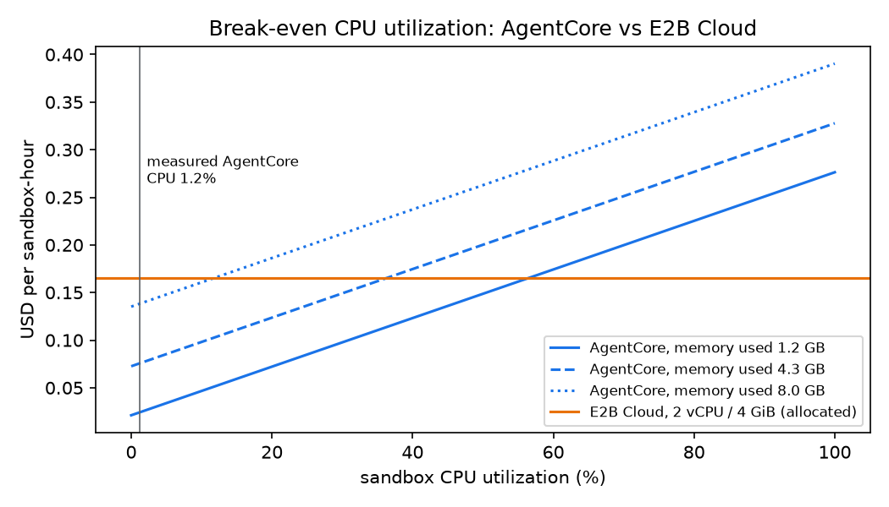

[한국어](ko/05-comparison.md)

# 05. Measurement-based comparison: E2B sandbox vs AgentCore Runtime

Every number in this document carries a source tag.

- **[measured]**: A value measured in the experiments of this guide. The raw data is in `results/`.
- **[documented]**: A value from official documentation or a price list. The source and check date are in [`references.md`](references.md).
- **[estimated]**: A value calculated from measured and documented values. The formula is next to the table or in the `formula` column of `results/summary/cost.csv`.

The tables and charts can be regenerated from `results/` with `bench/analyze.py` and `bench/cost_model.py`. Measurements were taken on 2026-10-07.

## 0. Comparison conditions

Both sandboxes were measured under the same conditions.

- Run from the same Trainer image (tag `v12`, the tag this guide builds) on the same HyperPod node (one `ml.p4d.24xlarge`).
- The same 56 tasks (40 training, 16 held-out), the same model (`google/gemma-4-E4B-it`), and the same training settings (`04-grpo-training.md`)
- The same network policy: every task uses `network_mode = "no-network"`. Code inside the sandbox cannot reach the internet (`02-tasks-and-images.md` 3.1).
- The same sandbox warm-up: `tasks/image/warmup.sh` (imports pandas, numpy, scipy, sklearn, statsmodels, seaborn, plotly, tabulate and matplotlib, and reads every file under `/data`) runs once before the sandbox snapshot on both sandboxes. On AgentCore, the shim runs it at container start before it listens on 8080 (V2 takes the snapshot after the first healthy `/ping`); on E2B, it is the template start command and E2B snapshots the template after it finishes. This follows the AgentCore V2 optimization guidance to do expensive, reusable work such as importing dependencies at startup, before the snapshot [documented]. It only reads files and creates no per-session state.
- Private paths on both sides: the trainer pods reach self-hosted E2B through VPC peering and an internal ALB, and reach the AgentCore data plane (`InvokeAgentRuntime`, `InvokeAgentRuntimeCommand`, `StopRuntimeSession`) through an interface endpoint (PrivateLink, `com.amazonaws.us-west-2.bedrock-agentcore`, private DNS) in the HyperPod VPC.

| Item | E2B sandbox (Method A) | AgentCore Runtime (Method B) |
|---|---|---|
| Deployment model | Self-hosted E2B (`aws-samples/sample-e2b-on-aws`) deployed in the same account and Region. E2B Cloud was not measured and is compared only with documented values | Managed service, Runtime V2 |
| Network | Internal ALB + VPC peering (private path). Sandbox egress blocked by E2B | Data plane through a PrivateLink interface endpoint (private path, SigV4). Sessions in VPC mode, isolated subnets with no internet path |
| Sandbox hardware | One dedicated `c8i.metal-48xl` (used only by this experiment during measurement) | Multi-tenant managed microVM |
| Session size | 2 vCPU / 4 GiB (task setting) | 2 vCPU / 8 GB (fixed) |
| Image | amd64 variant of the same image | arm64 variant of the same image + shim layer |
| Harbor environment | Harbor's built-in `e2b` environment as is | This guide's `AgentCoreEnvironment` |
| Warm-up before the snapshot | `warmup.sh` as the template start command (`bench/prebuild_e2b_templates.py`) | `warmup.sh` run by the shim at startup (`agentcore/shim/main.go`) |

**Settings applied to only one side** (all disclosed for fairness):

- **E2B only**
  - Pinned `e2b==2.50.0`: 2.51.0 creates sandboxes with an API that this self-hosted server version does not provide.
  - Raised team tier (24-hour sessions, 1,000 concurrent): Harbor creates sandboxes with a 24-hour timeout, and the benchmark launches 128 at once. The sample defaults are 1 hour / 20.
- **AgentCore only**
  - `exec </dev/null;` prepended to commands: AgentCore passes a pipe to stdin that never closes, so without this, commands that read stdin hang (aligns behavior with Docker/E2B).
  - Directory transfers handled as a single tar.gz: Harbor's E2B environment uploads in batches and downloads one file at a time. Each implementation was measured as is.

**Keep in mind when reading the results**

- The latency differences include both differences in sandbox technology and differences in deployment model (dedicated bare metal vs multi-tenant managed service). Both are reached over private paths in the same Region.
- E2B Cloud (over the internet) latency was not measured, so the self-hosted results should not be applied to E2B Cloud as is.

## 1. Task validity (arm64 porting cost)

| Sandbox | Oracle pass | Median time per task | Source |
|---|---|---|---|
| E2B (amd64) | 56/56 [measured] | 3.00 s [measured] | `results/oracle/oracle_e2b_20261007-083831.csv` |
| AgentCore (arm64) | 56/56 [measured] | 4.16 s [measured] | `results/oracle/oracle_agentcore_20261007-084123.csv` |

- No tasks were lost to arm64 in this suite.
- The porting cost is in the preparation stage. The original dataset image is amd64 only, so the image recipe was rebuilt for amd64 + arm64 and a shim layer for AgentCore was added (`02-tasks-and-images.md`). For a public dataset that uses its original images as is, this rebuild cost grows with the number of images.

## 2. Sandbox microbenchmarks

Run one at a time with the same script (`bench/sandbox_bench.py`) and the same parameters, with no other workload on the node.

**Single-session latency (30 sessions, 600 exec calls; the import rows run `python3 -c 'import pandas, numpy, sklearn'` twice right after session start)** [measured], `results/summary/bench_latency.csv`, `results/charts/bench_latency.png`

| Operation | E2B p50 / p95 | AgentCore p50 / p95 | Ratio (p50) |
|---|---|---|---|
| Session start | 87 / 194 ms | 1,820 / 2,283 ms | 21x |
| First Python import in the session | 862 / 927 ms | 2,610 / 46,619 ms | 3.0x |
| Second Python import in the session | 737 / 781 ms | 1,201 / 1,577 ms | 1.6x |
| exec round trip (`true`) | 8.6 / 9.7 ms | 140 / 191 ms | 16x |
| 1 MB upload | 8.6 / 11.2 ms | 143 / 184 ms | 17x |
| 1 MB download | 25.0 / 28.2 ms | 361 / 375 ms | 14x |
| 8 MB upload | 33.1 / 37.9 ms | 5,702 / 5,763 ms | 172x |
| 8 MB download | 160 / 189 ms | 5,539 / 5,604 ms | 35x |
| Session stop | 28.3 / 54.3 ms | 188 / 263 ms | 7x |

**Concurrency sweep (each session: start + 10 exec calls)** [measured], `results/summary/bench_concurrency.csv`, `results/charts/bench_concurrency.png`

| Concurrent sessions | E2B start p50 / p95 | AgentCore start p50 / p95 | E2B exec/s | AgentCore exec/s | Errors, throttles |
|---|---|---|---|---|---|
| 8 | 167 / 227 ms | 2,082 / 2,422 ms | 212 | 16 | 0 for both |
| 32 | 440 / 815 ms | 2,413 / 2,857 ms | 315 | 60 | 0 for both |
| 128 | 1,935 / 3,344 ms | 4,472 / 5,084 ms | 341 | 161 | 0 for both |

Interpretation:

- **E2B:** Single-call latency is 7x to 172x lower (p50) on every API item (start, exec, transfer, stop).
- **First import after start.** With the same warm-up in both snapshots, the first import of the task libraries takes 0.84 to 0.93 s on E2B in 29 of 30 sessions (one outlier at 3.2 s) [measured]. On AgentCore, most sessions take 1.7 to 2.7 s, but there is a tail up to about 57 s (p95 46.6 s; 11 of 30 sessions above 3 s) [measured]. The second import in the same session is stable on both (p95 0.78 s vs 1.58 s). The cause of the AgentCore tail was not determined in this guide.
- **AgentCore concurrency:** No errors or throttles even at 128 concurrent sessions. Session start p50 grows from 2.1 s at 8 concurrent to 4.5 s at 128 concurrent. This appears to be the effect of the new-session creation quota of 25 TPS [documented].
- **AgentCore file transfer:** An 8 MB transfer takes 5.5 to 5.7 s, disproportionately slow relative to size. Routing large files through S3 is recommended.
- **E2B at 128 concurrent:** 4 GiB × 128 = 512 GiB exceeds the node's physical memory (384 GiB, 192 vCPU [documented]), yet all sessions started without failure. This appears to be because Firecracker allocates memory only as it is actually used.
- **The "25 TPS" wording:** The "25 TPS" in the execute-command documentation did not apply to `InvokeAgentRuntimeCommand`. There were 161 commands per second at 128 concurrent, and 0 throttles across 31,672 commands over the whole training run (at most 380 per minute) [measured]. The data plane 1,000 TPS quota [documented] is the one that applies to commands.

## 3. GRPO training (same settings, 40 steps)

Settings: seed 42, 48 rollouts per step (6 prompts × 8 generations), `max_completion_length` 8192, `max_tool_calling_iterations` 20, temperature 1.0, lr 2e-6. Held-out evaluation of 16 tasks × 6 samples before and after training.

Sources: `results/summary/training_runs.csv`, `training_steps.csv`, `training_sandbox_ops.csv`, `training_sandbox_sessions.csv`, `results/charts/training.png`

| Metric | E2B | AgentCore |
|---|---|---|
| Training time for 40 steps | 8,660 s (2.41 h) [measured] | 16,524 s (4.59 h) [measured] |
| Total run time including evaluation | 2.65 h [measured] | 5.05 h [measured] |
| Average step time | 216 s [measured] | 413 s [measured] |
| ├ Generation (waiting on vLLM) | 88 s [measured] | 98 s [measured] |
| ├ Total sandbox wait | 36 s [measured] | 112 s [measured] |
| │ └ of which provisioning | 19.4 s [measured] | 18.1 s [measured] |
| └ Training (backward, etc.) and waiting on other ranks | 93 s [measured] | 203 s [measured] |
| Share of step time spent waiting on the sandbox | 17.0% [measured] | 27.5% [measured] |
| Rollouts / failed rollouts | 1,920 / 0 [measured] | 1,920 / 0 [measured] |
| Tool calls (exec) per rollout, pre-training evaluation → last 10 steps | 6.19 → 5.28 [measured] | 6.21 → 6.90 [measured] |
| Training reward, first 5 steps → last 5 steps | 0.375 → 0.417 [measured] | 0.321 → 0.404 [measured] |
| Held-out solve rate, before → after training | 33.3% → 33.3% [measured] | 34.4% → 38.5% [measured] |

**Sandbox call latency during training** [measured], `training_sandbox_ops.csv`

| Call | E2B p50 / p95 | AgentCore p50 / p95 |
|---|---|---|
| Full provisioning (create, start, health check, prepare) | 2,221 / 4,196 ms | 2,202 / 2,879 ms |
| exec (model tool call) | 14 / 1,132 ms | 200 / 8,027 ms |
| verifier | 84 / 96 ms | 1,149 / 1,641 ms |
| stop | 29 / 84 ms | 170 / 248 ms |

Interpretation:

- **Sandbox latency changes training time.** E2B steps were 197 s shorter on average (48%) [measured]. The difference splits into 77 s of each rank's sandbox wait, 110 s of "training and waiting on other ranks", and 10 s of generation. Ranks wait for the slowest rank at synchronization points, so one rank's sandbox latency also shows up as wait time on the other ranks.
- **Provisioning is similar.** In the microbenchmark, E2B session start was 87 ms, but through Harbor's E2B environment it becomes p50 2.2 s (apparently due to additional API calls such as the template check in Harbor's `start()`). AgentCore is also p50 2.2 s. In training, sessions are created sequentially per rank, so both sandboxes spend 18 to 19 s per step.
- **The cost of sequential provisioning.** Provisioning is 9.0% (E2B) and 4.4% (AgentCore) of step time [measured], because each rank creates its 8 sessions one at a time. Creating the 8 concurrently would reduce the per-rank wait to about the level of a single session (p95 E2B 4.2 s, AgentCore 2.9 s), saving about 15 s per step on both [estimated: 19.4 - 4.2, 18.1 - 2.9].
- **First Python command of a rollout.** The first command that runs `python3` in a rollout took p50 0.32 s on E2B and 1.19 s on AgentCore (means 0.43 s and 4.48 s); later Python commands took p50 0.27 s and 0.50 s (means 0.53 s and 1.99 s) [measured]. The AgentCore mean reflects the same first-import tail as in the microbenchmark.
- **Tool calls per rollout.** Before training, both sandboxes produced the same number of tool calls per rollout (6.19 vs 6.21). During training they diverged: in the last 10 steps E2B rollouts made 5.28 calls and AgentCore rollouts 6.90 [measured]; across the run, AgentCore steps averaged 339 exec calls and E2B steps 263. More calls per rollout add to the AgentCore sandbox wait. With one run per sandbox, it cannot be said whether the sandbox caused this divergence.
- **Long tool calls and network blocking.** AgentCore had 9 exec calls of 60 s or more, all `pip install` attempts that waited until the 180 s tool timeout (in the isolated VPC, DNS works but the connection times out). E2B had 6: 5 `pip install` attempts that ended after about 140 s, and 1 command ending in `tail -f`, which hit the 180 s timeout [measured]. That `tail -f` call is the only failed exec call in either run (E2B 1 of 11,609, AgentCore 0 of 14,776); the rollout itself did not fail.
- **No conclusion on training effect.** The held-out change is +0.0 pp for E2B and +4.2 pp for AgentCore. The standard error of a 96-sample mean is about 4.8 pp [estimated: √(0.33 × 0.67 / 96)]. With only one run each, this difference cannot be attributed to the sandbox. What this experiment shows is that the same training completed without failure on both sandboxes.

## 4. Cost

Prices are us-west-2 on-demand list prices [documented]. The calculation is in `bench/cost_model.py` and the results are in `results/summary/cost.csv`.

### 4.1 Sandbox cost (one training run, 2,112 sessions including evaluation)

| Item | AgentCore | Self-hosted E2B (dedicated) | E2B Cloud (assumed) |
|---|---|---|---|
| Billing basis | vCPU-h used, GB-h used, VPC endpoints | Instance hours (regardless of use) | Allocated vCPU, GiB × run time |
| Cost per run | **$6.09** [estimated] | $29.43 [estimated] | $20.25 [estimated] |
| Per 1,000 rollouts | **$2.89** [estimated] | $13.94 [estimated] | $9.59 [estimated] |

Formula for each amount:

- **AgentCore:** CloudWatch usage × unit price + VPC endpoints. 5.66 vCPU-h × $0.1276 + 294.0 GB-h × $0.0169 + $0.08/h × 5.05 h = $6.09. Usage, session count (2,112), command count (31,672), and throttles (0) are [measured] with source `results/usage/agentcore_grpo_window.json`; unit prices are [documented]. VPC endpoints are the 4 interface endpoints × 2 AZs × $0.01/h: the 3 the sessions need in VPC mode (`ecr.api`, `ecr.dkr`, `logs`) and the data-plane PrivateLink endpoint (`bedrock-agentcore`), the trainer's private access path (the E2B side's equivalent, the internal ALB, is in its fixed cost).
- **Self-hosted E2B:** Hourly fixed cost × run time. $11.11/h × 2.65 h = $29.43. Fixed cost breakdown:
  - `c8i.metal-48xl` $9.00
  - 5 × t3.xlarge (3 Nomad servers, 2 API) $0.83
  - `m8i.4xlarge` (template builds) $0.85
  - Bastion $0.18
  - NAT, ALB, Aurora, ElastiCache minimum charges
- **E2B Cloud:** Not actually run. The measured E2B session time of 122.3 h [measured] multiplied by E2B Cloud unit prices. 122.3 h × (2 × $0.000014 + 4 × $0.0000045) × 3600 = $20.25.

### 4.2 Utilization decides the cost

| Metric | Value |
|---|---|
| AgentCore session CPU utilization | 1.20% [measured]: 5.66 used vCPU-h / (235.4 session-h × 2 vCPU) |
| AgentCore average memory use per session | 1.25 GB [measured]: 294.0 GB-h / 235.4 session-h |
| E2B client node CPU utilization | 0.70% [measured]: CloudWatch, 5-minute average over the training window (`results/usage/e2b_client_cpu.json`, produced by `bench/e2b_client_cpu.py`) |
| Average concurrent sessions during training | 46 [measured]: 122.3 session-h / 2.65 h (6 ranks × 8 generations) |
| Average concurrent sessions at which self-hosted E2B sandbox cost equals AgentCore | About 430 [estimated]: $11.11/h ÷ ($6.09 / 235.4 session-h) |

Data analysis tasks spend most of their time waiting on model generation, so the sandbox CPU is mostly idle.

- **AgentCore:** Only the CPU and memory used are billed, so it has the lowest sandbox cost for this pattern.
- **Self-hosted E2B:** Unless the scale keeps the node busy (in this configuration, an average of about 430 or more concurrent sessions), it is expensive on sandbox cost alone.

### 4.3 Break-even CPU utilization (AgentCore vs E2B Cloud)

Cost per sandbox hour [estimated]:

- **AgentCore:** `2 vCPU × u × $0.1276 + memory used (GB) × $0.0169`. Memory is calculated as billed on usage (CloudWatch `MemoryUsed-GBHours`), not on the fixed 8 GB allocation. The fixed VPC endpoint cost is divided by the number of sessions, so it is not included in this chart.
- **E2B Cloud:** Allocation-based, so $0.1656 regardless of utilization.

| AgentCore session memory use | Break-even CPU utilization u |
|---|---|
| 1.25 GB (measured in this experiment) | 57% [estimated] = (0.1656 - 1.25 × 0.0169) / 0.2552 |
| 4.29 GB (using the same as the E2B 4 GiB allocation) | 36% [estimated] = (0.1656 - 4.29 × 0.0169) / 0.2552 |
| 8 GB (using the full fixed allocation) | 12% [estimated] = (0.1656 - 8 × 0.0169) / 0.2552 |

The measured utilization in this experiment is 1.20%, far below the break-even point in every case.

### 4.4 Sandbox share of total training cost

| Item | AgentCore | Self-hosted E2B (dedicated) |
|---|---|---|
| GPU (HyperPod `ml.p4d.24xlarge` $25.91/h [documented] × run time) | $130.89 [estimated] (5.05 h) | $68.67 [estimated] (2.65 h) |
| Sandbox | $6.09 [estimated] | $29.43 [estimated] |
| Total | $136.98 [estimated] | **$98.10** [estimated] |
| Sandbox share | 4.4% [estimated] | 30.0% [estimated] |

Because GPU cost is much larger, what actually decided the cost in this experiment was not the sandbox charge but **the GPU time added by sandbox latency**.

- **AgentCore:** The sandbox charge was $23.34 cheaper, but the run was 2.40 h longer, adding $62.22 in GPU cost. Self-hosted E2B is 28% lower in total [estimated: 1 - 98.10 / 136.98].
- **When the self-hosted E2B node is shared:** If the node is shared with other experiments, the E2B sandbox cost drops further.
- **E2B Cloud:** Its latency (over the internet) was not measured, so it is not included in the total cost comparison.

Decision criteria:

- If **GPU hourly price × sandbox wait share** is large, the lower-latency option wins.
- If **number of sandboxes × idle time** is large, usage-based billing wins.

## 5. Build effort

| Item | E2B (self-hosted) | AgentCore |
|---|---|---|
| New code written | Deployment and operations scripts (`infra/e2b-selfhosted/`), template prebuild (`bench/prebuild_e2b_templates.py`) | Environment class (`agentcore/harbor_agentcore/environment.py`), shim (`agentcore/shim/main.go`), image and network/deployment scripts |
| Harbor integration | Built-in `e2b` environment as is | Custom `BaseEnvironment` implementation. No official provider (Harbor issue #3446) |
| Infrastructure | VPC, 3 Nomad servers, 2 API, bare metal client, build node, Aurora, Redis, ALB, ACM, domain, VPC peering | 1 runtime, 1 execution role, 2 isolated subnets and 5 VPC endpoints (4 interface, 1 S3 gateway) |
| Setup time | Stack + deployment chain about 1 to 1.5 h [estimated] | Runtime creation in a few minutes after image build [estimated] |
| Operational burden | Node patching, capacity planning, DB, certificates, upgrades (matching SDK and server versions), team key management | Service quota management |
| Watch out for | Environment issues in the sample's unattended deployment path (handled by `deploy.sh`), tier defaults, SDK version | stdin pipe, `bash -c` wrapping, shim contract (`/ping`), V2 snapshot state replication (warm-up must stay read-only), S3 prefix list egress in VPC mode |

With E2B Cloud, the infrastructure row shrinks to "one API key", but data leaves the account and tier limits apply.

## 6. Constraints

| Item | E2B | AgentCore |
|---|---|---|
| Architecture | x86_64 (self-hosted can also be deployed on arm64) | arm64 only [documented] |
| Session size | Set per template (this guide: 2 vCPU / 4 GiB) | Fixed at 2 vCPU / 8 GB, not adjustable [documented]. For larger sizes, Runtime Instances (EC2-based: one instance per session, EC2 billing, no free I/O wait, no isolation between trials on the same instance) |
| Image size | Template disk limit | 2 GB, not adjustable [documented] |
| Concurrency | Cloud: Hobby 20, Pro 100 (1,100 with add-ons) [documented]. Self-hosted: node capacity and tier settings | 5,000 active sessions (us-west-2, adjustable) [documented] |
| Session lifetime | Cloud: Hobby 1 h, Pro 24 h [documented]. Self-hosted: tier settings | Up to 8 h, 15 min idle (adjustable) [documented] |
| Fork/snapshot | Pause/resume, snapshots [documented] | No session fork |
| Egress control | Per sandbox (`allow_internet_access`, network allowlist) | Per runtime (VPC mode and subnet routing). Not possible per session |
| Observability | Self-hosted: EC2/Nomad metrics and logs (self-operated) | CloudWatch built-in metrics (invocations, throttles, vCPU-h, GB-h). All 4 dimensions must be specified to query |

## 7. Security and governance

| Item | Self-hosted E2B (this guide's configuration) | E2B Cloud | AgentCore (this guide's configuration) |
|---|---|---|---|
| Data location | Your account | E2B infrastructure (outside the account) | Your account |
| Authentication | Team API key. Stored in Secrets Manager, delivered as a Kubernetes Secret | Team API key | IAM SigV4. Pod Identity role scoped to a single runtime |
| Secrets | Team API key in Secrets Manager; Kubernetes Secret written with server-side apply (no `last-applied` copy); the template prebuild hands E2B only a 12-hour ECR token that can pull one repository | Team API key | No sandbox secret. Kubernetes Secret holds only `HF_TOKEN` (server-side apply) |
| Network exposure | Internal ALB, HTTPS only from the two VPCs (`peer.sh` verifies that no 0.0.0.0/0 or `::/0` rule remains). No bastion SSH (SSM only, private key discarded at creation) | Internet | Data-plane interface endpoint (PrivateLink, private DNS) in the HyperPod VPC, IAM authentication |
| Sandbox egress | Blocked (task policy, enforced by E2B) | Per-sandbox setting | Blocked (isolated subnets with no internet path, VPC endpoints only) |
| VPC endpoint policies | Not applicable | Not applicable | The S3 gateway endpoint dedicated to the isolated route table allows only `s3:GetObject` on the ECR layer bucket (`prod-<region>-starport-layer-bucket`). The ECR (api, dkr), Logs and AgentCore data-plane (`bedrock-agentcore`) interface endpoints allow only principals of this account (`aws:PrincipalAccount`), blocking data export with another account's credentials (verified in [`03b-sandbox-agentcore.md`](03b-sandbox-agentcore.md) section 3.1) |
| Residual egress path | External DNS resolution also fails in the sandbox (`curl` fails already at DNS resolution, [`03a-sandbox-e2b.md`](03a-sandbox-e2b.md) section 3.7) | Not checked | The VPC resolver still answers public DNS names from the isolated subnets, so DNS tunneling is possible. For sensitive data, Route 53 Resolver DNS Firewall is needed (it applies to the whole VPC, so it needs an allow list of the names the cluster uses). Not configured in this guide |
| Path back to training | Only the ALB subnets on the E2B side route to the HyperPod VPC, and HyperPod node security groups admit only their own members, so E2B hosts cannot open connections to HyperPod nodes or Pods | Not applicable | The isolated route table has no peering route |
| Isolation | Firecracker microVM | Firecracker microVM | microVM per session |
| Audit logs | Self-configured: API server and Nomad logs. Not AWS API calls, so not recorded in CloudTrail | Whatever E2B provides (not verified in this guide) | Control plane (`CreateAgentRuntime`, `UpdateAgentRuntime`) is recorded in CloudTrail event history by default. Data plane (`InvokeAgentRuntime`, `InvokeAgentRuntimeCommand`, `StopRuntimeSession`) is not in the default event history [measured]. For per-command auditing, evaluate a data event configuration separately |
| Caveats | DB and node operations and key rotation are your responsibility. API keys are not as granular as IAM | Data egress review required | Code inside the session can read the execution role credentials, so keep the execution role least-privileged (this guide: pull from one image repository and log groups of this runtime only) |

Threat-model notes that apply to both sandboxes equally:

- **Reward integrity.** The agent's commands run as root in the same sandbox where the verifier later runs, so a policy could in principle tamper with the files or tools the verifier uses and raise its own reward. This is a property of Harbor's design, not of either sandbox. Treat rewards from untrusted policies accordingly.
- **Trainer Pod.** It runs as root with hostPath volumes on the GPU node, which is acceptable for a single-tenant HyperPod node dedicated to this workload. The vLLM server, whose development-mode weight-update routes have no authentication, listens on `127.0.0.1` inside the Pod.
- **Pinned inputs.** Base images are pinned by digest, trainer Python packages by exact version, Hugging Face dataset revisions by commit, and the self-hosted E2B sample by full commit SHA ([`02-tasks-and-images.md`](02-tasks-and-images.md), [`04-grpo-training.md`](04-grpo-training.md)).

## 8. Hypothesis verdicts

| Hypothesis | Verdict | Evidence |
|---|---|---|
| AgentCore has no infrastructure to operate compared with self-hosting | Confirmed | Section 5: one runtime and an isolated network vs 10+ kinds of infrastructure |
| Compared with E2B Cloud, data stays in the account and is controlled by IAM and CloudTrail | Partially confirmed | Data location and IAM confirmed. CloudTrail records only the control plane by default; command execution is not in the default event history [measured]. Self-hosted E2B is also in the account |
| High concurrency without an enterprise contract | Confirmed (measured up to 128) | 0 throttles at 128 concurrent and across 2,112 training sessions and 31,672 commands [measured]. Quota 5,000 [documented] |
| Cheaper when CPU utilization is low (roughly below 40 to 50%) | Confirmed, but the threshold depends on memory use | Break-even 57% (1.25 GB memory), 36% (4.29 GB), 12% (8 GB) [estimated]. Measured utilization 1.20% |
| arm64 porting cost for public amd64 datasets | Partially confirmed | 0 loss in the rebuilt suite [measured]. The original images are amd64 only, so the rebuild itself is the cost |
| Fixed limits of 2 vCPU / 8 GB and 2 GB image | Confirmed (not a constraint in this experiment) | [documented]. Measured CPU utilization 1.20%, memory use 1.25 GB |
| Cannot fork from mid-execution state | Confirmed | [documented] |
| No official Harbor provider | Confirmed | Harbor issue #3446 unresolved. Custom implementation required |
| Lack of fork is not a weakness for standard GRPO | Confirmed | 1,920 rollouts with 0 failures using G sessions from the same image [measured] |
| logprob collection is a harness concern, not a sandbox concern | Confirmed | For both sandboxes, TRL collects them on the Trainer side |
| Egress control is mostly solved by VPC mode | Confirmed, but per runtime | External connections fail in the isolated VPC, data access works [measured]. Per-session control is not possible |
| No evidence that cold start favors AgentCore | Confirmed | Single start 87 ms vs 1,820 ms [measured]. Provisioning through Harbor is the same at 2.2 s vs 2.2 s (p50) [measured] |

## 9. Customer decision table

| Customer situation | Recommendation | Reason |
|---|---|---|
| No staff to operate sandboxes and need to start quickly | AgentCore | One runtime, pay for what you use, 0 failures and throttles [measured] |
| Data cannot leave the account, controlled with IAM | AgentCore or self-hosted E2B | Both are in the account. AgentCore is IAM-native |
| Expensive GPUs and many sandbox calls per rollout | Self-hosted E2B | 48% shorter step time [measured], 28% lower total cost [estimated] |
| Bursty sandbox usage or intermittent experiments | AgentCore | Self-hosting costs $11.11 per hour even when idle [estimated] |
| Large-scale continuous training that keeps the node busy | Self-hosted E2B | Above an average of about 430 concurrent sessions, sandbox cost also flips [estimated] |
| Sandboxes larger than 2 vCPU / 8 GB, x86-only binaries | E2B | AgentCore session size is fixed, arm64 only |
| Frequent transfer of large files (several MB or more) | E2B, or AgentCore + via S3 | AgentCore 8 MB transfer takes 5.5 to 5.7 s [measured] |
| Saving/forking mid-rollout state (tree search, etc.) | E2B | AgentCore has no fork |
| Per-command auditing is mandatory | Additional configuration needed either way | AgentCore data plane is not in the CloudTrail default record; self-hosted E2B has its own logs |

## 10. Limitations

- Training was run only once with each sandbox. The step time difference is clear, but no conclusion can be drawn about training quality differences.
- Self-hosted E2B had favorable conditions: a dedicated node and a private path. E2B Cloud latency was not measured.
- Costs are based on list prices. Discounts, Savings Plans, data transfer, and CloudWatch charges are not included.
- AgentCore memory billing was calculated from CloudWatch `MemoryUsed-GBHours` and was not reconciled against the bill.
