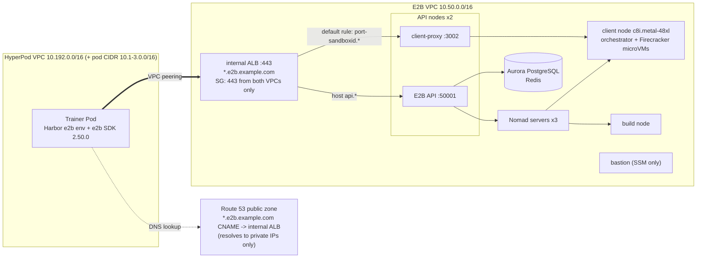

[English](../03a-sandbox-e2b.md)

# 03a. 방법 A: E2B 샌드박스 (셀프호스팅 E2B on AWS)

이 단계에서는 롤아웃 샌드박스 A로 쓸 E2B를 같은 AWS 계정과 리전(us-west-2)에 셀프호스팅으로 배포하고, HyperPod의 학습 Pod가 Harbor의 내장 `e2b` 환경으로 이 E2B를 쓰도록 연결합니다. 마지막으로 템플릿을 미리 만들고 oracle 검증으로 56개 태스크가 모두 동작하는지 확인합니다.

- 셀프호스팅 구현: [`aws-samples/sample-e2b-on-aws`](https://github.com/aws-samples/sample-e2b-on-aws) commit `830b516`(전체 SHA `830b516a47b5ecbe86bb981d4816927145280e22`) 고정, `x86_64`, 클라이언트 노드 `c8i.metal-48xl`
- Harbor 코드는 바꾸지 않습니다. 학습 Pod의 환경 변수 `E2B_API_KEY`와 `E2B_DOMAIN` 두 개로 셀프호스팅과 E2B Cloud를 전환합니다(8절).
- 이 가이드의 측정은 셀프호스팅 E2B에서만 했습니다. 측정 결과는 [`05-comparison.md`](05-comparison.md)에 있습니다.

예상 소요 시간: `deploy.sh` 1~1.5시간(대부분 대기), 피어링과 Secret 수 분, 템플릿 사전 빌드와 oracle 검증 각각 수 분에서 수십 분

## 0. 사전 조건

| 항목 | 내용 |
|---|---|
| 도메인 | 공개 Route 53 호스팅 영역이 있는 도메인 1개(2절) |
| EC2 쿼터 | Running On-Demand Standard 인스턴스(`L-1216C47A`) 약 230 vCPU([`00-prerequisites.md`](00-prerequisites.md) 2절) |
| HyperPod 클러스터 | [`01-hyperpod-eks.md`](01-hyperpod-eks.md) 완료. VPC 이름 태그 `harbor-rl-hp-VPC`. 네임스페이스 `harbor-rl`, ServiceAccount `trainer`, Pod Identity 역할 `harbor-rl-trainer-pod`는 01 6절의 `setup-access.sh`가 만듭니다(`RUNTIME_ID` 없이 실행해도 됨) |
| 태스크 이미지 | [`02-tasks-and-images.md`](02-tasks-and-images.md)의 `harbor-rl/tasks-base:v2`(linux/amd64 변형 포함) |
| Trainer 이미지 | [`04-grpo-training.md`](04-grpo-training.md) 3절의 `TAG=v12 ./training/build-image.sh`. 이 스크립트가 프로젝트 S3 버킷 `harbor-rl-sandbox-<ACCOUNT_ID>-us-west-2`도 만듭니다(`deploy.sh`가 이 버킷에 CloudFormation 템플릿을 올림) |
| 로컬 도구 | AWS CLI v2, Session Manager 플러그인 불필요(SSM Run Command만 사용), `kubectl`, `python3`, `curl` |

고정 비용: 셀프호스팅 E2B는 샌드박스를 하나도 띄우지 않아도 켜져 있는 동안 약 $11.11/시간이 듭니다 [estimated]. 산식은 [`05-comparison.md`](05-comparison.md)에 있습니다.

## 1. 아키텍처

`deploy.sh`가 만드는 CloudFormation 스택(`harbor-rl-e2b`)은 새 VPC(10.50.0.0/16), 배스천, 내부 ALB, DB를 만들고, 배스천이 샘플의 배포 체인(Packer, Terraform, Nomad)으로 나머지 E2B 구성 요소를 배포합니다.

| 구성 요소 | 인스턴스 / 서비스 | 역할 |
|---|---|---|
| Nomad 서버 x3 | `t3.xlarge` | Nomad/Consul 컨트롤 플레인 |
| API 노드 x2 | `t3.xlarge` | E2B REST API(`api.<E2B_DOMAIN>`, :50001)와 client-proxy(:3002) |
| 클라이언트 노드 x1 | `c8i.metal-48xl` | orchestrator + Firecracker microVM(샌드박스). Firecracker는 KVM이 필요하므로 베어메탈 |
| 빌드 노드 x1 | `m8i.4xlarge` | 템플릿 빌드(이미지 pull, rootfs 생성) |
| 배스천 | `c7i.xlarge` | 배포 체인 실행. SSH 없이 SSM으로만 관리 |
| DB / 캐시 | Aurora PostgreSQL Serverless, ElastiCache Redis | 팀, API 키, 티어, 템플릿 메타데이터 |
| 로드 밸런서 | 내부 ALB(ACM 와일드카드 인증서, HTTPS 443) | `*.<E2B_DOMAIN>` 진입점 |
| NAT 게이트웨이 | 1개 | 노드의 아웃바운드(이미지 pull 등) |



SDK가 접속하는 주소는 두 종류입니다.

- API: `https://api.<E2B_DOMAIN>`. 샌드박스 생성, 템플릿 빌드. ALB의 호스트 규칙이 API 노드로 보냅니다.
- 샌드박스: `https://<port>-<sandbox_id>.<E2B_DOMAIN>`(명령 실행과 파일 전송은 envd 포트 49983). ALB 기본 규칙이 API 노드의 client-proxy(:3002)로 보내고, client-proxy가 클라이언트 노드의 해당 샌드박스로 전달합니다.

그래서 개별 레코드 대신 와일드카드 `*.<E2B_DOMAIN>` CNAME 하나를 내부 ALB로 향하게 합니다. 이름은 인터넷에서 해석되지만 결과는 사설 IP(10.50.x.x)뿐이므로, 인터넷에서는 접속할 수 없고 학습 Pod는 VPC 피어링으로 접근합니다. 같은 이유로 E2B SDK나 CLI는 노트북이 아니라 VPC 안(학습 Pod, 배스천)에서 실행합니다.

## 2. 도메인 준비

셀프호스팅 E2B는 API와 각 샌드박스를 호스트 이름으로 구분하므로 **공개 Route 53 호스팅 영역이 있는 도메인**이 필요합니다. ACM 와일드카드 인증서를 DNS 검증으로 발급하고 와일드카드 레코드를 만들기 때문입니다.

- 자사 도메인의 하위 영역(예: `sandbox.example.com`)을 Route 53 공개 호스팅 영역으로 만들고, 상위 DNS에서 NS 레코드로 위임합니다.
- 이 가이드는 `DOMAIN=<호스팅 영역 이름>`, `E2B_DOMAIN=e2b.<DOMAIN>`(예: `e2b.example.com`)을 씁니다.
- 회사 도메인을 쓴다면 먼저 도메인 정책을 확인하세요. 인증 없이 응답하는 엔드포인트(예: E2B API의 `/health`)를 인터넷에 노출하지 않도록 이 가이드는 내부 ALB를 씁니다(6절).
- 메일을 보내지 않는 도메인이므로 사칭 방지 레코드(null MX, SPF `-all`, DMARC `reject`)를 둡니다. `deploy.sh`가 자동으로 넣습니다.

## 3. 배포

### 3.1 스택과 배포 체인: `deploy.sh`

```bash
export AWS_REGION=us-west-2
DOMAIN=example.com ./infra/e2b-selfhosted/deploy.sh   # E2B_DOMAIN defaults to e2b.example.com
```

[`infra/e2b-selfhosted/deploy.sh`](../../infra/e2b-selfhosted/deploy.sh)는 멱등입니다. 중간에 실패하면 원인을 고친 뒤 같은 명령을 다시 실행하면 완료된 단계를 건너뛰고 이어서 진행합니다. 자동화하는 내용은 다음과 같습니다.

| 단계 | 내용 |
|---|---|
| 0 | 사칭 방지 레코드 upsert: `<DOMAIN>`과 `<E2B_DOMAIN>`에 MX `0 .`와 SPF `v=spf1 -all`, `_dmarc.<DOMAIN>`에 `p=reject` |
| 1 | 전체 SHA로 고정한 커밋 `830b516a47b5ecbe86bb981d4816927145280e22`의 `e2b-setup-env.yml`을 받아 프로젝트 S3 버킷에 올리고 그 URL로 스택 생성(템플릿 버전 고정). 버킷 이름이 예측 가능하므로 업로드에 `--expected-bucket-owner <ACCOUNT_ID>`를 넘기며, 같은 이름의 버킷을 다른 계정이 소유하면 실패합니다 |
| 2 | 템플릿이 요구하는 배스천용 EC2 키 페어 `harbor-rl-e2b-bastion` 생성. 개인 키는 받자마자 버리며 어디에도 저장하지 않음(`~/.ssh`에 쓰지 않음). 배스천은 SSM으로만 다루므로 SSH 키가 필요 없음 |
| 3 | 스택 생성: `Environment=dev`, `Architecture=x86_64`, `ClientInstanceType=c8i.metal-48xl`, `VpcBlock=10.50.0.0/16`(HyperPod VPC와 겹치지 않게), `PublicAccess=Private`(내부 ALB), `AllowRemoteSSHIPs=127.0.0.1/32`(어디서도 SSH 불가), `AutoDeploy=false`. DB 비밀번호는 스크립트가 생성해 임시 0600 파라미터 파일로만 넘기고 바로 지웁니다(명령줄에 남지 않음, 스택이 Secrets Manager에 저장). 고정 커밋의 템플릿은 `DBPassword`를 `NoEcho`로 선언하므로(고정 커밋에서 확인) CloudFormation이 스택 파라미터에 값을 보여 주지 않습니다 |
| 4 | 스택이 기다리는 ACM 인증서의 DNS 검증 CNAME을 Route 53에 추가하고, 스택 완료 후 `*.<E2B_DOMAIN>` CNAME을 내부 ALB DNS 이름으로 upsert |
| 5 | 배스천이 SSM에 등록되면 SSM Run Command로 샘플의 배포 체인(`deploy-all.sh`: packer, terraform, init-db, build, prepare, deploy, create-template)을 고정 커밋에서 백그라운드로 시작하고 2분마다 완료 마커를 확인. 배포 로그 `/tmp/e2b.log`는 체인 시작 전에 모드 600(root 전용)으로 만듭니다. 체인이 출력한 팀 API 키가 `finalize.sh`의 가림 처리 전까지 이 로그에 남기 때문입니다 |
| 6 | [`finalize.sh`](../../infra/e2b-selfhosted/finalize.sh) 실행(3.3절) |

5단계에서 스크립트는 샘플의 무인 실행 경로에 빠져 있는 두 설정을 넣습니다.

- `HOME=/root`: cloud-init/SSM 경로에는 `HOME`이 없어서, `init-db` 단계의 Go가 캐시 디렉터리를 정하지 못하고 종료합니다.
- `git config --global --add safe.directory /opt/infra/sample-e2b-on-aws`: 저장소 소유자는 `ubuntu`인데 체인은 root로 돌기 때문에 git이 저장소를 거부하고, 이미지 태그의 커밋 해시가 빈 값이 되어 `build` 단계가 실패합니다.

> `ClientInstanceType`을 지정하지 않으면 샘플 기본값(`c5.metal`)이 쓰입니다. 이 가이드는 `c8i.metal-48xl`을 명시합니다(`CLIENT_INSTANCE_TYPE` 환경 변수로 변경 가능).

### 3.2 진행 확인: `status.sh`

```bash
./infra/e2b-selfhosted/status.sh
```

SSM으로 배스천의 완료 마커(`/opt/.e2b-step-*.done`)와 배포 로그(`/tmp/e2b.log`) 마지막 15줄을 보여 줍니다. SSH는 필요 없습니다. 출력이 SSM 명령 기록에 남으므로, `api key`, `token`, `password`, `secret`이 들어간 줄은 배스천에서 걸러낸 뒤 내보냅니다. `deploy.sh`가 실패로 끝났다면 이 출력으로 원인을 확인하고 고친 뒤 `deploy.sh`를 다시 실행합니다.

세 스크립트(`status.sh`, `finalize.sh`, `db-query.sh`)는 공용 도우미 [`bastion.sh`](../../infra/e2b-selfhosted/bastion.sh)를 씁니다. 스크립트 본문을 base64로 SSM `AWS-RunShellScript`에 실어 보내고 결과를 기다립니다. 본문과 출력이 SSM 기록에 남으므로 비밀 값은 본문에 넣지 않고, 배스천 안에서 Secrets Manager로 읽으며 출력하지 않습니다.

### 3.3 팀 티어와 API 키: `finalize.sh`

`deploy.sh`가 마지막에 자동으로 실행합니다. 따로 다시 실행해도 안전합니다.

```bash
./infra/e2b-selfhosted/finalize.sh
```

1. **팀 티어 조정.** 샘플은 팀 티어 `base_v1`을 세션 최대 1시간, 동시 20개로 만듭니다. Harbor의 E2B 환경은 샌드박스를 24시간 타임아웃으로 만들기 때문에(`harbor/environments/e2b.py:227-236`, `timeout=86_400`) 그대로 두면 모든 생성이 `400: Timeout cannot be greater than 1 hours`로 실패합니다. 스크립트는 `max_length_hours = 24`, `concurrent_instances = 1000`으로 바꿉니다(`MAX_HOURS`, `MAX_SANDBOXES`로 변경 가능). 1,000은 노드 용량이 실제 한도가 되도록 충분히 크게 잡은 값입니다.
2. **팀 API 키를 Secrets Manager로.** 배스천의 `/opt/config.properties`에 있는 `teamApiKey`를 배스천 안에서 Secrets Manager 비밀 `harbor-rl-e2b/team-api-key`(태그 `Project=harbor-rl-sandbox`)에 저장합니다. 키는 출력하지 않으므로 SSM 명령 기록에 남지 않습니다.
3. **로그와 파일 정리.** 샘플의 배포 로그(`/tmp/e2b.log`)가 출력한 키를 `<redacted>`로 바꾸고, `/opt/config.properties`와 DB 설정 파일을 `chmod 600`으로 root 전용으로 만듭니다.

DB를 직접 조회할 때는 [`db-query.sh`](../../infra/e2b-selfhosted/db-query.sh)를 씁니다. SQL 한 문장을 SSM으로 배스천에서 실행하며, DB 자격 증명은 배스천에서 Secrets Manager로 읽고 밖으로 나오지 않습니다. 자격 증명 컬럼은 조회하지 마세요.

```bash
./infra/e2b-selfhosted/db-query.sh "select id, max_length_hours, concurrent_instances from tiers"
```

### 3.4 VPC 피어링과 ALB 제한: `peer.sh`

```bash
./infra/e2b-selfhosted/peer.sh
```

[`peer.sh`](../../infra/e2b-selfhosted/peer.sh)(멱등)가 하는 일:

- E2B VPC(스택의 `VPC` 리소스, 10.50.0.0/16)와 HyperPod VPC(이름 태그 `harbor-rl-hp-VPC`) 사이에 피어링 `harbor-rl-e2b-to-hp`를 만들고 수락합니다.
- 경로는 상대 VPC의 **연결된 모든 CIDR**(HyperPod의 10.192.0.0/16과 보조 Pod CIDR 10.1.0.0/16, 10.2.0.0/16, 10.3.0.0/16 포함)에 대해 넣되, 범위를 필요한 쪽으로 제한합니다.
  - HyperPod 쪽: 라우트 테이블 전부(AgentCore 격리 라우트 테이블 `harbor-rl-agentcore-isolated`와 게이트웨이에 연결된 라우트 테이블 제외)에 E2B VPC로 가는 경로를 넣습니다. 학습 Pod와 노드가 ALB에 닿기 위한 경로입니다.
  - E2B 쪽: **내부 ALB가 있는 서브넷의 라우트 테이블에만** HyperPod VPC로 돌아가는 경로를 넣습니다. 그 밖의 E2B 라우트 테이블에는 HyperPod 경로를 두지 않으며, 남아 있는 경로가 있으면 지웁니다.
  - HyperPod 노드 보안 그룹은 자기 그룹 구성원만 받으므로, 경로와 별개로 E2B 호스트가 HyperPod 노드나 Pod로 연결을 열 수 없습니다.
  - 게이트웨이에 연결된 라우트 테이블은 건너뜁니다. E2B VPC의 리전 NAT 게이트웨이 라우트 테이블이 여기에 해당하며 피어링 경로를 거부합니다.
- **ALB 보안 그룹 제한.** 샘플은 ALB 보안 그룹을 `PublicAccess` 값과 관계없이 0.0.0.0/0의 80, 443으로 엽니다(`PublicAccess`가 바꾸는 것은 ALB scheme뿐). 샌드박스 호스트는 ALB에 도달할 수 있는 누구에게나 인증 없이 응답하므로, 스크립트는 80, 443의 0.0.0.0/0 규칙과 `::/0` 규칙을 모두 지우고 두 VPC의 CIDR에서 오는 HTTPS 443만 허용합니다(80에는 리스너가 없음). 마지막에 보안 그룹을 다시 조회해 0.0.0.0/0이나 `::/0`에 열린 규칙이 남아 있으면 오류로 종료합니다.

### 3.5 Kubernetes Secret: `set-secret.sh`

```bash
export KUBECONFIG=$HOME/.kube/harbor-rl-hp
E2B_DOMAIN=e2b.example.com ./infra/e2b-selfhosted/set-secret.sh
```

[`set-secret.sh`](../../infra/e2b-selfhosted/set-secret.sh)는 Secrets Manager에서 팀 API 키를 읽어 Kubernetes Secret `sandbox-secrets`(네임스페이스 `harbor-rl`)에 `E2B_API_KEY`, `E2B_DOMAIN`으로 씁니다. 키는 파이프로만 전달되고 화면이나 디스크에 남지 않습니다. Secret은 server-side apply(`kubectl apply --server-side --force-conflicts --field-manager=harbor-rl`)로 씁니다. client-side apply와 달리 `kubectl.kubernetes.io/last-applied-configuration` 어노테이션에 값의 사본이 남지 않습니다. 적용 시 Secret 데이터 전체가 바뀌므로, `HF_TOKEN`은 환경 변수가 있으면 그 값을, 없으면 기존 Secret의 값을 그대로 다시 넣습니다. Job 매니페스트([`infra/k8s/job.yaml`](../../infra/k8s/job.yaml))는 세 값을 모두 `optional: true`로 주입합니다. 네임스페이스는 `setup-access.sh`가 만들고 기존 키에 병합하는 것도 `setup-access.sh`뿐이므로, 이 스크립트는 [`01-hyperpod-eks.md`](01-hyperpod-eks.md) 6절의 `setup-access.sh` 다음에 실행합니다.

Secret을 바꾼 뒤 이미 실행 중인 Pod에는 반영되지 않습니다. Job을 다시 제출하세요.

### 3.6 API 키 교체

```bash
ROTATE=1 ./infra/e2b-selfhosted/finalize.sh               # new team API key (old key stops working)
E2B_DOMAIN=e2b.example.com ./infra/e2b-selfhosted/set-secret.sh
TAG=v12 ./infra/k8s/submit.sh e2b-prebuild 0 python3 bench/prebuild_e2b_templates.py \
  --image <ACCOUNT_ID>.dkr.ecr.us-west-2.amazonaws.com/harbor-rl/tasks-base:v2   # rebuild templates (3.8)
```

`ROTATE=1`은 배스천에서 샘플의 `init-db.sh`를 다시 실행해 팀을 새로 만듭니다(새 팀 ID와 새 API 키). 이전 키는 더 이상 동작하지 않고 **이전 팀의 템플릿도 지워지므로** 템플릿을 다시 빌드해야 합니다. 같은 실행에서 티어 조정과 Secrets Manager 갱신, 로그 정리가 이어서 적용됩니다. 키가 노출됐다고 의심되면 이 절차를 따르세요.

### 3.7 연결과 이그레스 확인

ALB가 내부용이므로 확인은 클러스터 안에서 합니다. 잠깐 쓰는 디버그 Job을 띄웁니다.

```bash
TAG=v12 ./infra/k8s/submit.sh e2b-debug 0 sleep 7200
kubectl -n harbor-rl wait --for=condition=Ready pod -l job-name=e2b-debug --timeout=600s
kubectl -n harbor-rl exec job/e2b-debug -- bash -c '
  getent hosts api.$E2B_DOMAIN                                                       # expect 10.50.x.x
  curl -s -o /dev/null -w "%{http_code}\n" https://api.$E2B_DOMAIN/health            # expect 200
  curl -s -o /dev/null -w "%{http_code}\n" https://api.$E2B_DOMAIN/templates'        # expect 401 (no key)
```

이름이 10.50.x.x로 해석되는데 연결이 안 되면 피어링 경로(3.4)와 ALB 보안 그룹을 확인합니다.

이그레스 차단 확인(템플릿 사전 빌드 3.8 이후). 학습과 같은 하네스로 태스크 하나의 샌드박스를 띄워, 외부 접속이 실패하고 태스크 데이터는 읽히는지 봅니다.

```bash
TAG=v12 ./infra/k8s/submit.sh egress-e2b 0 python3 bench/egress_check.py --sandbox e2b
kubectl -n harbor-rl logs -f job/egress-e2b
# expect: "network policy: no-network", the https, pypi and s3 checks fail, "egress blocked: True | data readable: True"
```

스크립트는 네트워크 확인 세 가지(`https`, `pypi`, `s3`)와 데이터 읽기 확인을 실행합니다. E2B에서는 세 확인 모두 DNS 해석 단계에서 실패합니다(`curl`은 `Resolving timed out`). 하네스가 태스크의 `network_mode = "no-network"`를 Harbor에 넘기고, Harbor E2B 환경이 이를 `allow_internet_access=False`로 바꿔 샌드박스를 만들기 때문입니다(6절).

### 3.8 템플릿 사전 빌드

Harbor E2B 환경은 태스크마다 템플릿 별칭 `{task short name}__{environment/ 내용 해시 12자}`(`/`는 `__`, `.`은 `-`로 치환, `harbor/environments/e2b.py:105-108`)를 찾고, 없으면 `Template().from_image(image)`(레지스트리 자격 증명 없음) 또는 `from_dockerfile`로 직접 빌드합니다(`:180-214`). 이 가이드의 태스크 Dockerfile은 비공개 ECR 이미지(`FROM ${BASE_IMAGE}`)를 쓰므로 Harbor가 직접 빌드할 수 없습니다.

그래서 [`bench/prebuild_e2b_templates.py`](../../bench/prebuild_e2b_templates.py)가 템플릿을 미리 만듭니다.

- 별칭, CPU, 메모리를 **Harbor의 `E2BEnvironment` 객체를 실제로 만들어** 계산합니다(`harbor_alias`, `:29-45`). 그래서 학습 시 Harbor가 찾는 이름과 항상 같습니다.
- ECR 비밀번호는 `ecr:GetAuthorizationToken`으로 받은 12시간짜리 토큰(사용자 이름 `AWS`)만 빌드 요청에 넘깁니다(`ecr_password`, `build_one`, `:55-70`). 장기 AWS 키는 E2B에 전달하지 않습니다.
- 반드시 위처럼 Kubernetes Job으로 실행합니다. Job의 Pod 역할은 `harbor-rl/tasks-base` 저장소 하나만 pull할 수 있으므로, E2B 템플릿 빌더에 넘어가는 토큰도 그 저장소의 pull 전용입니다. 더 넓은 권한의 로컬 자격 증명으로 실행하면 그 권한의 ECR 토큰이 E2B 쪽으로 넘어가므로 그렇게 실행하지 마세요.
- 공용 이미지의 linux/amd64 변형으로 빌드합니다. 각 `task.toml`의 `cpus = 2`, `memory_mb = 4096`이 그대로 템플릿에 들어갑니다.
- 템플릿 start command로 공용 샌드박스 워밍업 [`tasks/image/warmup.sh`](../../tasks/image/warmup.sh)를 실행합니다(`WARMUP_START_CMD`, `:48-52`, `set_start_cmd`, `:67-68`). 스크립트를 base64로 넣어 `sh`로 실행한 뒤 `/tmp/.harbor-warmup-done`을 만들고, 준비 확인 명령 `test -f /tmp/.harbor-warmup-done`이 통과하면 E2B가 템플릿 스냅샷을 찍습니다. 따라서 import한 태스크 라이브러리와 읽은 `/data`가 스냅샷에 담기고, 모든 샌드박스가 그 상태에서 시작합니다. AgentCore shim이 V2 스냅샷 전에 실행하는 것과 같은 스크립트입니다([`02-tasks-and-images.md`](02-tasks-and-images.md) 4.2절). 스크립트는 파일만 읽으므로 샌드박스 사이에 공유되는 세션별 상태는 없습니다.
- 이미 있는 별칭은 건너뜁니다(`--force`로 다시 빌드). 워밍업 스크립트를 바꾼 뒤에도 `--force`로 다시 빌드합니다. 동시 빌드 수는 `--parallel`(기본 8).

```bash
TAG=v12 ./infra/k8s/submit.sh e2b-prebuild 0 python3 bench/prebuild_e2b_templates.py \
  --image <ACCOUNT_ID>.dkr.ecr.us-west-2.amazonaws.com/harbor-rl/tasks-base:v2
kubectl -n harbor-rl logs -f job/e2b-prebuild     # last line: "templates: 56 ok, 0 failed"
```

학습 Pod 역할에는 이를 위한 권한으로 `ecr:GetAuthorizationToken`과 `harbor-rl/tasks-base` 저장소 하나에 대한 pull만 들어 있습니다([`infra/iam/trainer-pod-policy.json`](../../infra/iam/trainer-pod-policy.json)의 `EcrTokenForE2BTemplateBuild`, `PullTaskBaseImage`). 이미지 빌드는 E2B 빌드 노드에서 원격으로 일어나므로 로컬 Finch나 Docker가 필요 없습니다.

태스크의 `environment/`를 바꾸면 해시가 바뀌어 별칭도 바뀌므로 이 단계를 다시 실행합니다.

### 3.9 Oracle 검증

```bash
TAG=v12 ./infra/k8s/submit.sh oracle-e2b 0 python3 bench/oracle_check.py --sandbox e2b
kubectl -n harbor-rl logs -f job/oracle-e2b       # last line: "[e2b] oracle passed 56/56 -> ..."
```

[`bench/oracle_check.py`](../../bench/oracle_check.py)는 학습과 같은 하네스(`training.harness:TimedBashEnv`)로 태스크마다 샌드박스를 시작하고, `solution/`을 올려 `bash /solution/solve.sh`를 실행한 뒤 verifier 보상을 CSV(`/results/oracle/oracle_e2b_<시각>.csv`)에 기록합니다. 56/56이 통과해야 다음 단계로 넘어갑니다. 실패한 태스크는 CSV의 `error` 열에 원인이 남습니다. 측정 결과는 [`05-comparison.md`](05-comparison.md)에 있습니다.

## 4. Harbor E2B 환경의 동작 (Harbor 0.23.0)

비교 결과를 해석할 때 필요한 점만 정리합니다(`harbor/environments/e2b.py`).

| 항목 | 동작 |
|---|---|
| 샌드박스 생성 | `AsyncSandbox.create(template=<alias>, timeout=86_400, allow_internet_access=..., network=...)`(`:221-236`). 실패 시 1회 재시도 |
| 명령 실행 | `commands.run(background=True)`로 시작한 뒤 `wait()`. 연결 수립 오류(`ConnectError`, `ConnectTimeout`, `PoolTimeout`)와 429만 최대 3회 시도(`:46-56`, `:432-462`). 이미 시작된 명령은 다시 보내지 않음. stdin은 주지 않음 |
| 업로드 | `upload_dir`는 파일을 20개씩 묶어 `files.write_files` 호출 |
| 다운로드 | `download_dir`는 `files.list`로 재귀 순회하며 파일마다 `files.read` 1회 |
| 종료 | `stop(delete)`는 `delete` 값과 관계없이 `kill()`(`:280-297`) |
| 네트워크 | `capabilities`에 `disable_internet=True`, allowlist 지원 선언(`:123-138`) |

AgentCore 환경은 디렉터리를 tar.gz 하나로 옮기므로, 파일 전송 수치에는 이 구현 차이가 포함됩니다(`05-comparison.md`에 표시).

학습 프로세스가 끝날 때 TRL의 `HarborEnv.__del__`은 정리 전에 멈출 수 있고, Harbor는 샌드박스를 24시간 타임아웃으로 만들기 때문에 남은 샌드박스가 계속 자원을 차지합니다. [`training/harness.py`](../../training/harness.py)의 종료 훅(`:186-196`)이 살아 있는 샌드박스를 모두 `kill`합니다.

## 5. SDK 버전 고정: `e2b==2.50.0`

Trainer 이미지는 `e2b==2.50.0`을 고정합니다([`training/Dockerfile`](../../training/Dockerfile)). E2B Python SDK 2.51.0은 샌드박스 생성에 `POST /v2/sandboxes`를 쓰는데, 이 셀프호스팅 버전의 API는 이 경로를 제공하지 않아 생성이 `404 ... method not allowed`로 실패합니다. 2.50.0은 `POST /sandboxes`를 씁니다. 템플릿 빌드 API는 영향이 없어서, 템플릿은 만들어지는데 샌드박스만 안 뜨는 형태로 나타납니다.

일반 원칙: **셀프호스팅 E2B에서는 SDK 버전을 배포한 서버 버전에 맞춰 고정**합니다. E2B Cloud는 최신 API를 제공하지만 셀프호스팅 서버는 배포 시점의 버전에 머뭅니다. 샘플 커밋을 바꾸면 SDK 버전도 다시 확인하세요.

## 6. 보안

| 항목 | 이 가이드의 구성 |
|---|---|
| 노출 범위 | `PublicAccess=Private`로 ALB가 내부 scheme. 공개 DNS에는 사설 IP만 노출. `peer.sh`가 ALB 보안 그룹을 두 VPC에서 오는 HTTPS 443으로 제한하고(IPv4, IPv6 전체 개방 규칙 제거), 인터넷에 열린 규칙이 남으면 오류로 종료. 샌드박스 호스트는 ALB까지 도달하면 인증 없이 응답하므로 이 제한이 중요합니다 |
| VPC 간 경로 | E2B 쪽은 ALB 서브넷만 HyperPod VPC로 돌아가는 경로를 가짐. HyperPod 노드 보안 그룹은 자기 구성원만 받으므로 E2B 호스트(샌드박스 포함)가 HyperPod 노드나 Pod로 연결을 열 수 없음 |
| 관리 접근 | `AllowRemoteSSHIPs=127.0.0.1/32`로 SSH 경로 없음. 배스천은 SSM Run Command로만 다룸. 키 페어는 템플릿 요구 사항이라 만들지만 개인 키는 생성 직후 버리므로 장기 자격 증명이 남지 않음 |
| 배포 입력 | 샘플을 전체 커밋 SHA로 고정. CloudFormation 템플릿 업로드는 `--expected-bucket-owner`로 버킷 소유 계정을 확인 |
| API 키 | 배스천에서 Secrets Manager로 바로 저장(SSM 기록에 남지 않음), 샘플 로그(`/tmp/e2b.log`, 처음부터 모드 600)에서 가림, 설정 파일 root 전용. 클러스터에는 `set-secret.sh`가 Kubernetes Secret으로만 전달(server-side apply). 사전 빌드 Job이 E2B에 넘기는 것은 저장소 하나만 pull할 수 있는 12시간 ECR 토큰뿐. 교체는 3.6절 |
| DB 비밀번호 | 명령줄이 아닌 임시 0600 파일로 CloudFormation에 전달(템플릿 파라미터는 `NoEcho`), 스택이 Secrets Manager에 보관. `db-query.sh`도 배스천 안에서만 읽음 |
| 샌드박스 이그레스 | 모든 `task.toml`이 `[environment] network_mode = "no-network"`. TRL의 Harbor 통합은 네트워크 정책을 넘기지 않으므로 하네스가 Harbor의 `resolve_agent_env_baseline`으로 태스크 정책을 계산해 `network_policy=`로 넘깁니다([`training/harness.py:111-125`](../../training/harness.py)). Harbor E2B 환경은 이를 `allow_internet_access=False`로 생성 요청에 넣습니다(`e2b.py:232-234`). 정책을 강제할 수 없는 환경이면 Harbor가 환경 생성 시점에 태스크를 거부합니다(`harbor/environments/base.py:776-790`) |
| 오케스트레이터 | 샘플이 Nomad ACL을 켠 상태로 배포합니다 |
| 학습 Pod 권한 | EKS Pod Identity. E2B 쪽에 필요한 AWS 권한은 템플릿 빌드용 ECR 토큰과 `tasks-base` pull뿐. 템플릿 사전 빌드를 Job으로만 실행하는 이유(3.8절) |

E2B 팀 API 키는 IAM처럼 동작 단위로 나눌 수 없습니다. 키를 가진 쪽은 그 팀의 샌드박스와 템플릿을 모두 다룰 수 있으므로, 키는 위 경로 밖으로 꺼내지 마세요.

## 7. 비용

셀프호스팅 비용은 샌드박스 초 단위 과금이 아니라 **켜져 있는 동안의 인프라 비용**입니다: 클라이언트 노드 `c8i.metal-48xl`(가장 큼), Nomad 서버 3대와 API 노드 2대(`t3.xlarge`), 빌드 노드(`m8i.4xlarge`), 배스천, Aurora Serverless, ElastiCache Redis, NAT 게이트웨이, ALB. 샌드박스를 띄우지 않아도 같은 비용이 나가므로 사용률이 낮을수록 롤아웃당 비용이 커집니다. 롤아웃당 비용과 E2B Cloud, AgentCore 대비 손익분기 계산은 [`05-comparison.md`](05-comparison.md)에, 삭제 절차는 [`06-cleanup.md`](06-cleanup.md)에 있습니다.

## 8. 대안: E2B Cloud (이 가이드에서 측정하지 않음)

| 항목 | 셀프호스팅 (이 가이드) | E2B Cloud |
|---|---|---|
| 인프라 | 1~3절 전부 | 없음 |
| 설정 | `E2B_API_KEY` + `E2B_DOMAIN` | `E2B_API_KEY`만. `E2B_DOMAIN`이 없으면 SDK 기본 도메인 사용 |
| 동시 샌드박스 | 티어 DB 값(1,000으로 조정), 실제 한도는 노드 용량 | Hobby 20, Pro 100(애드온으로 증설 가능) [documented] |
| 최대 세션 | 티어 DB 값(24시간으로 조정) | Hobby 1시간, Pro 24시간 [documented] |
| 생성 속도 | 운영자 설정 | Hobby 1/초, Pro 5/초 [documented] |
| 템플릿 | 비공개 ECR + 단기 토큰, 빌드는 계정 내 | 같은 스크립트 사용 가능. 단, 12시간 ECR 토큰이 외부 서비스로 전달됨 |
| 데이터 위치 | 계정 내 VPC | 태스크 데이터와 명령 출력이 계정 밖(E2B)으로 나감 |
| 과금 | EC2, Aurora 등 상시 비용 | vCPU-초 $0.000014, GiB-초 $0.0000045 [documented] |

전환 방법: `E2B_API_KEY`에 E2B Cloud 키를 넣고 [`01-hyperpod-eks.md`](01-hyperpod-eks.md) 6절의 `./infra/k8s/setup-access.sh`를 다시 실행합니다. 이 스크립트는 Secret의 다른 키를 유지하므로, 셀프호스팅에서 넣은 `E2B_DOMAIN`은 직접 지웁니다.

```bash
export E2B_API_KEY=<your E2B Cloud key>
RUNTIME_ID=<runtime id> ./infra/k8s/setup-access.sh   # keep RUNTIME_ID if AgentCore is deployed (without it the AgentCore permissions are left out)
kubectl -n harbor-rl patch secret sandbox-secrets --type=json -p='[{"op":"remove","path":"/data/E2B_DOMAIN"}]'
```

이어서 3.8절과 3.9절을 그대로 실행합니다. 2절부터 3.6절, 5절의 버전 고정은 필요 없습니다(최신 SDK 사용 가능).

Harbor E2B 환경은 24시간 타임아웃으로 샌드박스를 만들고 동시성 스윕은 128까지 가므로, 이 가이드를 E2B Cloud로 재현하려면 Pro 이상(동시성 애드온 포함)이 필요합니다. Hobby 티어에서는 세션 최대 1시간 제한 때문에 생성이 거부될 수 있습니다.

2 vCPU / 4 GiB 샌드박스의 E2B Cloud 시간당 비용 [estimated]: `(2 x 0.000014 + 4 x 0.0000045) x 3600 = 0.000046 x 3600 = 약 $0.166/시간`.

## 9. 자주 겪는 문제 (Common pitfalls)

| 증상 | 원인 | 대응 |
|---|---|---|
| 템플릿은 빌드되는데 샌드박스 생성이 `404 ... method not allowed` | SDK 2.51.0 이상은 `POST /v2/sandboxes`로 생성하지만 이 셀프호스팅 서버는 제공하지 않음 | `e2b==2.50.0` 고정(5절) |
| 모든 생성이 `400: Timeout cannot be greater than 1 hours` | 샘플 기본 티어 `base_v1`은 1시간/동시 20개, Harbor는 24시간으로 생성 | `finalize.sh`(3.3절) |
| 배포 체인이 `init-db`에서 `GOCACHE is not defined ...`로 종료 | 무인 실행 경로에 `HOME` 없음 | `deploy.sh`가 `HOME=/root` 설정. 샘플 체인을 직접 돌릴 때도 동일하게 |
| `build` 단계에서 `e2b-core/client-proxy:` invalid reference | root로 실행된 git이 `ubuntu` 소유 저장소를 거부해 커밋 해시가 빈 값 | `deploy.sh`가 `safe.directory` 설정 |
| 노트북에서 E2B SDK나 CLI가 연결되지 않음 | 내부 ALB, 공개 DNS는 사설 IP만 반환 | 학습 Pod나 배스천에서 실행 |
| `PublicAccess=Private`인데 ALB 보안 그룹이 0.0.0.0/0 | 샘플의 `PublicAccess`는 ALB scheme만 바꿈 | `peer.sh`가 두 VPC의 443만 허용 |
| 클라이언트 노드가 `c5.metal`로 생성됨 | `ClientInstanceType` 미지정 시 샘플 기본값 | `deploy.sh`처럼 명시 |
| `peer.sh`가 `ALB security group ... is still open to the internet`으로 종료 | 0.0.0.0/0 또는 `::/0` 규칙이 지워지지 않음(다른 포트나 형식으로 추가된 규칙 등) | 콘솔이나 `describe-security-groups`로 남은 규칙을 확인해 지운 뒤 `peer.sh` 재실행 |
| E2B 호스트(예: 클라이언트 노드)에서 HyperPod 쪽 주소로 접속이 안 됨 | 의도된 동작. E2B 쪽은 ALB 서브넷에만 HyperPod 경로가 있고 HyperPod 노드 보안 그룹은 자기 구성원만 받음 | 연결은 항상 HyperPod 쪽(학습 Pod)에서 ALB로 시작 |
| `deploy.sh`가 템플릿 업로드에서 `AccessDenied` 또는 403으로 실패 | `--expected-bucket-owner` 확인 결과 프로젝트 버킷 이름을 다른 계정이 소유하거나, 버킷이 아직 없음 | `training/build-image.sh`를 먼저 실행해 이 계정에 버킷을 만듦. 다른 계정이 이름을 소유하고 있다면 그 버킷은 쓰지 않음 |
| 배스천 SSH 키를 찾을 수 없음 | `deploy.sh`는 키 페어의 개인 키를 저장하지 않음 | SSM Run Command(`bastion.sh` 기반 스크립트)로 접근 |
| `create-route`가 한 라우트 테이블에서 실패 | NAT 게이트웨이용 게이트웨이 라우트 테이블은 피어링 경로를 거부 | 해당 테이블 제외(`peer.sh`에 반영) |
| 학습 Pod에서 `api.<E2B_DOMAIN>`이 사설 IP로 해석되지만 연결 시간 초과 | 피어링 경로 누락(특히 Pod CIDR) 또는 ALB 보안 그룹 | `peer.sh` 재실행, 3.7절 확인 |
| Harbor가 템플릿을 직접 빌드하려다 실패 | 별칭이 없음. 태스크 Dockerfile이 비공개 ECR 기반이라 Harbor가 자격 증명 없이 빌드 불가. `environment/`를 바꾸면 별칭도 바뀜 | 3.8절 사전 빌드 재실행 |
| 키 교체 후 모든 생성이 템플릿을 찾지 못함 | `ROTATE=1`은 팀을 다시 만들어 이전 팀의 템플릿을 지움 | 3.6절대로 템플릿 재빌드 |
| 학습 프로세스 종료 후에도 샌드박스가 남음 | Harbor는 24시간 타임아웃으로 생성, TRL `HarborEnv.__del__`이 정리 전에 멈출 수 있음 | `training/harness.py` 종료 훅이 살아 있는 샌드박스를 `kill` |
| 기본 메모리가 E2B 문서마다 다름 | 문서 간 불일치 | `task.toml`에 `cpus = 2`, `memory_mb = 4096` 명시 |

근거와 확인 날짜는 [`references.md`](references.md)에 있습니다.

## 다음 단계

- [`03b-sandbox-agentcore.md`](03b-sandbox-agentcore.md): 방법 B(AgentCore Runtime)
- [`04-grpo-training.md`](04-grpo-training.md): `--sandbox e2b`로 GRPO 학습 실행
