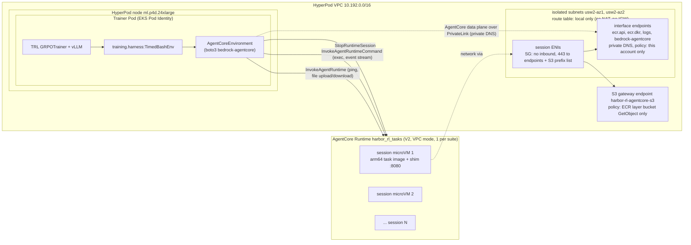

[English](../03b-sandbox-agentcore.md)

# 03b. 방법 B: Amazon Bedrock AgentCore Runtime 샌드박스

이 단계에서는 Amazon Bedrock AgentCore Runtime 세션을 Harbor 샌드박스로 씁니다. 준비할 것은 다섯 가지입니다.

1. 인터넷 경로가 없는 격리 네트워크(`agentcore/network.sh`)
2. 태스크 이미지에 붙이는 작은 서비스 계약 shim(`agentcore/shim/main.go`)
3. 태스크 스위트 전체가 공유하는 런타임 1개(`agentcore/deploy_runtime.sh`)
4. Harbor `BaseEnvironment` 구현(`agentcore/harbor_agentcore/environment.py`)
5. TRL을 포크하지 않고 학습에 연결하는 하네스(`training/harness.py`)

예상 소요 시간: 네트워크 수 분, 이미지 빌드/푸시 수 분(공용 베이스 이미지가 이미 있을 때), 런타임 READY 대기 수 분

## 0. 사전 조건

| 항목 | 내용 |
|---|---|
| HyperPod 클러스터 | [`01-hyperpod-eks.md`](01-hyperpod-eks.md) 1~5절 완료. VPC 이름 태그 `harbor-rl-hp-VPC`(기본 CIDR 10.192.0.0/16) |
| 태스크 이미지 | [`02-tasks-and-images.md`](02-tasks-and-images.md)의 `harbor-rl/tasks-base:v2`(linux/arm64 변형 포함) |
| Trainer 이미지 | oracle 검증 Job용. [`04-grpo-training.md`](04-grpo-training.md) 3절의 `TAG=v12 ./training/build-image.sh` |
| 로컬 도구 | AWS CLI 2.36.46 이상(`--platform-version` 지원), Finch(또는 Docker), `envsubst`(gettext) |
| 쿼터 | AgentCore 활성 세션 128 이상(동시성 스윕 최대값). 기본값은 7절 |

## 1. 왜 커스텀 환경인가

Harbor에는 공식 AgentCore provider가 없습니다(2026-09-30 확인). Harbor 이슈 [#3446](https://github.com/harbor-framework/harbor/issues/3446)이 provider를 제안하고 있지만 열려 있고, 병합된 provider는 없습니다. Harbor는 `BaseEnvironment`를 구현한 클래스를 import path(`module:Class`)로 받을 수 있으므로, Harbor를 수정하지 않고 환경 클래스 하나를 이 저장소에 둡니다.

참고 구현과 라이선스:

| 참고 구현 | 라이선스 | 이 저장소에서 |
|---|---|---|
| [`mightma/harbor@acr-kit-v1`](https://github.com/mightma/harbor/tree/acr-kit-v1) (commit `4ee0cb25`) | Apache-2.0 | shim의 헬스 핸드셰이크, 명령 래핑 규칙, 스트리밍 처리 패턴을 출처 표기 후 재사용 |
| [`awslabs/agentcore-rl-toolkit`](https://github.com/awslabs/agentcore-rl-toolkit) (`agentcore-sandboxd`) | Apache-2.0 | 위 브랜치가 가져온 원본. 출처 표기 |
| [`mightma/harbor-on-agentcore`](https://github.com/mightma/harbor-on-agentcore) | LICENSE 파일 없음 | 설계 참고만. **코드는 복사하지 않음** |

출처 표기는 `agentcore/shim/main.go:13-17`과 `agentcore/harbor_agentcore/environment.py:18-20`에 있습니다. 참고 구현과 다르게 만든 점(항상 `StopRuntimeSession`, `HealthyBusy` 미보고, stdin 차단, `platformVersion V2`, VPC 모드)은 아래 각 절에서 설명합니다.

## 2. 아키텍처



- **롤아웃 1개 = 세션 1개.** 새 `runtimeSessionId`로 처음 호출하면 서비스가 microVM을 하나 띄웁니다. 정책 모델은 Trainer Pod 안에서만 호출되고, 세션은 명령 실행과 verifier만 담당합니다(TRL Harbor 통합의 external agent 패턴). 세션에서 vLLM으로 돌아오는 네트워크 경로는 필요 없습니다.
- **스위트 전체에 런타임 1개.** 런타임 하나는 이미지 하나를 가리킵니다. 이 가이드의 56개 태스크는 공용 베이스 이미지 하나를 쓰므로 런타임도 하나입니다. 태스크마다 이미지가 다르면 이미지 내용으로 중복을 제거해 런타임 수를 줄이고, 계정당 런타임 쿼터(7절)를 확인합니다.
- **VPC 모드, 인터넷 없음.** 세션의 네트워크 인터페이스는 HyperPod VPC 안의 격리 서브넷에 놓이고, 이 서브넷의 라우트 테이블에는 local 경로만 있습니다. 모델이 생성한 코드는 인터넷에 나갈 수 없고, 이미지 pull과 로그 전송만 VPC 엔드포인트로 가며, 각 엔드포인트의 정책이 거기서 할 수 있는 일을 제한합니다(3.1절). 네트워크 설정은 **런타임 단위**이므로 세션마다 인터넷을 켜고 끌 수 없습니다. 인터넷이 필요한 태스크와 그렇지 않은 태스크를 섞으려면 런타임을 나눕니다.
- **학습 Pod에서 AgentCore까지 PrivateLink.** 같은 서브넷에 AgentCore 데이터 플레인 인터페이스 엔드포인트(`com.amazonaws.us-west-2.bedrock-agentcore`, 프라이빗 DNS)가 있으므로, 학습 Pod의 `InvokeAgentRuntime`, `InvokeAgentRuntimeCommand`, `StopRuntimeSession` 호출은 퍼블릭 엔드포인트가 아니라 VPC 안의 사설 경로로 갑니다. E2B 쪽에서 학습 Pod가 VPC 피어링과 내부 ALB로 E2B API에 닿는 것과 같은 조건입니다.

## 3. 격리 네트워크: `network.sh`

```bash
export AWS_REGION=us-west-2
./agentcore/network.sh      # idempotent; prints SUBNETS=... and SESSION_SG=...
```

`deploy_runtime.sh`가 이 스크립트를 호출하므로 따로 실행하지 않아도 됩니다. [`agentcore/network.sh`](../../agentcore/network.sh)가 HyperPod VPC 안에 만드는 리소스(모두 `Project=harbor-rl-sandbox` 태그):

| 리소스 | 설정 | 이유 |
|---|---|---|
| 라우트 테이블 `harbor-rl-agentcore-isolated` (`:26-32`) | local 경로만 | NAT, 인터넷 게이트웨이 경로가 없으므로 세션에서 인터넷 불가 |
| 서브넷 2개 (`:34-47`) | AZ ID `usw2-az1`, `usw2-az2`, CIDR `10.192.96.0/24`, `10.192.112.0/24` | VPC 모드 서브넷은 AgentCore가 지원하는 AZ ID에 있어야 함(us-west-2: `usw2-az1`, `usw2-az2`, `usw2-az3`) [documented]. CIDR은 HyperPod VPC 기본 CIDR의 빈 범위. `AZ_IDS`, `CIDRS`로 변경 가능 |
| 세션 보안 그룹 `harbor-rl-agentcore-sessions` (`:60-70`) | 인바운드 없음. 기본 all-allow 이그레스를 지우고 HTTPS 443을 엔드포인트 보안 그룹과 S3 관리형 프리픽스 목록(`com.amazonaws.us-west-2.s3`)으로만 허용 | ECR 이미지 레이어는 S3에서 오므로 S3 게이트웨이 엔드포인트로 가는 443이 필요. 게이트웨이 엔드포인트는 IP가 아니라 프리픽스 목록으로 지정됨 |
| 엔드포인트 보안 그룹 `harbor-rl-agentcore-endpoints` (`:71-79`) | HTTPS 443을 세션 보안 그룹과 VPC의 모든 CIDR에서 허용 | 인터페이스 엔드포인트의 프라이빗 DNS는 VPC 전체에 적용되므로 HyperPod 노드와 Pod의 ECR pull, 로그 전송도 이 엔드포인트로 감 |
| 인터페이스 엔드포인트 (`:108-122`) | `ecr.api`, `ecr.dkr`, `logs`, 프라이빗 DNS 활성. 엔드포인트 정책은 이 계정의 주체(`aws:PrincipalAccount`)만 허용 | 인터넷 없는 VPC 모드에서 필요 [documented]. 정책은 세션 코드가 다른 계정의 자격 증명으로 이 엔드포인트를 통해 데이터를 내보내지 못하게 함 |
| AgentCore 데이터 플레인 인터페이스 엔드포인트 (`:123-125`) | `bedrock-agentcore`(서비스 이름 `com.amazonaws.us-west-2.bedrock-agentcore`), 프라이빗 DNS 활성, 같은 이 계정 전용 정책 | 세션이 아니라 학습 Pod용. 프라이빗 DNS가 VPC 전체에 적용되므로 HyperPod 노드의 Pod가 `InvokeAgentRuntime`, `InvokeAgentRuntimeCommand`, `StopRuntimeSession`을 PrivateLink로 호출(엔드포인트 보안 그룹이 VPC CIDR의 443을 허용) |
| S3 게이트웨이 엔드포인트 `harbor-rl-agentcore-s3` (`:91-106`) | 격리 라우트 테이블 전용. 정책은 `arn:aws:s3:::prod-<region>-starport-layer-bucket/*`의 `s3:GetObject`만 허용 | 인터넷 없는 VPC 모드에서 필요 [documented]. ECR 이미지 레이어 버킷만 열어 두는 최소 권한은 AgentCore 개발자 가이드의 "Minimum S3 bucket permissions for container agents"를 따름 |

세션 보안 그룹에 S3 프리픽스 목록 이그레스가 없으면 이미지 레이어를 받을 수 없어 런타임 생성이나 갱신이 `UPDATE_FAILED`(사유 "internal error")로 끝납니다.

### 3.1 엔드포인트 정책

세션 안의 코드는 이 엔드포인트들에 닿을 수 있으므로, 엔드포인트 정책이 거기서 할 수 있는 일을 제한합니다.

| 엔드포인트 | 정책 | 범위 |
|---|---|---|
| S3 게이트웨이 `harbor-rl-agentcore-s3` | `s3:GetObject` on `arn:aws:s3:::prod-<region>-starport-layer-bucket/*`만 | 격리 라우트 테이블에만 연결. `network.sh`는 VPC 안의 다른 S3 게이트웨이 엔드포인트에서 격리 라우트 테이블을 떼어 냅니다. 다른 라우트 테이블(HyperPod 노드 서브넷 등)은 VPC에 원래 있던 S3 엔드포인트를 그대로 씁니다 |
| `ecr.api`, `ecr.dkr`, `logs`, `bedrock-agentcore` 인터페이스 | `aws:PrincipalAccount`가 이 계정인 주체만 | 프라이빗 DNS가 VPC 전체에 적용되므로 HyperPod 노드와 Pod도 이 엔드포인트를 씁니다. 이들은 이 계정의 역할로 호출하므로 영향이 없습니다 |

검증(2026-10-07): AgentCore 세션에서 엔드포인트를 통해 다른 S3 버킷의 객체를 읽으면 HTTP 403으로 거부되고, oracle 검증(9.1절)은 그대로 통과하며, 이미지 pull도 정상입니다.

**남은 위험: DNS.** 격리 서브넷에서도 VPC 리졸버(Route 53 Resolver)는 공개 DNS 이름에 응답합니다. 9.1절의 이그레스 확인에서 `curl`이 DNS 해석이 아니라 연결 단계에서 실패하는 것도 이 때문입니다. 따라서 DNS 질의에 데이터를 실어 내보내는 DNS 터널링은 막혀 있지 않습니다. 태스크가 민감한 데이터를 다룬다면 VPC에 Route 53 Resolver DNS Firewall을 붙여 막으세요. DNS Firewall은 VPC 전체에 적용되므로, 클러스터가 쓰는 이름(ECR, S3, STS, EKS, Hugging Face, E2B 도메인 등)의 허용 목록이 필요합니다. 이 가이드에서는 구성하지 않습니다.

## 4. 서비스 계약과 shim

AgentCore Runtime은 명령만 실행하는 용도라도 HTTP 서비스 계약(포트 8080의 `GET /ping`, `POST /invocations`)을 요구합니다 [documented]. 태스크 이미지는 Python 데이터 분석 환경일 뿐이므로 Go로 만든 작은 정적 바이너리 shim을 ENTRYPOINT로 붙입니다. 셸 명령은 shim을 거치지 않고 `InvokeAgentRuntimeCommand`로 실행됩니다.

shim([`agentcore/shim/main.go`](../../agentcore/shim/main.go))의 계약:

| 경로 | 요청 | 응답 |
|---|---|---|
| `GET /ping` | | 항상 `{"status":"Healthy"}` (`:56-58`) |
| `POST /invocations` | `{"action":"ping"}` | `{"status":"ok"}` |
| | `{"action":"upload","path","data"(base64),"mode"}` | `{"status":"ok","path"}`. 같은 디렉터리의 임시 파일에 쓴 뒤 rename하므로 실패해도 잘린 파일이 남지 않음(`:60-94`) |
| | `{"action":"download","path"}` | `{"status":"ok","path","data"(base64)}`. 파일이 shim 상한(96 MiB, `maxUploadBytes`)보다 크면 메모리로 읽지 않고 HTTP 413으로 거부(`:120-124`) |
| | 그 외 | `{"status":"error","error"}`와 4xx/5xx |

설계 이유:

- **8080을 열기 전에 워밍업합니다.** `main()`은 HTTP 서버를 시작하기 전에 `warmup()`을 호출합니다(`:138-148`). `warmup()`(`:151-172`)은 이미지의 `/usr/local/share/harbor/warmup.sh`([`tasks/image/warmup.sh`](../../tasks/image/warmup.sh)와 같은 파일)를 `/bin/sh`로 실행하고, 90초가 지나면 종료시킵니다. 스크립트가 없거나 실패해도 shim은 그대로 서비스를 시작하므로 손해는 속도뿐입니다. V2는 첫 healthy `/ping` 뒤에 스냅샷을 찍으므로, 워밍업이 읽은 Python과 태스크 라이브러리, 태스크 데이터가 복원된 모든 세션의 메모리에 이미 있습니다. 90초 상한은 V2 초기화 한도 120초 [documented]보다 충분히 작게 잡은 값입니다. 이는 V2 최적화 가이드의 권고(의존성 import처럼 비싸고 재사용 가능한 작업을 스냅샷 전 시작 단계에서 수행) [documented]를 따른 것이며, E2B 템플릿도 같은 스크립트를 스냅샷 전에 실행합니다([`02-tasks-and-images.md`](02-tasks-and-images.md) 4.2절). 스크립트는 파일만 읽고 세션별 상태를 만들지 않습니다.
- **`HealthyBusy`를 보고하지 않습니다.** `HealthyBusy` 상태의 세션에는 유휴 타임아웃이 적용되지 않으므로, 클라이언트가 정리하지 못하고 죽으면 세션이 최대 수명(8시간)까지 남아 과금됩니다. 이 shim은 항상 `Healthy`만 보고하므로 버려진 세션도 유휴 타임아웃(15분) 후 끝납니다.
- **파일은 `/invocations`로 보냅니다.** `InvokeAgentRuntimeCommand`는 명령 길이를 64 KB로 제한하지만 `InvokeAgentRuntime` 페이로드는 100 MB까지 허용합니다 [documented]. shim 쪽 상한은 96 MiB(`maxUploadBytes`, `main.go:34-36`)이며 업로드와 다운로드 모두에 적용됩니다. 종단 간 한도는 이보다 낮습니다. 데이터가 base64로 인코딩되어 `InvokeAgentRuntime` 페이로드(100,000,000바이트) 안에 실리므로, 원본 데이터 기준 약 75 MB입니다. 96 MiB를 넘는 파일은 shim이 HTTP 413으로 거부하고, 약 75 MB와 96 MiB 사이의 파일은 API 단계에서 실패합니다.

### 4.1 이미지

[`agentcore/image/Dockerfile`](../../agentcore/image/Dockerfile)은 공용 베이스 이미지의 arm64 변형 위에 shim 바이너리와 워밍업 스크립트만 추가합니다. shim 빌드 스테이지의 Go 이미지는 다이제스트로 고정합니다. 태스크 내용은 E2B에서 쓰는 이미지와 같습니다.

```dockerfile
# agentcore/image/Dockerfile:3-14
ARG BASE_IMAGE
FROM --platform=linux/arm64 golang:1.25-bookworm@sha256:3b4a11519ad929d1e1d261a12cff056f0c85b735253d7d861346b9c6f8b36437 AS shim
WORKDIR /src
COPY shim/main.go .
RUN go mod init agentcore-shim && CGO_ENABLED=0 GOOS=linux GOARCH=arm64 go build -trimpath -ldflags="-s -w" -o /agentcore-shim .

FROM --platform=linux/arm64 ${BASE_IMAGE}
COPY --from=shim /agentcore-shim /usr/local/bin/agentcore-shim
# Shared sandbox warm-up (tasks/image/warmup.sh), run by the shim before the snapshot.
COPY warmup.sh /usr/local/share/harbor/warmup.sh
EXPOSE 8080
ENTRYPOINT ["/usr/local/bin/agentcore-shim"]
```

`deploy_runtime.sh`가 빌드와 푸시를 하므로 직접 실행할 필요는 없습니다. 빌드 컨텍스트는 `shim/main.go`와 `tasks/image/warmup.sh`만 담은 임시 디렉터리입니다(`deploy_runtime.sh:31-35`). 스크립트가 실행하는 명령과 Docker 대응 명령:

```bash
REGISTRY=<ACCOUNT_ID>.dkr.ecr.us-west-2.amazonaws.com
TAG=v2
CTX=$(mktemp -d); mkdir -p $CTX/shim
cp agentcore/shim/main.go $CTX/shim/ && cp tasks/image/warmup.sh $CTX/

# Finch
aws ecr get-login-password --region us-west-2 | finch login --username AWS --password-stdin $REGISTRY
finch build --platform linux/arm64 --build-arg BASE_IMAGE=$REGISTRY/harbor-rl/tasks-base:$TAG \
  -f agentcore/image/Dockerfile -t $REGISTRY/harbor-rl/tasks-agentcore:$TAG $CTX
finch push --platform linux/arm64 $REGISTRY/harbor-rl/tasks-agentcore:$TAG

# Docker equivalent
aws ecr get-login-password --region us-west-2 | docker login --username AWS --password-stdin $REGISTRY
docker buildx build --platform linux/arm64 --build-arg BASE_IMAGE=$REGISTRY/harbor-rl/tasks-base:$TAG \
  -f agentcore/image/Dockerfile -t $REGISTRY/harbor-rl/tasks-agentcore:$TAG --push $CTX
```

AgentCore Runtime은 linux/arm64 이미지만 받습니다 [documented]. 두 스테이지 모두 `--platform=linux/arm64`로 고정되어 있어 Apple Silicon Mac에서는 에뮬레이션 없이 빌드되고, x86 머신에서는 arm64 에뮬레이션(QEMU)이 필요합니다. 베이스 이미지에 arm64 변형이 없으면 빌드가 실패합니다.

## 5. 런타임 배포: `deploy_runtime.sh`

```bash
export AWS_REGION=us-west-2
TAG=v2 ./agentcore/deploy_runtime.sh               # TAG = tag of harbor-rl/tasks-base (required, no default)
TAG=v2 SKIP_BUILD=1 ./agentcore/deploy_runtime.sh  # reuse an already pushed tasks-agentcore:v2
```

마지막 줄에 런타임 ARN, 상태(`READY`), `platformVersion`(`V2`)이 출력됩니다. [`agentcore/deploy_runtime.sh`](../../agentcore/deploy_runtime.sh)가 하는 일:

1. **이미지** (`:22-37`): ECR 리포지토리 `harbor-rl/tasks-agentcore`가 없으면 `scanOnPush=true`, `Project=harbor-rl-sandbox` 태그로 만들고, 4.1절의 Finch 빌드(shim과 워밍업 스크립트를 담은 임시 컨텍스트)와 푸시를 합니다. `SKIP_BUILD=1`이면 이미 푸시된 `tasks-agentcore:$TAG`를 그대로 씁니다.
2. **실행 역할** (`:39-49`): `harbor-rl-agentcore-exec`가 없으면 만들고, 인라인 정책을 **매번 다시 적용**합니다(정책 파일을 바꾼 뒤 재실행하면 반영됨). 범위는 6절.
3. **네트워크** (`:51-53`): `network.sh`를 실행해 서브넷과 세션 보안 그룹을 받아 `networkMode: VPC` 설정을 만듭니다. 같은 스크립트가 학습 Pod용 `bedrock-agentcore` 인터페이스 엔드포인트도 만듭니다(3절).
4. **런타임** (`:55-81`): 이름 `harbor_rl_tasks`(`RUNTIME_NAME`으로 변경 가능)가 없으면 생성하고, 있으면 같은 설정으로 갱신합니다. 갱신하면 새 런타임 버전이 생기고 `DEFAULT` 엔드포인트가 최신 버전을 따라갑니다.
5. **대기** (`:83-91`): `READY`가 될 때까지 15초 간격으로 확인하고, `*FAILED*`이면 `failureReason`을 출력하고 종료합니다.

생성 호출의 핵심 부분:

```bash
# agentcore/deploy_runtime.sh:59-69 (values substituted)
aws bedrock-agentcore-control create-agent-runtime --region us-west-2 \
  --agent-runtime-name harbor_rl_tasks \
  --agent-runtime-artifact '{"containerConfiguration":{"containerUri":"<REGISTRY>/harbor-rl/tasks-agentcore:<TAG>"}}' \
  --role-arn arn:aws:iam::<ACCOUNT_ID>:role/harbor-rl-agentcore-exec \
  --network-configuration '{"networkMode":"VPC","networkModeConfig":{"subnets":["<SUBNET_1>","<SUBNET_2>"],"securityGroups":["<SESSION_SG>"]}}' \
  --protocol-configuration '{"serverProtocol":"HTTP"}' \
  --lifecycle-configuration '{"idleRuntimeSessionTimeout":900,"maxLifetime":28800}' \
  --platform-version V2 \
  --tags Project=harbor-rl-sandbox
```

- `--platform-version V2`: 기본값은 V1입니다. V2는 초기화된 스냅샷에서 세션을 기동하며, 120초 안에 `/ping`이 healthy를 반환해야 세션 생성이 성공합니다 [documented].
- `idleRuntimeSessionTimeout` 900초, `maxLifetime` 28,800초(8시간).
- 런타임 자체는 과금되지 않고 활성 세션만 과금됩니다 [documented]. 만든 리소스와 삭제 명령은 [`06-cleanup.md`](06-cleanup.md)에 있습니다.

배포가 끝나면 런타임 ID를 지정해 `setup-access.sh`를 다시 실행합니다([`01-hyperpod-eks.md`](01-hyperpod-eks.md) 6절). 01 6절에서 `RUNTIME_ID` 없이 실행했다면 학습 Pod 역할 정책에 AgentCore 문이 빠져 있으므로, 이 단계를 거치지 않으면 AgentCore 호출이 `AccessDenied`로 실패합니다.

```bash
export RUNTIME_ID=<RUNTIME_ID>      # last path segment of the runtime ARN
./infra/k8s/setup-access.sh
```

## 6. IAM

| 역할 | 신뢰 주체 | 권한 | 파일 |
|---|---|---|---|
| `harbor-rl-agentcore-exec` (런타임 실행 역할) | `bedrock-agentcore.amazonaws.com`, `aws:SourceAccount`와 `aws:SourceArn`(이 계정의 bedrock-agentcore 리소스)으로 제한 | `harbor-rl/tasks-agentcore` 리포지토리 하나의 이미지 pull, `ecr:GetAuthorizationToken`, 이 런타임의 로그 그룹 `/aws/bedrock-agentcore/runtimes/${RUNTIME_NAME}-*` 쓰기(`deploy_runtime.sh`가 `RUNTIME_NAME`을 export, 기본값 `harbor_rl_tasks`) | [`infra/iam/agentcore-exec-policy.json`](../../infra/iam/agentcore-exec-policy.json), [`agentcore-exec-trust.json`](../../infra/iam/agentcore-exec-trust.json) |
| `harbor-rl-trainer-pod` (EKS Pod Identity) | `pods.eks.amazonaws.com`, `aws:SourceAccount`가 이 계정이고 Pod Identity 세션 태그가 이 클러스터, 네임스페이스 `harbor-rl`, ServiceAccount `trainer`와 일치할 때만 | `bedrock-agentcore:InvokeAgentRuntimeCommand`, `InvokeAgentRuntime`, `StopRuntimeSession`을 **런타임 하나**(`runtime/<RUNTIME_ID>`와 그 `runtime-endpoint/*`)에만. 결과 업로드용 S3 `results/*` put/get. E2B 템플릿 빌드용 ECR 토큰과 `harbor-rl/tasks-base` pull | [`infra/iam/trainer-pod-policy.json`](../../infra/iam/trainer-pod-policy.json), [`trainer-pod-trust.json`](../../infra/iam/trainer-pod-trust.json) |

**실행 역할은 최소 권한으로 유지하세요.** 세션 안에서 실행되는 코드(정책 모델이 만든 명령 포함)는 실행 역할의 자격 증명을 읽을 수 있습니다. 이 가이드의 실행 역할은 태스크 이미지 pull과 런타임 로그 쓰기만 허용하므로, 자격 증명이 노출돼도 할 수 있는 일이 그 범위로 제한됩니다. 실행 역할에 S3, Bedrock 모델 호출 같은 권한을 더하지 마세요. 액세스 키는 어느 역할에도 만들지 않습니다.

## 7. 쿼터, 제한, 감사

| 항목 | 값 | 근거 |
|---|---|---|
| 활성 세션 (`L-3E5722B2`) | 5,000(us-east-1, us-west-2), 그 외 리전 2,500. 조정 가능 | [documented] |
| 데이터 플레인 API (`L-46ED137C`) | 1,000 TPS. 조정 가능. `InvokeAgentRuntimeCommand`도 여기에 속함 | [documented] |
| 새 세션 생성 (`L-8EE2AEA2`) | 25 TPS. 조정 가능 | [documented] |
| 세션당 리소스 | 2 vCPU / 8 GB 고정. 조정 불가 | [documented] |
| 이미지 크기 (`L-0A9E32B3`) | 2 GB. 조정 불가 | [documented] |
| 최대 세션 수명 / 유휴 타임아웃 | 8시간 / 15분. 조정 가능 | [documented] |
| 명령 | 타임아웃 1~3,600초, 길이 최대 65,536자. 셸 상태는 명령 간 유지되지 않음(파일과 백그라운드 프로세스는 세션 안에 유지) | [documented] |
| 아키텍처 | linux/arm64만 | [documented] |
| 런타임 수 (`L-F4575653`) | 1,000 | [documented] |
| VPC 모드 ENI | 런타임 삭제 후 최대 8시간 남을 수 있음(그동안 서브넷, 보안 그룹 삭제가 막힘) | [documented] |

쿼터가 실제 지연과 처리량에 어떻게 나타나는지는 [`05-comparison.md`](05-comparison.md)에 있습니다.

**감사 로그.** CloudTrail 이벤트 기록에는 제어 플레인 호출(`CreateAgentRuntime`, `UpdateAgentRuntime` 등)이 기본으로 남습니다. 데이터 플레인 호출(`InvokeAgentRuntime`, `InvokeAgentRuntimeCommand`, `StopRuntimeSession`)은 기본 이벤트 기록에 나타나지 않습니다. 세션에서 실행된 명령 단위의 감사가 필요하면 CloudTrail 데이터 이벤트(트레일과 이벤트 선택기)를 별도로 구성해야 하며, 이 가이드는 그 구성을 검증하지 않았습니다. 이 가이드에서 명령 기록은 하네스의 타이밍 로그(JSONL, 명령 앞 300자 포함)에 남습니다.

## 8. `BaseEnvironment` 코드 살펴보기

Harbor 0.23.0의 `BaseEnvironment`(`harbor/environments/base.py`)를 구현합니다. 아래 줄 번호는 [`agentcore/harbor_agentcore/environment.py`](../../agentcore/harbor_agentcore/environment.py) 기준입니다.

| Harbor 메서드 | AgentCore API | 비고 |
|---|---|---|
| `start` | `InvokeAgentRuntime` (`{"action":"ping"}`) | 새 세션 ID의 첫 호출이 microVM 생성 |
| `exec` | `InvokeAgentRuntimeCommand` (event stream) | stdin 차단, bash 래핑, cwd/env/user 합성 |
| `upload_*`, `download_*` | `InvokeAgentRuntime` (shim) | 디렉터리는 tar.gz 1개 |
| `stop` | `StopRuntimeSession` | `delete` 값과 무관하게 항상 |

### 8.1 설정, 타입, 기능

설정은 환경 변수로 받습니다.

| 변수 | 의미 |
|---|---|
| `AGENTCORE_RUNTIME_ARN` | 필수. 없으면 `_validate_definition()`이 환경 생성 시점에 실패(`:153-155`) |
| `AGENTCORE_QUALIFIER` | 엔드포인트 qualifier, 기본 `DEFAULT` |
| `AGENTCORE_NETWORK_ISOLATED` | `1`이면 런타임이 격리 VPC 모드라고 선언. `infra/k8s/submit.sh`의 기본값이 `1` |
| `AGENTCORE_MAX_THREADS` | boto3 호출용 스레드 풀 크기, 기본 512 |
| `AWS_REGION` | 런타임 리전 |

```python
# environment.py:147-151
@property
def capabilities(self) -> EnvironmentCapabilities:
    # Network mode (PUBLIC or VPC) is fixed per runtime, so there is no per-session toggle: the runtime either
    # blocks all egress (isolated VPC subnets) or allows it.
    return EnvironmentCapabilities(disable_internet=self._network_isolated)
```

네트워크는 세션이 아니라 런타임의 속성이므로 환경 클래스가 스스로 확인할 수 없습니다. 운영자가 `AGENTCORE_NETWORK_ISOLATED=1`로 "이 런타임은 격리 서브넷에 있다"고 선언할 때만 `disable_internet`을 지원한다고 알립니다. 이 가이드의 모든 태스크는 `network_mode = "no-network"`이므로, 선언이 없으면 Harbor가 환경 생성 시점에 `network_mode='no-network' is not supported by agentcore environment`로 태스크를 거부합니다(`harbor/environments/base.py:776-790`). 조용히 인터넷이 열린 채로 실행되는 경우는 없습니다. 반대로 PUBLIC 런타임에 `1`을 설정하면 이 보장이 깨지므로, 값은 실제 네트워크 구성과 맞춰야 합니다.

`type()`은 `"agentcore"`입니다(`:143-145`). boto3 클라이언트는 프로세스당 하나를 공유하며(`:68-78`) 연결 풀 512, read timeout 3,720초(최대 명령 타임아웃 + 120초)입니다. boto3 호출은 블로킹이므로 전용 스레드 풀에서 실행합니다(`:59-65`). asyncio 기본 executor는 스레드 수가 작아 높은 동시성에서 클라이언트 쪽 병목이 됩니다.

### 8.2 `start` / `stop`

```python
# environment.py:174-179
async def start(self, force_build: bool) -> None:
    # The first call that names a new session id provisions the microVM.
    stem = re.sub(r"[^a-zA-Z0-9_-]+", "-", self.environment_name)[:120]
    self._session_id = f"{stem}-{uuid.uuid4().hex}".ljust(SESSION_ID_MIN_LEN, "0")
    await _in_thread(self._invoke_shim, {"action": "ping"})
    await self._upload_environment_dir_after_start()
```

- 세션 ID는 태스크 이름 + uuid이며, API가 요구하는 최소 33자를 맞춥니다.
- shim의 `ping` 응답이 `{"status":"ok"}`이면 세션이 준비된 것입니다(`_invoke_shim`, `:159-172`).
- 이미지는 런타임에 미리 고정되어 있으므로 `force_build`는 쓰지 않습니다. 태스크 Dockerfile은 빌드하지 않고 `WORKDIR`만 읽어 `exec`의 기본 cwd로 씁니다(`:140-141`).

```python
# environment.py:181-193
async def stop(self, delete: bool) -> None:
    # Always stop the session: an idle session keeps billing memory until the idle timeout.
    if not self._session_id:
        return
    session_id, self._session_id = self._session_id, None
    try:
        await _in_thread(
            _call_with_retry, _client().stop_runtime_session,
            agentRuntimeArn=self._runtime_arn, runtimeSessionId=session_id, qualifier=self._qualifier,
        )
    except ClientError as e:
        if e.response.get("Error", {}).get("Code") != "ResourceNotFoundException":
            self.logger.warning(f"StopRuntimeSession failed for {session_id}: {e}")
```

`stop`은 `delete` 인자와 관계없이 항상 `StopRuntimeSession`을 호출합니다. 호출하지 않으면 세션이 유휴 타임아웃(15분)까지 메모리 요금을 냅니다. 이미 끝난 세션의 `ResourceNotFoundException`은 무시하고, 다른 오류는 경고만 남깁니다.

### 8.3 `exec`: 명령 합성과 래핑

`InvokeAgentRuntimeCommand` 요청 본문에는 `command`와 `timeout`만 있고 cwd, env, user 필드가 없습니다 [documented]. 그래서 이 셋을 명령 문자열에 합성합니다.

```python
# environment.py:100-110 (compose_command)
prefix = "exec </dev/null; "
prefix += f"cd {shlex.quote(cwd)} && " if cwd else ""
if env:
    bad = [k for k in env if not _ENV_KEY_RE.match(k)]
    if bad:
        raise ValueError(f"invalid environment variable names: {bad}")
    prefix += "export " + " ".join(f"{k}={shlex.quote(str(v))}" for k, v in env.items()) + " && "
composed = prefix + command
if user is None or str(user) in ("root", "0"):
    return composed
return f"su -s /bin/bash {shlex.quote(str(user))} -c {shlex.quote(composed)}"
```

- `exec </dev/null;`: 서비스는 명령에 EOF가 오지 않는 열린 파이프를 stdin으로 줍니다. 그대로 두면 `cat`, 인자 없는 `python3`처럼 stdin을 읽는 명령이 타임아웃까지 멈춥니다. Docker(`exec`에 `-i` 없음)와 E2B는 stdin을 주지 않으므로 의미를 맞춥니다.
- env 키는 정규식 `^[A-Za-z_][A-Za-z0-9_]*$`로 검증하고 값은 `shlex.quote`로 이스케이프합니다. env는 Harbor의 persistent env와 호출별 env를 합친 값(`_merge_env`)입니다.
- root가 아닌 사용자는 `su -s /bin/bash <user> -c`로 실행합니다.

합성한 명령은 다시 `/bin/bash -c`로 감쌉니다. API는 명령을 argv처럼 분리하므로 셸로 감싸지 않으면 파이프, `&&`, `$VAR`가 해석되지 않습니다.

```python
# environment.py:81-90 (wrap_in_shell)
if "'" not in command:
    return f"/bin/bash -c '{command}'"
escaped = command.replace("\\", "\\\\").replace('"', '\\"')
return f'/bin/bash -c "{escaped}"'
```

작은따옴표가 없으면 작은따옴표로 감싸고, 있으면 큰따옴표로 감싸되 `\`와 `"`만 이스케이프해 `$`와 백틱은 안쪽 셸이 해석하게 합니다.

### 8.4 `exec`: 타임아웃, 길이 제한, 스트림

```python
# environment.py:197-226 (_exec_sync, abridged)
wrapped = wrap_in_shell(command)
if len(wrapped) > COMMAND_MAX_LEN:          # 65,536 chars
    raise ValueError(...)
resp = _call_with_retry(_client().invoke_agent_runtime_command, ...,
                        accept="application/vnd.amazon.eventstream",
                        body={"command": wrapped, "timeout": timeout_sec})
for event in resp["stream"]:
    chunk = event.get("chunk")
    if chunk is None:
        raise RuntimeError(f"error event in command stream: {event}")
    if "contentDelta" in chunk: ...          # stdout / stderr
    elif "contentStop" in chunk: ...         # exitCode, status
if exit_code is None:
    raise RuntimeError("command stream ended without contentStop")
if status == "TIMED_OUT" and exit_code == 0:
    exit_code = 124
```

- **타임아웃**: API 범위 1~3,600초로 자릅니다(`exec`, `:240-241`). 값이 없으면 3,600초입니다. TRL 하네스는 도구 호출마다 180초를 넘깁니다.
- **길이 제한**: 래핑 후 64 KB(65,536자)를 넘으면 API를 호출하기 전에 실패시킵니다. 큰 스크립트는 `upload_file`로 보낸 뒤 실행합니다.
- **스트림**: 이벤트는 `contentStart`, `contentDelta{stdout,stderr}`, `contentStop{exitCode,status}`입니다. 타임아웃으로 끝났는데 종료 코드가 0이면 `timeout` 명령 관례대로 124로 바꿉니다.

### 8.5 재시도 범위

```python
# environment.py:113-122
def _call_with_retry(fn, *, attempts: int = 8, **kwargs):
    """Retry throttling and transient errors with jittered exponential backoff."""
    for i in range(attempts):
        try:
            return fn(**kwargs)
        except ClientError as e:
            code = e.response.get("Error", {}).get("Code", "")
            if code not in RETRYABLE_CODES or i == attempts - 1:
                raise
            time.sleep(min(20.0, 0.5 * 2**i) * (0.5 + random.random()))
```

- **재시도하는 경우**: API 호출 자체가 `ThrottlingException`, `ServiceQuotaExceededException`, `RetryableConflictException`, `ServiceUnavailableException`, `InternalServerException`으로 실패할 때(`:54-55`). 지터가 있는 지수 백오프, 최대 20초 간격, 최대 8회입니다. 이 단계에서는 명령이 아직 시작되지 않았으므로 다시 보내도 안전합니다. boto3 클라이언트에 설정한 botocore standard 재시도(호출당 최대 3회 시도)도 그 아래에서 동작합니다.
- **재시도하지 않는 경우**: 응답 스트림이 시작된 뒤 스트림 안에 오류 이벤트가 오거나 스트림이 `contentStop` 없이 끝나면 `RuntimeError`로 실패시킵니다. 명령이 이미 일부 실행됐을 수 있어 자동 재실행은 부작용을 중복시킬 수 있기 때문입니다. 하네스는 이 예외를 그 도구 호출의 `sandbox error: ...` 출력으로 정책 모델에 돌려줍니다. Harbor E2B 환경도 같은 원칙(연결 수립 오류와 429만 재시도)을 따릅니다.

### 8.6 파일 전송

```python
# environment.py:257-266 (upload_dir)
buf = io.BytesIO()
with tarfile.open(fileobj=buf, mode="w:gz") as tar:
    tar.add(str(source_dir), arcname=".")
archive = f"/tmp/.upload-{uuid.uuid4().hex}.tgz"
await self._write(archive, buf.getvalue())
target = shlex.quote(str(PurePosixPath(target_dir)))
r = await self.exec(f"mkdir -p {target} && tar -xzf {archive} -C {target} && rm -f {archive}", user="root")
```

- 디렉터리는 tar.gz 하나로 묶어 shim 호출 1번 + `exec` 1번으로 보냅니다.
- `download_dir`는 반대로 세션에서 tar.gz를 만들어 읽은 뒤 `filter="data"`로 풉니다(`:272-287`). 아카이브는 세션 안의 코드가 만든 것이므로 신뢰하지 않습니다. 항목이 100,000개(`MAX_DOWNLOAD_MEMBERS`)를 넘거나 풀린 크기 합계가 1 GiB(`MAX_DOWNLOAD_BYTES`)를 넘으면 풀기 전에 거부하고, `filter="data"`는 절대 경로, 상위 경로(`..`) 항목, 링크를 거부해 로컬 파일 시스템 밖으로 풀리지 않게 합니다. verifier 로그와 산출물은 이 한도보다 훨씬 작습니다.
- 파일 하나는 shim에 직접 쓰고 읽습니다(`_write`, `_read`, `:245-251`, `:268-270`). 업로드는 원본 파일의 권한 비트를 유지합니다.
- Harbor E2B 환경은 업로드를 20개 묶음으로, 다운로드를 파일 단위로 하므로 두 환경의 전송 방식이 다릅니다. 각 환경의 구현을 그대로 측정했고, [`05-comparison.md`](05-comparison.md)에 이 차이를 표시합니다.

## 9. TRL에 연결하기 (포크 없음)

TRL 1.14.1의 `HarborSpec(environment_type=...)`은 Harbor 내장 환경 이름만 Harbor에 `type=`으로 넘깁니다. import path(`module:Class`)를 넘기면 첫 `reset()`에서 검증 오류가 납니다. 대신 `agent=` 인자는 `"pkg.mod:Class"`를 받으므로, TRL bash 하네스의 서브클래스([`training/harness.py`](../../training/harness.py)의 `TimedBashEnv`)를 넘기고 그 안에서 Harbor의 `import_path`와 태스크 네트워크 정책을 씁니다.

```python
# training/harness.py:109-125 (abridged)
et = self._environment_type
config = TrialEnvironmentConfig(import_path=et) if ":" in et else TrialEnvironmentConfig(type=et)
# TRL's Harbor env does not pass a network policy, so every sandbox would default to public internet.
network_policy = resolve_agent_env_baseline(self._task.config, config)
...
self._env = EnvironmentFactory.create_environment_from_config(
    config=config, ..., task_env_config=self._task.config.environment,
    network_policy=network_policy,
)
```

```python
# training/train_grpo.py:30-34, 104
SANDBOXES = {
    "e2b": "e2b",  # Harbor's built-in E2B environment
    "agentcore": "harbor_agentcore.environment:AgentCoreEnvironment",
}
HARNESS = "training.harness:TimedBashEnv"
train_spec = HarborSpec(args.train_tasks, agent=HARNESS, environment_type=env_type)
```

두 샌드박스가 같은 하네스를 지나므로 다음이 동일하게 적용됩니다.

- 네트워크 정책: 태스크의 `[environment] network_mode`를 Harbor 트라이얼과 같은 방식으로 계산해 전달
- 시간 측정: create, start, upload_build_files, healthcheck, prepare, exec, verify, stop을 `$SANDBOX_TIMING_DIR`에 JSONL로 기록
- 실패 처리: 프로비저닝이 실패하면 학습 스텝을 멈추지 않고 그 롤아웃의 보상을 0으로 하고 원인을 `rollout_failed`로 기록
- 종료 처리: TRL `HarborEnv.__del__`이 인터프리터 종료 시 멈추는 문제를 피하고, 종료 훅(`:186-196`)이 살아 있는 세션을 모두 중지

Trainer 이미지는 `PYTHONPATH=/app:/app/agentcore`로 `harbor_agentcore`를 import할 수 있게 하고([`training/Dockerfile`](../../training/Dockerfile)), Job 매니페스트가 `AGENTCORE_RUNTIME_ARN`과 `AGENTCORE_NETWORK_ISOLATED`를 넘깁니다([`infra/k8s/job.yaml`](../../infra/k8s/job.yaml)). Harbor CLI에서 쓸 때는 `-e harbor_agentcore.environment:AgentCoreEnvironment`로 지정합니다.

### 9.1 Oracle 검증과 이그레스 확인

```bash
export AGENTCORE_RUNTIME_ARN=arn:aws:bedrock-agentcore:us-west-2:<ACCOUNT_ID>:runtime/<RUNTIME_ID>
TAG=v12 ./infra/k8s/submit.sh oracle-agentcore 0 python3 bench/oracle_check.py --sandbox agentcore
kubectl -n harbor-rl logs -f job/oracle-agentcore   # last line: "[agentcore] oracle passed 56/56 -> ..."
```

[`bench/oracle_check.py`](../../bench/oracle_check.py)는 학습과 같은 하네스로 태스크마다 세션을 시작하고 `bash /solution/solve.sh`를 실행한 뒤 verifier 보상을 CSV(`/results/oracle/oracle_agentcore_<시각>.csv`)에 기록합니다. 56/56이 통과해야 합니다. 모든 태스크가 `network_mode='no-network' is not supported`로 실패하면 `AGENTCORE_NETWORK_ISOLATED`가 `1`이 아닌 것입니다.

이그레스 차단은 학습과 같은 하네스로 세션 하나를 띄워 확인합니다([`bench/egress_check.py`](../../bench/egress_check.py)).

```bash
AGENTCORE_RUNTIME_ARN=<runtime ARN> TAG=v12 ./infra/k8s/submit.sh egress-agentcore 0 \
  python3 bench/egress_check.py --sandbox agentcore
kubectl -n harbor-rl logs -f job/egress-agentcore
# expect: "network policy: no-network", the https, pypi and s3 checks fail, "egress blocked: True | data readable: True"
```

스크립트는 네트워크 확인 세 가지(`https`, `pypi`, `s3`)와 데이터 읽기 확인을 실행합니다. AgentCore 격리 VPC 모드에서는 인터넷 경로가 없어 `https` 확인(`curl`)이 연결 시간 초과로 실패하고, `s3` 확인(다른 계정 버킷의 공개 객체)은 S3 게이트웨이 엔드포인트 정책에 막혀 HTTP 403을 받습니다. `/home/user/input`의 태스크 데이터는 읽힙니다.

## 10. 자주 겪는 문제 (Common pitfalls)

| 증상 | 원인 | 대응 |
|---|---|---|
| `cat`, 인자 없는 `python3` 같은 명령이 타임아웃(학습 시 180초)까지 멈춤 | `InvokeAgentRuntimeCommand`가 EOF 없는 열린 파이프를 stdin으로 줌 | 모든 명령 앞에 `exec </dev/null;`(`compose_command`) |
| 파이프, `&&`, `$VAR`가 동작하지 않음 | 명령이 argv처럼 분리됨 | `/bin/bash -c`로 래핑(`wrap_in_shell`) |
| 모든 세션의 난수 시드, uuid, 시각 관련 상태가 같음 | V2는 초기화된 스냅샷을 복제해 세션을 기동하므로 ENTRYPOINT 시점의 상태가 모든 세션에 복사됨 | 시드는 명령 실행 시점에 생성. 시작 시 무작위 데이터를 만드는 태스크 코드는 주의 |
| 세션의 첫 무거운 import(예: `import pandas`)만 느림 | 스냅샷 복원 뒤 첫 실행 비용. shim 워밍업(4절)을 해도 측정에서 첫 import p50 2.6초, 일부 세션은 수십 초(p95 46.6초) [measured] | 워밍업 스크립트가 이미지에 있는지 확인(`/usr/local/share/harbor/warmup.sh`, 세션 로그의 `warm-up finished in ...`). 롤아웃 시간 분해에서 이 점을 감안([`05-comparison.md`](05-comparison.md) 2절) |
| 수 MB 이상 파일 전송이 느림 | shim 경유 base64 전송 | 큰 파일은 이미지에 포함하거나 S3 경유(격리 VPC에서는 S3 게이트웨이 엔드포인트와 정책 필요) |
| 실행 명령 문서의 "25 TPS"를 명령 한도로 오해 | 25 TPS는 새 세션 생성 한도. `InvokeAgentRuntimeCommand`는 데이터 플레인 1,000 TPS 쿼터에 속함 | 동시성 계획은 세션 생성 속도와 활성 세션 수 기준으로 |
| CloudWatch에서 런타임 지표가 조회되지 않음 | 호출 지표는 `Resource`(런타임 ARN), `Operation`, `ComputeType=MicroVM`, `Name=<런타임 이름>::DEFAULT` 4개 차원을 모두 지정해야 함. 사용량 지표(`CPUUsed-vCPUHours`, `MemoryUsed-GBHours`)는 `Resource`, `Service=AgentCore.Runtime`, `Name` | [`bench/agentcore_metrics.py`](../../bench/agentcore_metrics.py) 참고 |
| 런타임 생성/갱신이 `UPDATE_FAILED`, 사유 "internal error" | 세션 보안 그룹에 S3 프리픽스 목록 443 이그레스가 없어 ECR 레이어를 받지 못함 | `network.sh` 재실행(3절) |
| VPC 모드 런타임 생성 실패 | 서브넷이 AgentCore 미지원 AZ에 있음 | `usw2-az1`, `usw2-az2`, `usw2-az3`의 AZ ID로 서브넷 생성(AZ 이름이 아니라 ID 기준) |
| 런타임 삭제 후 서브넷, 보안 그룹 삭제가 실패 | VPC 모드 ENI가 최대 8시간 남음 | 시간을 두고 다시 삭제([`06-cleanup.md`](06-cleanup.md)) |
| 모든 태스크가 `network_mode='no-network' is not supported by agentcore environment` | `AGENTCORE_NETWORK_ISOLATED`가 `1`이 아님 | 격리 VPC 런타임이면 `1`로 설정(`submit.sh` 기본값) |
| 클라이언트가 죽은 뒤에도 세션 요금이 계속됨 | shim이 `HealthyBusy`를 보고하면 유휴 타임아웃이 적용되지 않아 최대 수명까지 유지. 참고 구현은 `stop(delete=False)`일 때 세션을 중지하지 않음 | shim은 항상 `Healthy`, `stop()`은 항상 `StopRuntimeSession`, 하네스 종료 훅이 살아 있는 세션을 모두 중지 |
| `create-agent-runtime`이 `--platform-version`을 모름 | 구버전 AWS CLI | AWS CLI 2.36.46 이상 또는 boto3 1.43.95 이상 |
| 런타임은 READY인데 세션 생성 실패 | V2는 120초 안에 `/ping`이 healthy여야 함. amd64 이미지이거나 ENTRYPOINT가 8080을 열지 않음 | arm64 이미지인지 확인(`finch image inspect`, Docker는 `docker image inspect`), 로그 그룹 `/aws/bedrock-agentcore/runtimes/<RUNTIME_ID>-DEFAULT` 확인 |
| 세션에서 다른 S3 버킷 접근이 403 | 의도된 동작. 격리 라우트 테이블의 S3 게이트웨이 엔드포인트 정책이 ECR 레이어 버킷의 `s3:GetObject`만 허용 | 태스크 데이터는 이미지에 넣거나 shim으로 업로드. S3가 꼭 필요하면 엔드포인트 정책에 해당 버킷을 명시적으로 추가 |
| 다른 계정 자격 증명으로 ECR, Logs, AgentCore 데이터 플레인 호출이 VPC 안에서 `AccessDenied` | 인터페이스 엔드포인트 정책이 이 계정 주체만 허용하고, 프라이빗 DNS가 VPC 전체에 적용됨 | 의도된 동작. 교차 계정 접근이 필요하면 엔드포인트 정책에 그 계정을 추가 |
| `download_dir`가 `... exceeds limits`로 실패 | 세션 쪽 디렉터리가 항목 100,000개 또는 1 GiB를 넘음 | 필요한 파일만 내려받거나 결과를 줄임. 한도는 `environment.py`의 `MAX_DOWNLOAD_*` |
| 파일 하나의 전송이 413(`file larger than the response limit`)이나 API 오류로 실패 | 96 MiB(`maxUploadBytes`)를 넘는 파일은 shim이 413으로 거부. 약 75 MB와 96 MiB 사이의 파일은 base64 인코딩 후 `InvokeAgentRuntime` 페이로드 한도(100,000,000바이트)를 넘어 API에서 실패 | 세션 안에서 압축하거나 나눠서 전송(파일 하나당 원본 약 75 MB 이하) |
| 런타임 이름을 바꾼 뒤 세션 로그가 CloudWatch에 안 남음 | 실행 역할의 로그 권한이 `/aws/bedrock-agentcore/runtimes/${RUNTIME_NAME}-*`로 범위 제한됨 | 같은 `RUNTIME_NAME`으로 `deploy_runtime.sh`를 다시 실행해 정책을 갱신 |
| `deploy_runtime.sh`가 `set TAG`로 즉시 종료 | `TAG`는 기본값 없는 필수 값 | `TAG=v2`처럼 `tasks-base` 태그 지정 |

근거와 확인 날짜는 [`references.md`](references.md)에 있습니다.

## 다음 단계

- [`04-grpo-training.md`](04-grpo-training.md): `--sandbox agentcore`로 GRPO 학습 실행
- [`05-comparison.md`](05-comparison.md): E2B와의 측정 비교
