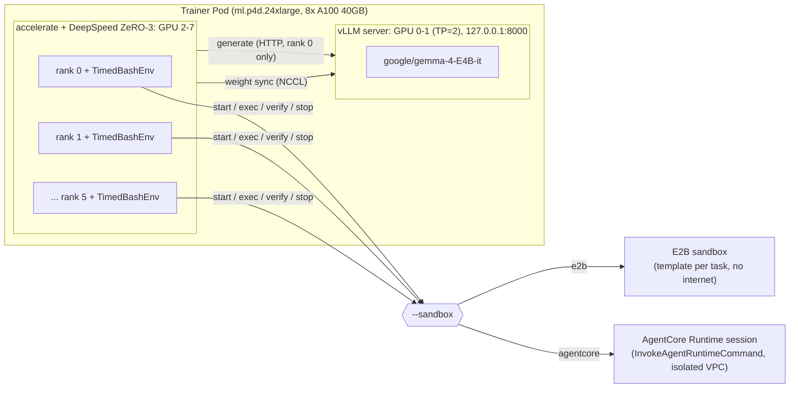

[English](../04-grpo-training.md)

# 04. GRPO 학습 실행 (TRL + Harbor)

이 단계에서는 HyperPod EKS의 GPU 노드(`ml.p4d.24xlarge`, A100 40GB x 8) 하나에서 TRL `GRPOTrainer`와 Harbor 태스크로 정책 모델을 학습합니다. 롤아웃 샌드박스는 플래그 하나(`--sandbox e2b|agentcore`)로 바꾸며, 그 외의 코드, Trainer 이미지, 하이퍼파라미터는 두 샌드박스에서 같습니다.

사전 조건:
- `01-hyperpod-eks.md`: 클러스터, kubectl, 네임스페이스 `harbor-rl`, ServiceAccount `trainer`(EKS Pod Identity), Secret `sandbox-secrets`
- `02-tasks-and-images.md`: 태스크 스위트(`tasks/train`, `tasks/heldout`)와 `harbor-rl/tasks-base:v2`
- `03a-sandbox-e2b.md`: E2B 템플릿 사전 빌드, `sandbox-secrets`의 `E2B_API_KEY`(셀프호스팅이면 `E2B_DOMAIN`도)
- `03b-sandbox-agentcore.md`: 격리 VPC 모드로 배포한 AgentCore 런타임의 ARN

소요 시간: Trainer 이미지 빌드 수십 분(CodeBuild), 학습 1회(40 스텝 + 전후 평가)는 수 시간. 실제 측정값은 `05-comparison.md`에 있습니다.

## 1. 아키텍처: external agent 패턴

정책 모델은 학습 Pod 안의 vLLM 서버가 서빙하고, TRL이 생성 결과의 토큰 ID와 logprob을 학습 쪽에서 직접 받습니다. 샌드박스는 모델이 요청한 `bash` 명령과 verifier만 실행합니다(TRL Harbor 통합의 external agent 패턴). 샌드박스 안의 에이전트가 vLLM을 호출하는 구조가 아니므로 샌드박스에서 Pod로 돌아오는 네트워크 경로가 필요 없고, 샌드박스를 인터넷 없이(`no-network`) 실행할 수 있습니다. Pod에서 샌드박스로 나가는 호출은 세션 생성, `exec`, 파일 업로드와 다운로드, 종료뿐입니다.



- vLLM: GPU 0, 1에서 tensor parallel 2로 실행하며 `127.0.0.1:8000`에만 바인드합니다(4.4절). 각 rank의 프롬프트를 모아 rank 0이 한 번에 요청하고 결과를 모든 rank에 broadcast합니다(TRL 서버 모드).
- 학습: GPU 2~7에서 6개 프로세스, DeepSpeed ZeRO-3([`training/zero3.yaml`](../../training/zero3.yaml), optimizer/parameter offload 없음, bf16).
- 샌드박스: rank마다 Harbor 환경(`training.harness:TimedBashEnv`)이 독립적으로 세션을 만들고 명령을 실행합니다.

> 순차 프로비저닝: TRL은 한 프로세스 안에서 `environment.reset()`을 일반 for 루프로 호출하므로, 샌드박스 생성은 rank 안에서 순차이고 동시성은 학습 프로세스 수(여기서는 6)만큼입니다.

colocate 모드(학습과 vLLM이 같은 GPU 공유)를 쓰지 않는 이유: A100 40GB에서 메모리가 빠듯하고, colocate + sleep 모드는 도구 호출 턴마다 가중치를 다시 올리는 문제(TRL 이슈 #7428)가 있습니다.

## 2. 정책 모델: `google/gemma-4-E4B-it`

> 용어 주의: Gemma 4 모델 이름의 "E2B"(`google/gemma-4-E2B-it`, effective 2B)는 E2B 샌드박스와 무관합니다. 이 가이드에서 모델은 항상 전체 Hugging Face ID로 씁니다.

| 항목 | 값 | 이유 |
|---|---|---|
| 모델 | `google/gemma-4-E4B-it` | Apache 2.0, gated 아님. TRL 1.14.1 + transformers 5.x에서 도구 호출, 채팅 템플릿, 응답 파싱이 동작 |
| 파라미터 구성 | 텍스트 디코더, per-layer embedding(PLE), 오디오/비전 타워 [documented] | |
| 동결 | 이름에 `audio`, `vision`, `per_layer`가 들어간 텐서 | 태스크가 텍스트 전용이고, A100 40GB에서 텍스트 디코더 전체 미세조정을 맞추기 위함 |
| attention | `sdpa` | FlashAttention 2가 Gemma 4의 head_dim 512를 지원하지 않음 |
| dtype | bfloat16, gradient checkpointing | |

동결 후 학습 가능 파라미터 수는 학습 로그 앞부분의 `[train_grpo] sandbox=... frozen_tensors=... trainable_params=... total_params=...` 줄에서 확인합니다(ZeRO-3에서는 파라미터가 분할되므로 `ds_numel`로 계산).

다른 모델을 쓰려면 `MODEL` 환경 변수(`run.sh`)를 바꿉니다. 이때 동결 규칙(`FROZEN_SUBSTRINGS`)과 attention 구현이 그 모델에 맞는지 확인하세요.

## 3. Trainer 이미지 (`harbor-rl/trainer:v12`)

[`training/Dockerfile`](../../training/Dockerfile) 하나로 vLLM 서버, 학습, 벤치마크, E2B 템플릿 사전 빌드를 모두 실행합니다. 같은 이미지(이 가이드에서는 태그 `v12`)를 두 샌드박스 실행에 함께 씁니다. 플랫폼은 `linux/amd64`만 필요합니다(p4d는 x86_64).

| 구성 요소 | 버전 | 비고 |
|---|---|---|
| 베이스 | `vllm/vllm-openai:v0.30.0@sha256:8a69ffad015f138d7170c4ddc429e230a3bc1c1719f67e14324749df200a4b90` | 다이제스트로 고정. `python` 없이 `python3`만 있음 |
| TRL | `trl[harbor]==1.14.1` | `trl.experimental.harbor` 모듈 사용(실험 모듈이므로 버전 고정) |
| Harbor | `harbor[e2b]==0.23.0` | |
| E2B SDK | `e2b==2.50.0` | 2.51.0은 `POST /v2/sandboxes`로 샌드박스를 만드는데, 이 가이드의 셀프호스팅 E2B API는 이 경로를 지원하지 않음 |
| 기타 | `transformers==5.17.0`, `deepspeed==0.19.7`, `boto3==1.43.99`, `pandas==3.0.6`, `matplotlib==3.11.2` | 모든 Python 패키지를 정확한 버전으로 고정 |
| 코드 | `training/`, `agentcore/harbor_agentcore/`, `bench/`, `tasks/train/`(40개), `tasks/heldout/`(16개), `tasks/image/warmup.sh` | `PYTHONPATH=/app:/app/agentcore`, 작업 디렉터리 `/app` |

AgentCore 경로는 E2B SDK를 사용하지 않으므로 `e2b` 고정은 AgentCore 실행에 영향을 주지 않습니다.

재현용 태그는 `v12`이며 위 고정 값으로 빌드합니다. [`05-comparison.md`](05-comparison.md)의 측정도 이 태그로 했습니다. `tasks/image/warmup.sh`는 `bench/prebuild_e2b_templates.py`가 E2B 템플릿 start command를 만들 때 읽으므로 이미지에 들어갑니다([`training/Dockerfile`](../../training/Dockerfile) 22행, [`02-tasks-and-images.md`](02-tasks-and-images.md) 4.2절).

### 3.1 CodeBuild로 빌드 (권장)

로컬(특히 Apple silicon)에서 크기가 큰 amd64 이미지를 에뮬레이션으로 빌드하고 업로드하는 것은 느리므로, [`training/build-image.sh`](../../training/build-image.sh)가 AWS CodeBuild(x86_64, `BUILD_GENERAL1_LARGE`, privileged)에서 빌드해 ECR에 바로 푸시합니다. `TAG`는 필수입니다(기본값 없음).

```bash
export AWS_REGION=us-west-2
TAG=v12 ./training/build-image.sh
# -> <ACCOUNT_ID>.dkr.ecr.us-west-2.amazonaws.com/harbor-rl/trainer:v12
```

스크립트가 하는 일:
- 처음 한 번: S3 버킷 `harbor-rl-sandbox-<ACCOUNT_ID>-us-west-2`(퍼블릭 액세스 차단), ECR 리포지토리 `harbor-rl/trainer`(푸시 시 이미지 스캔 `scanOnPush=true`), IAM 역할 `harbor-rl-codebuild`([`infra/codebuild/codebuild-policy.json`](../../infra/codebuild/codebuild-policy.json)), CodeBuild 프로젝트 `harbor-rl-trainer-build`를 만들고 모두 `Project=harbor-rl-sandbox`로 태그합니다. 이미 있으면 건너뜁니다.
- 버킷 이름은 계정 ID와 리전으로 예측할 수 있으므로, 다른 계정이 같은 이름을 먼저 만들어 두는 경우(bucket squatting)에 대비해 `head-bucket`과 업로드 모두 `--expected-bucket-owner <ACCOUNT_ID>`로 이 계정 소유인지 확인합니다.
- CodeBuild 역할의 신뢰 정책([`infra/codebuild/codebuild-trust.json`](../../infra/codebuild/codebuild-trust.json))은 `codebuild.amazonaws.com`이 `aws:SourceAccount`(이 계정)와 `aws:SourceArn`(프로젝트 `harbor-rl-trainer-build`)을 만족할 때만 역할을 맡게 합니다. 스크립트를 실행할 때마다 `update-assume-role-policy`로 다시 적용합니다.
- 빌드 컨텍스트(`training`, `agentcore/harbor_agentcore`, `bench`, `tasks/train`, `tasks/heldout`, `tasks/image/warmup.sh`, buildspec, [`training/build-image.sh`](../../training/build-image.sh) 52행)를 zip으로 묶어 `s3://<버킷>/codebuild/trainer-src.zip`에 올리고, [`infra/codebuild/buildspec.yml`](../../infra/codebuild/buildspec.yml)(`docker build` 후 `docker push`)로 빌드한 뒤 20초마다 상태를 조회합니다. 성공하면 이미지 URI를 출력합니다.

태스크(`tasks/train`, `tasks/heldout`)나 학습 코드를 바꾸면 이미지에 다시 넣어야 하므로 새 태그로 다시 빌드합니다. 만든 리소스의 삭제 명령은 `06-cleanup.md`에 있습니다.

### 3.2 로컬 빌드 (대안)

```bash
REGISTRY=<ACCOUNT_ID>.dkr.ecr.us-west-2.amazonaws.com
IMAGE=$REGISTRY/harbor-rl/trainer:v12

# Finch
aws ecr get-login-password --region us-west-2 | finch login --username AWS --password-stdin $REGISTRY
finch build --platform linux/amd64 -f training/Dockerfile -t "$IMAGE" .
finch push "$IMAGE"

# Docker equivalent
aws ecr get-login-password --region us-west-2 | docker login --username AWS --password-stdin $REGISTRY
docker buildx build --platform linux/amd64 -f training/Dockerfile -t "$IMAGE" --push .
```

## 4. 학습 실행

### 4.1 샌드박스 전환

샌드박스 선택은 [`training/train_grpo.py`](../../training/train_grpo.py)의 `--sandbox` 하나뿐입니다.

| `--sandbox` | Harbor 환경 | 구현 |
|---|---|---|
| `e2b` | `e2b` | Harbor 내장 E2B 환경(수정 없음) |
| `agentcore` | `harbor_agentcore.environment:AgentCoreEnvironment` | 이 저장소의 Harbor `BaseEnvironment` 구현 |

두 경우 모두 `HarborSpec(tasks, agent="training.harness:TimedBashEnv", environment_type=...)`로 하네스를 지정합니다. import path 형태의 환경은 하네스가 처리합니다(7절).

### 4.2 Job 제출

학습은 GPU 8개와 `:8000` 포트를 모두 쓰므로 한 번에 한 Job만 실행합니다. 두 샌드박스를 같은 노드, 같은 이미지에서 차례로 실행합니다.

```bash
export AWS_REGION=us-west-2
export KUBECONFIG=$HOME/.kube/harbor-rl-hp

# Method B: AgentCore Runtime
TAG=v12 \
AGENTCORE_RUNTIME_ARN=arn:aws:bedrock-agentcore:us-west-2:<ACCOUNT_ID>:runtime/<RUNTIME_ID> \
AGENTCORE_NETWORK_ISOLATED=1 \
  ./infra/k8s/submit.sh grpo-agentcore 8 \
  bash -c "RUN_ID=grpo-agentcore training/run.sh agentcore"

# Method A: E2B sandbox (after the AgentCore job has finished)
TAG=v12 ./infra/k8s/submit.sh grpo-e2b 8 \
  bash -c "RUN_ID=grpo-e2b training/run.sh e2b"
```

[`infra/k8s/submit.sh`](../../infra/k8s/submit.sh) `<job 이름> <GPU 수> <명령...>`:
- `TAG`(Trainer 이미지 태그)는 필수이며, 빠뜨리면 즉시 중단합니다. `IMAGE`를 직접 지정하면 `TAG` 대신 그 값을 씁니다.
- `AGENTCORE_RUNTIME_ARN`은 AgentCore Job에만 필요합니다.
- `AGENTCORE_NETWORK_ISOLATED`는 기본값 `1`입니다. 런타임이 인터넷 경로가 없는 서브넷의 VPC 모드로 배포되었다는 운영자의 선언이며, 이 값이 `1`일 때만 AgentCore 환경이 `no-network` 태스크를 받습니다(6.1절).
- `RESULTS_S3_URI`는 기본값 `s3://harbor-rl-sandbox-<ACCOUNT_ID>-us-west-2/results`입니다.
- 명령을 JSON 배열로 바꿔 [`infra/k8s/job.yaml`](../../infra/k8s/job.yaml)을 `envsubst`로 렌더링한 뒤 `kubectl apply`합니다.

`run.sh` 뒤에 붙인 인자는 `train_grpo.py`로 그대로 전달됩니다(예: `training/run.sh e2b --max-steps 5`로 짧은 동작 확인). 비교 실행에서는 아무것도 덧붙이지 않습니다.

### 4.3 Job 구성

| 항목 | 값 |
|---|---|
| ServiceAccount | `trainer`(Pod Identity 역할 `harbor-rl-trainer-pod`, 액세스 키는 Pod에 들어가지 않음) |
| 재시도 | `backoffLimit: 0`, `restartPolicy: Never`, 완료 후 24시간 뒤 자동 삭제(`ttlSecondsAfterFinished`) |
| `AWS_REGION` | `us-west-2` |
| `AGENTCORE_RUNTIME_ARN`, `AGENTCORE_NETWORK_ISOLATED`, `RESULTS_S3_URI` | `submit.sh`가 렌더링 |
| `HF_HOME` | `/cache/hf`(노드 NVMe에 유지되어 두 번째 실행부터 모델 다운로드 생략) |
| `E2B_API_KEY`, `E2B_DOMAIN`, `HF_TOKEN` | Secret `sandbox-secrets`(모두 `optional: true`, `E2B_DOMAIN`은 셀프호스팅 E2B에서만) |
| 볼륨 | `/dev/shm`(메모리 64Gi), `/cache`와 `/results`는 노드의 `/opt/dlami/nvme/harbor-rl/` 아래 hostPath |
| 실행 사용자 | root(vLLM 공식 이미지 기본값) |

Pod 역할 권한([`infra/iam/trainer-pod-policy.json`](../../infra/iam/trainer-pod-policy.json)): 태스크 런타임 하나에 대한 `InvokeAgentRuntimeCommand`, `InvokeAgentRuntime`, `StopRuntimeSession`(`setup-access.sh`를 `RUNTIME_ID`와 함께 실행했을 때만 포함), 결과 버킷의 `results/*` 쓰기와 읽기, E2B 템플릿 빌드용 ECR 토큰과 `harbor-rl/tasks-base` pull.

### 4.4 `training/run.sh`가 하는 일

[`training/run.sh`](../../training/run.sh) `e2b|agentcore [train_grpo.py 인자...]`:

1. `RUN_ID`(기본값 `grpo-<sandbox>-<타임스탬프>`)로 출력 디렉터리 `/results/<RUN_ID>`를 정합니다. 이 디렉터리가 비어 있지 않으면 시작하지 않습니다. 결과가 노드 hostPath에 남으므로, 같은 `RUN_ID`를 다시 쓰면 이전 실행의 로그와 섞이기 때문입니다. 새 `RUN_ID`를 쓰거나 이전 디렉터리를 옮기세요.
2. `:8000`에 이미 vLLM이 떠 있으면 중단합니다.
3. GPU 0, 1에서 vLLM 서버를 `setsid`로 띄우며 `127.0.0.1:8000`에만 바인드합니다. 종료 시 `trap`이 프로세스 그룹 전체를 종료해 GPU를 반환합니다.

```bash
CUDA_VISIBLE_DEVICES=0,1 VLLM_SERVER_DEV_MODE=1 setsid vllm serve "$MODEL" \
  --tensor-parallel-size 2 --host 127.0.0.1 --port 8000 \
  --weight-transfer-config '{"backend": "nccl"}' \
  --logprobs-mode processed_logprobs --max-logprobs -1 \
  --limit-mm-per-prompt '{"image": 0, "audio": 0}' \
  --max-model-len 32768 --gpu-memory-utilization 0.6
```

| 플래그 | 의미 |
|---|---|
| `--host 127.0.0.1` | 같은 Pod의 학습 프로세스(localhost)만 접속. dev 모드 서버는 가중치 업데이트와 RPC 경로를 인증 없이 열기 때문에 Pod 밖에 노출하지 않음 |
| `--weight-transfer-config '{"backend": "nccl"}'`, `VLLM_SERVER_DEV_MODE=1` | 매 스텝 학습된 가중치를 NCCL로 서버에 전송 |
| `--logprobs-mode processed_logprobs --max-logprobs -1` | 샘플링에 쓰인 분포의 logprob 반환(TRL이 중요도 비율 계산에 사용) |
| `--limit-mm-per-prompt` 이미지/오디오 0 | 멀티모달 입력 비활성화(텍스트 태스크) |
| `--max-model-len 32768` | 다중 턴 프롬프트(지시문 + 이전 턴 + 도구 출력)에 생성 상한 8,192 토큰을 더해도 들어가야 함. TRL은 서버의 `--max-model-len`이 아니라 모델 설정의 최대 길이로 컨텍스트를 검사하므로, 서버 값이 작으면 vLLM이 요청을 400으로 거부하고 학습이 종료됨 |
| `--gpu-memory-utilization 0.6` | 가중치 동기화 때 받을 버퍼를 위한 GPU 메모리 여유 |

4. `/health`가 응답할 때까지 5초마다 확인합니다. vLLM이 먼저 종료되면 `vllm.log` 끝 50줄을 출력하고 종료합니다.
5. GPU 2~7에서 `accelerate launch --config_file training/zero3.yaml --num_processes 6 training/train_grpo.py --sandbox <sandbox> --model "$MODEL" --output-dir /results/<RUN_ID>`를 실행하고 출력을 `train.log`에 함께 기록합니다(`PYTORCH_CUDA_ALLOC_CONF=expandable_segments:True`).
6. 학습이 성공하고 `RESULTS_S3_URI`가 설정되어 있으면 `python3 -m bench.s3sync /results/<RUN_ID>`로 결과를 올립니다. 학습이 실패하면(`set -euo pipefail`) 업로드 전에 종료합니다.

### 4.5 보안 참고

- **vLLM은 Pod 안에서만 접근 가능.** dev 모드 서버는 가중치 업데이트를 인증 없이 받으므로 `127.0.0.1`에만 바인드합니다(4.4절). 샌드박스는 vLLM을 호출하지 않습니다(external agent 패턴).
- **학습 Pod는 root로 실행되고 GPU 노드의 hostPath 볼륨**(`/cache`, `/results`)을 씁니다. 이 워크로드 전용인 단일 테넌트 HyperPod 노드에서는 허용 가능한 구성입니다. 다른 테넌트와 공유하는 노드에서는 이렇게 실행하지 마세요.
- **신뢰할 수 없는 정책의 보상은 조작될 수 있습니다.** 에이전트 명령은 나중에 verifier가 실행될 같은 샌드박스에서 root로 실행되므로, 정책이 원리적으로 verifier가 쓰는 파일이나 도구를 바꿔 자신의 보상을 올릴 수 있습니다. 이는 Harbor 설계의 성질이며 어느 샌드박스의 문제도 아닙니다. 신뢰할 수 없는 정책(외부에서 받은 체크포인트 등)의 보상은 이 점을 감안해 해석하세요.
- **Pod 권한**은 EKS Pod Identity에서 받으며, 신뢰 정책은 이 클러스터, 네임스페이스 `harbor-rl`, ServiceAccount `trainer`로 범위가 제한됩니다([`01-hyperpod-eks.md`](01-hyperpod-eks.md) 6절).

## 5. 하이퍼파라미터 (두 샌드박스 동일)

모두 `train_grpo.py`의 기본값이며 비교 실행에서는 덮어쓰지 않습니다.

| 항목 | 값 | 비고 |
|---|---|---|
| `seed` | 42 | |
| `max_steps` | 40 | |
| 배치 | per-device 1 x grad accum 8 x 6 rank = 스텝당 48 롤아웃 | 6 프롬프트 x 8 생성. Gemma 4의 262k 어휘 때문에 긴 시퀀스 여러 개의 전체 logit이 40GB에 들어가지 않음 |
| `num_generations` | 8 | GRPO 그룹 크기 |
| `num_generations_eval` | 6 | held-out 태스크당 6 샘플 |
| `per_device_eval_batch_size` | 2 | |
| `max_completion_length` | 8192 | 다중 턴 전체(모델 토큰 + 도구 출력) 예산 |
| `max_tool_calling_iterations` | 20 | |
| `temperature` | 1.0 | |
| `learning_rate` | 2e-6 | |
| `beta` | 0 | KL 항 없음(참조 모델 불필요) |
| 정밀도 | bf16, gradient checkpointing, `sdpa` | |
| 평가 | 시작(`eval_on_start`)과 끝(`eval_steps=max_steps`), held-out 16개 태스크 | `--skip-eval`로 끔 |
| `vllm_server_timeout` | 900초 | |
| `save_strategy` | `"no"` | 체크포인트 저장 없음 |
| 도구 출력 상한 | 2,000자(`TOOL_OUTPUT_MAX_CHARS`, TRL 기본 8,000자) | 큰 `cat` 출력이 토큰 예산을 소진하는 것을 방지 |
| 도구 호출 타임아웃 | 180초 | 하네스 `_exec` 기본값. `task.toml`의 agent 타임아웃은 TRL이 사용하지 않음 |

> 평가를 `train()` 앞뒤에서 `trainer.evaluate()`로 따로 부르지 않는 이유: DeepSpeed ZeRO-3에서 `train()` 전에 `evaluate()`를 부르면 엔진이 추론 모드로 남아 backward가 실패합니다. 그래서 학습 루프 안의 `eval_on_start`와 마지막 스텝 평가를 씁니다.

## 6. 학습 하네스 (`training/harness.py`)

[`training/harness.py`](../../training/harness.py)의 `TimedBashEnv`는 TRL의 `HarborBashEnv`(모델에 `bash` 도구 하나를 노출)를 상속해 네트워크 정책 전달, 플러그인 환경, 호출별 시간 측정, 실패 처리, 종료 정리를 더합니다. 두 샌드박스가 같은 하네스를 씁니다.

### 6.1 네트워크 정책 적용

TRL의 Harbor 환경은 Harbor에 네트워크 정책을 넘기지 않으므로, 그대로 두면 모든 샌드박스가 기본값(공용 인터넷 허용)으로 만들어집니다. 하네스는 Harbor trial과 같은 방식으로 태스크의 `[environment]` 정책을 해석해 환경에 전달합니다.

```python
network_policy = resolve_agent_env_baseline(self._task.config, config)   # harbor.trial.network_policy
self._env = EnvironmentFactory.create_environment_from_config(..., network_policy=network_policy)
```

- 이 스위트의 모든 태스크는 `network_mode = "no-network"`입니다(`02-tasks-and-images.md` 3.1).
- E2B: Harbor E2B 환경이 샌드박스를 `allow_internet_access=False`로 생성합니다.
- AgentCore: `AGENTCORE_NETWORK_ISOLATED=1`일 때만 `AgentCoreEnvironment`가 인터넷 차단 지원을 선언합니다. 네트워크는 런타임 단위 설정이므로 실제 차단은 런타임의 격리 VPC 구성(`03b-sandbox-agentcore.md`)이 담당합니다.
- 인터넷 차단을 지원하지 않는 환경은 Harbor가 생성 단계에서 거부합니다. 하네스는 이를 `rollout_failed`(cause `provision`)로 기록하고 해당 롤아웃의 보상을 0으로 처리하므로, 조용히 인터넷이 허용된 채 학습이 진행되지 않습니다.
- [`bench/sandbox_bench.py`](../../bench/sandbox_bench.py)도 같은 방식으로 정책을 전달합니다. 이 벤치마크는 세션 시작 직후 `python3 -c 'import pandas, numpy, sklearn'`을 두 번 실행해 `py_import_first`, `py_import_again`으로 기록합니다(`:70-74`). 첫 번째는 스냅샷이 라이브러리를 담고 있지 않으면 디스크에서 읽는 비용을 치르므로, 샌드박스 워밍업([`02-tasks-and-images.md`](02-tasks-and-images.md) 4.2절)의 효과를 보여 줍니다.

### 6.2 타이밍 기록

TRL 로그에 의존하지 않도록 모든 샌드박스 호출을 직접 측정해 프로세스별 JSONL(`$SANDBOX_TIMING_DIR/sandbox_<host>_rank<N>_<pid>.jsonl`, 기본 `<output-dir>/sandbox/`)로 남깁니다. 각 레코드에는 `ts`(호출 종료 시각), `step`, `sandbox`, `rollout`, `task`, `op`, `dur`, `ok`, `err`가 들어갑니다. `step`은 `TRAIN_STEP` 환경 변수 값으로, `train_grpo.py`의 콜백이 스텝 번호, `eval_before`, `eval_after`로 설정합니다.

| `op` | 측정 범위 |
|---|---|
| `provision` | 아래 다섯 단계 전체 |
| `create`, `start`, `upload_build_files`, `healthcheck`, `prepare` | 환경 객체 생성, 세션 시작, 빌드 파일 업로드, 태스크 healthcheck, 작업 디렉터리 준비 |
| `exec` | 도구 호출 1회(`rc`, 명령 앞 300자 포함) |
| `verify` | verifier 실행 |
| `reward` | 롤아웃 보상 값(`reward`) |
| `stop` | 세션 종료 |
| `rollout_failed` | 프로비저닝 또는 verifier 실패(`cause`, `err`, 프로비저닝 실패 시 traceback) |
| `generate` | [`training/trl_patches.py`](../../training/trl_patches.py)가 기록하는 vLLM 생성 라운드 1회. 모든 rank가 같은 라운드를 기다리므로 rank마다 기록 |

프로비저닝이 실패하면 해당 롤아웃은 오류 메시지를 돌려주는 도구와 보상 0으로 계속 진행되어 학습 스텝이 중단되지 않습니다.

### 6.3 스텝별 분해 (`bench/analyze.py`)

[`bench/analyze.py`](../../bench/analyze.py)의 `training_summary`가 `steps.jsonl`과 샌드박스 JSONL에서 스텝별 시간 분해를 계산합니다.

- 대상: `step`이 숫자인 이벤트만(시작과 끝 평가 구간 제외).
- rank 안에서는 호출이 순차이므로, 스텝마다 rank별로 `op`별 `dur` 합을 구한 뒤 6개 rank의 평균을 냅니다.
- `step_wall_sec` = rank 0의 `steps.jsonl` `kind=step` 레코드의 `t_end - t_begin`
- `generation_sec` = `generate` 합의 rank 평균
- `sandbox_provision_sec`, `sandbox_exec_sec`, `sandbox_verify_sec`, `sandbox_stop_sec` = 각 `op` 합의 rank 평균
- `sandbox_wait_sec` = provision + exec + verify + stop
- `train_and_other_sec` = `step_wall_sec - generation_sec - sandbox_wait_sec`(역전파, 가중치 동기화, 집합 통신 대기 등)
- 그 밖에 `mean_reward`(TRL 로그의 `reward`), `failed_rollouts`와 원인, `exec_calls`, `exec_timeouts`, 실행별 held-out 전후 값(`eval_before.json`, `eval_after.json`의 `eval_reward`)

출력: `results/summary/training_steps.csv`, `training_runs.csv`, `results/charts/training.png`. 같은 스크립트의 `sandbox_usage_summary`는 평가 구간을 포함한 모든 이벤트로 `op`별 지연(`training_sandbox_ops.csv`)과 세션 시간(`training_sandbox_sessions.csv`, 세션 = 롤아웃별 `create` 시작부터 `stop` 종료까지)을 계산하고, [`bench/cost_model.py`](../../bench/cost_model.py)가 이를 비용 추정에 사용합니다.

`analyze.py`는 `results/grpo-<sandbox>*` 중 이름순 첫 디렉터리를 읽습니다. 그래서 비교 실행에는 `RUN_ID=grpo-e2b`, `RUN_ID=grpo-agentcore`처럼 고정 이름을 쓰고, 다른 실행은 `results/` 밖에 두세요.

## 7. TRL 1.14.1 우회 사항

모든 우회는 두 샌드박스에 똑같이 적용되며 TRL을 포크하지 않습니다.

**(1) 서버 모드 + 도구 호출 + 다중 rank (`training/trl_patches.py`).** TRL 1.14.1의 서버 모드 생성은 모든 rank의 프롬프트를 모은 결과를 `process_index * len(prompts)`로 잘라 나눕니다. 즉 rank마다 요청 수가 같다고 가정합니다. 그런데 `_tool_call_loop`에서는 rank마다 도구 호출 후 재생성할 샘플 수가 달라 `IndexError`가 나고, 한 rank의 루프가 먼저 끝나면 나머지 rank의 집합 통신과 짝이 맞지 않아 교착될 수 있습니다. `train_grpo.py` 맨 앞에서 호출하는 `trl_patches.apply()`가 (a) 모은 개수로 rank별 오프셋을 계산하고, (b) 루프가 끝난 rank도 모든 rank가 끝날 때까지 빈 요청으로 집합 통신에 참여하게 하며, (c) 생성 라운드마다 `generate` 이벤트를 기록합니다. 생성 내용 자체는 바꾸지 않으며, 텍스트 전용 프롬프트만 지원합니다.

**(2) 플러그인 샌드박스.** TRL의 `HarborEnv`는 Harbor에 `type=`만 넘기므로 import path 형태의 환경을 Harbor가 거부합니다. 하네스는 `_start`를 덮어써서 값에 `:`가 있으면 `EnvironmentConfig(import_path=...)`를 사용합니다. 같은 지점에서 네트워크 정책도 전달합니다(6.1절).

**(3) 종료 시 무한 대기와 샌드박스 정리.** TRL의 `HarborEnv.__del__`은 인터프리터 종료 시 이미 멈춘 이벤트 루프 스레드를 기다려 프로세스가 끝나지 않습니다. 또 종료 시점에 열린 샌드박스는 정리되지 않습니다(Harbor는 E2B 샌드박스를 24시간 타임아웃으로 생성하고, AgentCore 세션은 유휴 타임아웃까지 과금). 하네스는 `__del__`이 막히지 않게 하고, `concurrent.futures`의 스레드 풀이 닫히기 전에 실행되도록 `threading._register_atexit`로 종료 훅을 등록해 살아 있는 샌드박스를 모두 중지합니다. 일반 `atexit`는 스레드 풀이 닫힌 뒤에 실행되어 AgentCore `StopRuntimeSession`을 호출할 수 없습니다.

**(4) public 메서드는 도구가 됨.** TRL은 환경 클래스의 모든 public 메서드를 모델 도구로 노출합니다. 도우미 메서드를 public으로 두면 도구 스키마 생성에서 `DocstringParsingException`이 나므로 `_close`, `_timed`처럼 `_` 접두사를 붙입니다. 모델에 노출되는 도구는 `bash` 하나입니다.

**(5) 컨텍스트 길이 검사.** 서버 모드에서 TRL은 다중 턴 컨텍스트 상한을 vLLM 서버의 `--max-model-len`이 아니라 모델 설정의 `max_position_embeddings`로 검사합니다. 따라서 서버 쪽 `--max-model-len`이 다중 턴 프롬프트 + `max_completion_length`보다 작으면 vLLM이 요청을 400으로 거부하고 학습이 종료됩니다. `run.sh`는 `--max-model-len 32768`을 사용합니다.

**(6) `completions/clipped_ratio` 지표.** Gemma 4는 `generation_config.json`의 여러 종료 토큰(`<eos>`, `<turn|>`, `<|tool_response>`) 중 하나에서 멈추지만, TRL은 마지막 토큰이 `eos_token_id`나 pad일 때만 정상 종료로 셉니다. 그래서 이 지표는 실제보다 높게 나옵니다. `mask_truncated_completions=False`(기본값)이므로 학습에는 영향이 없으며, 비교에 쓰지 않습니다.

**(7) CUDA 할당기 경고.** `expandable_segments` 관련 OOM 경고가 로그에 보일 수 있지만 학습을 멈추지 않는 경고입니다.

## 8. 출력과 S3 동기화

노드의 `/opt/dlami/nvme/harbor-rl/results/<RUN_ID>/`(Pod에서는 `/results/<RUN_ID>/`)와 S3 `$RESULTS_S3_URI/<RUN_ID>/`에 같은 구조로 남습니다.

| 파일 | 내용 |
|---|---|
| `steps.jsonl` | `kind=step`: 모든 rank의 스텝 시작/종료 시각. `kind=log`: rank 0의 TRL 지표(`reward`, `loss` 등, 매 스텝) |
| `eval_before.json`, `eval_after.json` | 스텝 0과 마지막 스텝의 held-out 평가 지표(`eval_reward`가 solve rate) |
| `sandbox/sandbox_<host>_rank<N>_<pid>.jsonl` | 하네스가 기록한 샌드박스 호출별 시간, 실패, 보상, 생성 라운드(6.2절) |
| `vllm.log`, `train.log` | vLLM 서버 로그, 학습 표준 출력 |
| `trainer/` | TRL `output_dir`(체크포인트 없음) |

[`bench/s3sync.py`](../../bench/s3sync.py)는 Trainer 이미지에 AWS CLI가 없으므로 boto3로 디렉터리의 모든 파일을 `s3://<버킷>/<prefix>/<디렉터리 이름>/...`에 올립니다. 클라이언트는 `AWS_REGION`(기본 `us-west-2`)으로 리전을 명시해 만듭니다. 권한은 Pod Identity 역할에서 받습니다.

학습이 끝나면 결과를 로컬로 받아 요약표와 차트를 만듭니다.

`bench/cost_model.py`는 사용량 파일 두 개도 읽습니다. `results/usage/agentcore_grpo_window.json`(AgentCore 서비스 제공 사용량, [`bench/agentcore_metrics.py`](../../bench/agentcore_metrics.py)가 생성)과 `results/usage/e2b_client_cpu.json`(셀프호스팅 E2B 샌드박스를 실행하는 `<stack>-client` 인스턴스의 EC2 `CPUUtilization`, [`bench/e2b_client_cpu.py`](../../bench/e2b_client_cpu.py)가 생성)입니다. 저장소에 커밋된 파일은 측정 실행의 값이므로, 재현할 때는 두 파일을 자신의 학습 구간(`--start`/`--end`, UTC, 예: `2026-10-07T09:10:00Z`)으로 다시 만들어야 합니다. 첫 번째는 AgentCore 실행 구간, 두 번째는 E2B 실행 구간을 지정합니다(E2B 클라이언트 인스턴스가 아직 실행 중이어야 함). 로컬에서 분석 스크립트는 `pandas`와 `matplotlib`, 지표 스크립트는 `boto3`가 필요합니다.

```bash
BUCKET=harbor-rl-sandbox-<ACCOUNT_ID>-us-west-2
aws s3 sync s3://$BUCKET/results/grpo-agentcore results/grpo-agentcore --region us-west-2
aws s3 sync s3://$BUCKET/results/grpo-e2b results/grpo-e2b --region us-west-2

# Usage inputs of cost_model.py, for your own training windows
uv run --with boto3 python3 bench/agentcore_metrics.py --start <agentcore run start> --end <agentcore run end> \
  --runtime-arn arn:aws:bedrock-agentcore:us-west-2:<ACCOUNT_ID>:runtime/<RUNTIME_ID> \
  --out results/usage/agentcore_grpo_window.json
uv run --with boto3 python3 bench/e2b_client_cpu.py --start <e2b run start> --end <e2b run end> \
  --out results/usage/e2b_client_cpu.json

uv run --with pandas --with matplotlib python3 bench/analyze.py --results results     # -> results/summary/*.csv, results/charts/*.png
uv run --with pandas --with matplotlib python3 bench/cost_model.py --results results  # -> results/summary/cost.csv (inputs: 05-comparison.md)
```

## 9. 모니터링

```bash
kubectl -n harbor-rl get pods -l job=grpo-agentcore
kubectl -n harbor-rl logs -f job/grpo-agentcore
# Per-step metrics (rank 0)
kubectl -n harbor-rl exec job/grpo-agentcore -- \
  bash -c 'grep "\"kind\": \"log\"" /results/grpo-agentcore/steps.jsonl | tail -n 2'
# Sandbox failures so far
kubectl -n harbor-rl exec job/grpo-agentcore -- \
  bash -c 'cat /results/grpo-agentcore/sandbox/*.jsonl | grep -c rollout_failed'
# vLLM side
kubectl -n harbor-rl exec job/grpo-agentcore -- tail -n 20 /results/grpo-agentcore/vllm.log
```

E2B 실행은 Job 이름과 경로의 `grpo-agentcore`를 `grpo-e2b`로 바꿉니다. AgentCore 쪽 서비스 지표(호출 수, 스로틀, 세션 수, vCPU/메모리 사용량)는 CloudWatch 네임스페이스 `AWS/Bedrock-AgentCore`에서 볼 수 있으며, [`bench/agentcore_metrics.py`](../../bench/agentcore_metrics.py)가 시간 구간을 지정해 내려받습니다(`03b-sandbox-agentcore.md`).

## 10. 자주 겪는 문제 (Common pitfalls)

| 증상 | 원인 | 대응 |
|---|---|---|
| `submit.sh`가 `set TAG`로 즉시 종료 | Trainer 이미지 태그에 기본값이 없음 | `TAG=v12 ./infra/k8s/submit.sh ...` |
| `run.sh`가 `/results/<RUN_ID> is not empty`로 종료 | 같은 `RUN_ID`의 이전 결과가 노드 hostPath에 남아 있음 | 새 `RUN_ID`를 쓰거나 이전 디렉터리를 옮김 |
| 첫 가중치 동기화에서 학습 종료, 로그 끝에 `start_weight_update must be called before update_weights` | vLLM GPU에 가중치 수신 버퍼를 할당할 여유가 없어 OOM. 마지막 오류는 원인이 아님 | `--gpu-memory-utilization 0.6` 사용. `vllm.log`에서 첫 번째 ERROR를 확인 |
| 학습 시작 직후(평가 단계) vLLM 400 오류로 종료 | 다중 턴 컨텍스트 + 생성 상한이 `--max-model-len` 초과(7절 (5)) | `--max-model-len 32768` |
| `IndexError` 또는 스텝 중 응답 없음(교착) | 서버 모드 + 도구 호출 + 다중 rank(7절 (1)) | `trl_patches.apply()`가 `train_grpo.py` 맨 앞에서 호출되는지 확인 |
| 학습은 끝났는데 Pod가 종료되지 않음 | `HarborEnv.__del__` 무한 대기 | `training.harness:TimedBashEnv` 사용 |
| 모든 롤아웃이 `network_mode='no-network' is not supported`로 실패 | AgentCore 환경이 인터넷 차단을 선언하지 않음 | 런타임을 격리 VPC 모드로 배포하고 `AGENTCORE_NETWORK_ISOLATED=1`(기본값)로 제출 |
| AgentCore 롤아웃이 모두 `rollout_failed`(`AGENTCORE_RUNTIME_ARN is not set`)로 기록되고 보상이 0 | 제출 시 ARN을 넘기지 않음 | `AGENTCORE_RUNTIME_ARN=... ./infra/k8s/submit.sh ...` |
| 다른 Pod나 노드에서 `<pod IP>:8000`으로 vLLM에 접속이 안 됨 | 의도된 동작. vLLM은 `127.0.0.1`에만 바인드 | 같은 Pod 안에서 `localhost:8000` 사용(`kubectl exec`) |
| `build-image.sh`가 버킷 확인에서 실패하거나 버킷을 만들려다 `BucketAlreadyExists` | 같은 이름의 버킷을 다른 계정이 소유(`--expected-bucket-owner` 확인 실패). 스크립트는 그 버킷에 아무것도 올리지 않음 | 그 버킷은 쓰지 않음. 이름을 바꾸려면 버킷 이름을 정하는 스크립트(`training/build-image.sh`, `infra/k8s/setup-access.sh`, `infra/k8s/submit.sh`, `infra/e2b-selfhosted/deploy.sh`)를 함께 수정 |
| `python: command not found` | vLLM 공식 이미지에는 `python3`만 있음 | 스크립트와 Job 명령에서 `python3` 사용 |
| E2B 샌드박스 생성이 `404 method not allowed` | E2B SDK 2.51.0의 `POST /v2/sandboxes`를 이 셀프호스팅 E2B가 지원하지 않음 | `e2b==2.50.0` 고정(Trainer 이미지에 반영됨) |
| E2B 생성이 `400: Timeout cannot be greater than 1 hours` | Harbor는 24시간 타임아웃으로 생성, 셀프호스팅 기본 티어는 1시간 / 동시 20 | 팀 티어 조정(`03a-sandbox-e2b.md`) |
| E2B 학습이 템플릿 빌드 오류로 실패 | 템플릿을 사전 빌드하지 않았거나 태스크 `environment/`가 바뀌어 alias가 달라짐 | `prebuild_e2b_templates.py` 실행(`02-tasks-and-images.md` 5.2) |
| AgentCore 롤아웃 하나가 도구 타임아웃(180초)까지 멈춤 | `InvokeAgentRuntimeCommand`가 EOF 없는 stdin을 넘겨 `cat`, 인자 없는 `python3`이 대기 | AgentCore 환경이 모든 명령 앞에 `exec </dev/null;` 추가(E2B, Docker와 의미 일치) |
| 도구 출력이 토큰 예산을 소진 | 큰 파일 `cat` | 하네스의 2,000자 상한(`TOOL_OUTPUT_MAX_CHARS`) |
| `completions/clipped_ratio`가 높게 나옴 | Gemma 4 종료 토큰을 TRL이 일부만 인식(7절 (6)) | 학습에는 영향 없음, 비교 지표로 쓰지 않음 |
| 학습 실패 후 S3에 결과가 없음 | `run.sh`는 학습 실패 시 동기화 전에 종료 | 노드의 `/opt/dlami/nvme/harbor-rl/results/<RUN_ID>`에 남아 있음. 같은 노드의 다른 Pod에서 `python3 -m bench.s3sync /results/<RUN_ID>` 실행 |
| S3 업로드가 `TemporaryRedirect`로 실패 | 리전 없이 boto3 S3 클라이언트를 만들면 새 버킷에서 리디렉션 발생 | `region_name` 명시(`bench/s3sync.py`) |
| 다른 GPU Job과 동시 실행 시 Pending 또는 `a vLLM server is already listening on :8000` | 학습이 GPU 8개와 `:8000`을 모두 사용 | 이전 Job이 끝난 뒤 제출 |

근거 URL과 확인 날짜는 `references.md`에 있습니다.

다음 단계: 두 샌드박스의 측정 결과, 비용, 제약 비교는 `05-comparison.md`.
